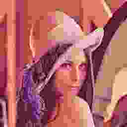
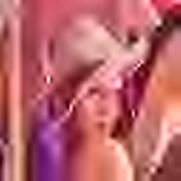
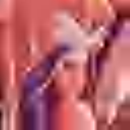
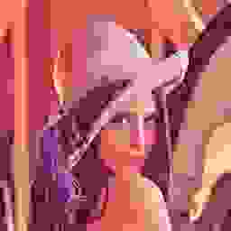
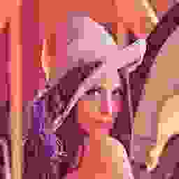
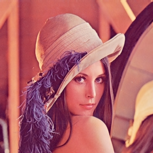

# Small Wavelet Thumbnail & Preview Codec - WTPC

A simple, drop-in image codec in the style of stb_image.
It targets low sizes from 200 B to 36 KB at resolutions around 256x256.
The main target for thumbnails is 1400 B -- designed to fit within one MTU
packet, so the user sees *something* while the main preview downloads.

It has two modes: fast Huffman and slower EBCOT-lite (much simpler than
JPEG 2000 -- not even Tier-1, since that would need far more code).
Despite its simplicity, WTPC outperforms JPEG 2000 and JPEG XL on this
small-image benchmark, likely because its quantization is tuned to sharpen
at low bitrates and the test dataset is relatively small (~3000 images).

## API and usage

```c
   === API ===

   typedef struct {
       int encoded_bytes;   - output number of bytes
       int result_q;        - resulting quantization factor if target_bytes provided, or same as 'quality' if target_bytes=0
       int search_steps;    - number of iterations to search target bytes quantization 
       int ebcot;           - 1 = ebcot or 0 = huffman mode for best pick if auto huffman_mode used
       int huffman_y_size;  - in bits if not picked static table
       int huffman_u_size;
       int huffman_v_size;
       int huffman_y_table; - 0..NUM_DEF_TABLES-1 - static, NUM_DEF_TABLES - custom written in bitstream
       int huffman_u_table;
       int huffman_v_table;
   } wtpc_enc_info;

   unsigned char *wtpc_encode_mem(const unsigned char *rgb, wtpc_enc_info *info,
       int w, int h, int target_bytes, int quality, int chroma_420,
       int huffman_mode, int huf_extra_ctx, int has_alpha);
     Encode an RGB/RGBA image in memory. Returns malloc'd WTPC bitstream,
     or NULL on error. Caller must free().
       rgb           : input pixels, w*h*3 bytes (RGB) or w*h*4 (RGBA).
       info          : output struct, filled with encoding details (may be NULL).
       w, h          : image dimensions (>= 1).
       target_bytes  : desired output size in bytes. 0 = use 'quality' instead.
                       When > 0, the encoder does a binary search over the
                       quality range [1..MAX_QUALITY] to hit the target.
       quality       : quantization level 1..MAX_QUALITY (1024). Lower = better
                       quality / larger file. Used only when target_bytes == 0.
       chroma_420    : 0 = 4:4:4 (full chroma), 1 = 4:2:0 (half chroma).
                       4:2:0 saves ~15-30% bytes with minor visual loss.
       huffman_mode  : 0 = auto-pick smaller of ebcot/huffman,
                       1 = huffman, 2 = ebcot.
       huf_extra_ctx : 0 = single Huffman table (faster),
                       1 = two context-switched tables (slightly better).
       has_alpha     : 0 = RGB (3 channels), 1 = RGBA (4 channels).

   unsigned char *wtpc_decode_mem(const unsigned char *data, int data_len,
       int *w, int *h, int *out_quality, int *out_comp);
     Decode a WTPC bitstream from memory. Returns malloc'd pixel buffer
     (w*h*3 for RGB, w*h*4 for RGBA). Caller must free().
       data          : input WTPC bitstream bytes.
       data_len      : number of bytes in 'data'.
       w, h          : output image dimensions.
       out_quality   : quality level used for encoding (may be NULL).
       out_comp      : number of color components: 3 = RGB, 4 = RGBA (may be NULL).

   int wtpc_encode_file(const char *out_path, const unsigned char *rgb,
       wtpc_enc_info *info, int w, int h, int target_bytes, int quality,
       int chroma_420, int huffman_mode, int huf_extra_ctx, int has_alpha);
     Same as wtpc_encode_mem but writes directly to a file.
     Returns 0 on success, -1 on error.

   unsigned char *wtpc_decode_file(const char *in_path,
       int *w, int *h, int *out_quality, int *out_comp);
     Same as wtpc_decode_mem but reads from a file.

   === Build-time options ===
     #define WTPC_NO_STDIO        : exclude file I/O functions.
     #define DEBUG_WAVELET        : dump wavelet coefficient images (needs stb).
     #define STANDARD_CDF97       : enable standard CDF 9/7 K-scaling.
     #define WTPC_TUNE_PARAMS     : mutable quantization tables for grid-search tuning.
     #define WTPC_RC_ONLY_LESS_THAN_TARGET : rate control never overshoots
                                    target_bytes (picks the largest size <= target
                                    instead of the closest). Implied by
                                    WTPC_TUNE_PARAMS.
```

You can retrain quantization parameters and Huffman tables on your own
dataset. Enable `WTPC_TUNE_PARAMS`, set param ranges in `param_cfg`, and
run tuning (`wtpc -T`) and/or Huffman table generation (`wtpc -G`).

## Benchmark: WTPC vs JPEG vs JPEG 2000 vs JPEG XL

**Test image:** `lena256.png` (256x256, 24-bit RGB)  
**Target range:** 200 B -- 36 KB  
**Metrics:** PSNR (dB, higher is better), ssimulacra2 (higher is better)  
**Full results:** [results.md](results.md)

### Best Codec by Target Size (by PSNR)

| Target | Best Codec         | Size   | PSNR   | ssimulacra2 |
|--------|--------------------|--------|--------|-------------|
| 200 B  | WTPC 4:2:0 EBCOT   | 200 B  | 19.65  | -61.34      |
| 400 B  | WTPC 4:4:4 EBCOT   | 400 B  | 21.76  | -42.91      |
| 600 B  | WTPC 4:4:4 EBCOT   | 600 B  | 22.94  | -27.32      |
| 800 B  | WTPC 4:4:4 EBCOT   | 801 B  | 23.81  | -13.12      |
| 1.4 KB | WTPC 4:4:4 EBCOT   | 1398 B | 25.66  | 14.96       |
| 2 KB   | WTPC 4:4:4 EBCOT   | 2006 B | 26.97  | 30.48       |
| 3 KB   | WTPC 4:4:4 EBCOT   | 3008 B | 28.34  | 48.55       |
| 4 KB   | JPEG 2000           | 4111 B | 29.41  | 45.18       |
| 5 KB   | WTPC 4:4:4 EBCOT   | 4982 B | 30.40  | 63.24       |
| 6 KB   | WTPC 4:4:4 EBCOT   | 6069 B | 31.37  | 69.08       |
| 8 KB   | WTPC 4:4:4 EBCOT   | 8038 B | 32.93  | 74.87       |
| 10 KB  | WTPC 4:4:4 EBCOT   | 9902 B | 34.12  | 78.72       |
| 13 KB  | WTPC 4:4:4 EBCOT   | 13090 B| 35.76  | 83.63       |
| 15 KB  | WTPC 4:4:4 EBCOT   | 15065 B| 36.55  | 85.62       |
| 18 KB  | WTPC 4:4:4 EBCOT   | 17870 B| 37.56  | 87.81       |
| 22 KB  | WTPC 4:4:4 EBCOT   | 22025 B| 38.89  | 90.15       |
| 28 KB  | WTPC 4:4:4 EBCOT   | 28256 B| 40.61  | 92.11       |
| 36 KB  | WTPC 4:4:4 EBCOT   | 36760 B| 42.52  | 93.78       |

### Key Takeaways

- **WTPC EBCOT 4:4:4** dominates PSNR across almost the entire range
  (wins 20 out of 22 targets). JPEG 2000 wins only at ~4 KB; JPEG XL
  never leads on PSNR.
- **WTPC 4:2:0 EBCOT** leads at the very smallest sizes (200 B) thanks
  to chroma subsampling saving bits.
- **WTPC Huffman** is 2-5x faster to encode and 3-10x faster to decode
  than EBCOT, at a PSNR cost of 0.5-1.5 dB.
- **JPEG** is far behind at all sizes below ~25 KB.
- **JPEG XL** has competitive ssimulacra2 at higher sizes (wins 3 targets
  by perceptual metric), but its minimum file size is ~1.4 KB -- it cannot
  reach the 200 B-1 KB range.

### Speed Summary (lena 256x256, fixed q=20)

| Codec               | Encode (ms) | Decode (ms) |
|---------------------|-------------|-------------|
| WTPC EBCOT 4:4:4    | 19          | 16          |
| WTPC Huffman 4:4:4  | 5           | 3           |
| WTPC EBCOT 4:2:0    | 10          | 10          |
| WTPC Huffman 4:2:0  | 3           | 2           |
| JPEG 2000            | 20          | 40          |
| JPEG XL              | 17-150      | 8           |
| JPEG                 | 5-7         | -           |

See [results.md](results.md) for the complete per-size breakdown, speed
measurements across all quality levels, mermaid charts, and raw data.

### Visual Comparison (lena 256x256)

Click any image to view full size.

**1.4 KB** -- thumbnail target (worst quality)

| WTPC EBCOT | WTPC Huffman | JPEG 2000 | JPEG XL | JPEG |
|:----------:|:------------:|:---------:|:-------:|:----:|
|  |  |  |  |  |

**6 KB** -- preview (mid quality)

| WTPC EBCOT | WTPC Huffman | JPEG 2000 | JPEG XL | JPEG |
|:----------:|:------------:|:---------:|:-------:|:----:|
|  |  |  |  |  |

**13 KB** -- good quality

| WTPC EBCOT | WTPC Huffman | JPEG 2000 | JPEG XL | JPEG |
|:----------:|:------------:|:---------:|:-------:|:----:|
|  |  |  |  |  |

**36 KB** -- best quality

| WTPC EBCOT | WTPC Huffman | JPEG 2000 | JPEG XL | JPEG |
|:----------:|:------------:|:---------:|:-------:|:----:|
|  |  |  |  |  |

**200 B -- 1.2 KB** -- ultra-low bitrates (JPEG XL cannot reach this range)

| Size | WTPC EBCOT | JPEG 2000 | JPEG |
|:----:|:----------:|:---------:|:----:|
| 200 B |  |  | - |
| 400 B |  |  | - |
| 600 B |  |  | - |
| 800 B |  |  | - |
| 1000 B |  |  |  |
| 1200 B |  |  |  |

**4:2:0 chroma subsampling** -- saves bits at low sizes, softer color

| Size | WTPC 4:2:0 EBCOT | WTPC 4:2:0 Huffman |
|:----:|:----------------:|:------------------:|
| 1.4 KB |  |  |
| 6 KB |  |  |
| 13 KB |  |  |
| 36 KB |  |  |

## Interesting Links

 * https://github.com/nothings/stb
 * https://github.com/josejuansanchez/bgp-image-format
 * https://github.com/LMP88959/Digital-Subband-Video-2
 * https://github.com/castano/image-datasets
 * https://jpegai.github.io/test_images/
 * https://github.com/EliSchwartz/imagenet-sample-images
 * https://cloudinary.com/labs/cid22
 * https://www.imageprocessingplace.com/root_files_V3/image_databases.htm
 * https://samplelib.com/sample-png.html
 * https://www.stickpng.com/
