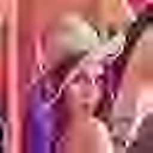
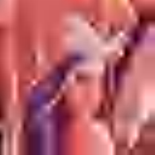
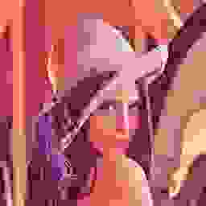
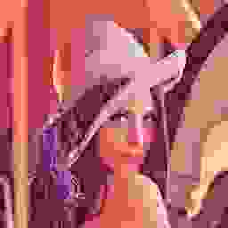
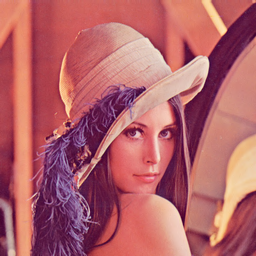

# Small Wavelet Thumbnail & Preview Codec - WTPC

A simple, drop-in image codec in the style of stb_image (single header library).
It targets low sizes from 200 B to 36 KB at resolutions around 256x256, but supports
any image dimensions up to 65536x65536 (practically tested up to ~27K with
images loadable by stb_image).
The main target for thumbnails is 1400 B -- designed to fit within one MTU
packet, so the user sees *something* while the main preview downloads.

It has two modes: fast Huffman and slower EBCOT-lite (much simpler than
JPEG 2000 -- not even Tier-1, since that would need far more code).
Despite its simplicity, WTPC outperforms JPEG 2000 and JPEG XL on this
small-image benchmark, likely because its quantization is tuned to sharpen
at low bitrates and the test dataset is relatively small (~3000 images).

Currently WIP, bitstream format is not yet stable and may change if further quality improvements are found.

**Confirmed to outperform** (by ssimulacra2, 256x256, 200 B - 36 KB):
- JPEG (libjpeg)
- JPEG 2000 (OpenJPEG 2.5.4)
- HTJ2K (openjph 0.26.0, clear win in our range 200 B - 36 KB +1..+24 ssim2, HTJ2K wins only at >62 KB where WTPC hits int16 quality ceiling; encode speed comparable 3-4ms vs WTPC 1-9ms)
- JPEG XL (libjxl 0.11.1)
- AVIF --speed 10 (avifenc 1.3.0; speeds 0/6 partially win but encoding is 8-370x slower)
- WebP (libwebp 1.5.0, clear win across all sizes +2..+15 ssim2, similar encode speed 1-9ms vs WebP 6-9ms)
- WebP 2 (libwebp2 0.0.1, partial: WTPC wins at <=2.6 KB and 36 KB, WebP2 wins at 2.9-21 KB but encoding is 4-10x slower)
- HEIF (libheif 1.21.2 / x265 4.1, partial: WTPC wins at <=3 KB and >=15 KB, HEIF wins at 3-15 KB but encoding is 3-5x slower and quality plateaus at ~91.8 ssim2)
- BPG 0.9.8 x265 (libbpg 0.9.8 / x265 4.1, partial: WTPC wins at <526 B (BPG minimum) and >=21 KB, BPG wins at 0.5-21 KB by +2..+12 ssim2 but encoding is 3-5x slower; quality plateaus at ~93 ssim2 vs WTPC 95)
- BPG 0.9.8 JCTVC (libbpg 0.9.8, partial: WTPC wins at <380 B (BPG minimum) and >=21 KB, BPG wins at 0.4-21 KB by +0.7..+12 ssim2 but encoding is 20-50x slower; quality plateaus at ~93 ssim2 vs WTPC 95)
- VC-2 SMPTE 2042-1 (reference encoder 0.1.0.2, Daub97 DD97 wavelets, clear win across all sizes +29..+50 ssim2)
- SPIHT (TiLib 1.0, Daub97 wavelet)
- GFWX 1.2 (Golomb-Rice entropy coder)
- SQZ (5/3 wavelet + WDR, no entropy coding)
- Ako 0.3.0 (CDF 9/7 + Kagari/ANS)
- NHW 0.3.3 (simple wavelet, speed-oriented, only 512x512)

## API and usage

```c
   === API ===

   typedef struct {
       int encoded_bytes;   - output number of bytes
       int result_q;        - resulting quantization factor if target_bytes provided, or same as 'quality' if target_bytes=0
       int search_steps;    - number of iterations to search target bytes quantization 
       int ebcot;           - 1 = ebcot or 0 = huffman mode for best pick if auto huffman_mode used
       int huffman_y_size;  - in bits if not picked static table
       int huffman_u_size;
       int huffman_v_size;
       int huffman_y_table; - 0..NUM_DEF_TABLES-1 - static, NUM_DEF_TABLES - custom written in bitstream
       int huffman_u_table;
       int huffman_v_table;
   } wtpc_enc_info;

   unsigned char *wtpc_encode_mem(const unsigned char *rgb, wtpc_enc_info *info,
       int w, int h, int target_bytes, int quality, int chroma_420,
       int huffman_mode, int huf_extra_ctx, int has_alpha, int stride);
     Encode an RGB/RGBA image in memory. Returns malloc'd WTPC bitstream,
     or NULL on error. Caller must free().
       rgb           : input pixels, h rows of stride bytes each.
                        Each row has w pixels, 3 bytes/pixel (RGB) or 4 (RGBA).
       info          : output struct, filled with encoding details (may be NULL).
       w, h          : image dimensions (>= 1).
       target_bytes  : desired output size in bytes. 0 = use 'quality' instead.
                       When > 0, the encoder does a binary search over the
                       quality range [1..MAX_QUALITY] to hit the target.
       quality       : quantization level 1..MAX_QUALITY (1024). Lower = better
                       quality / larger file. Used only when target_bytes == 0.
       chroma_420    : 0 = 4:4:4 (full chroma), 1 = 4:2:0 (half chroma).
                       4:2:0 saves ~15-30% bytes with minor visual loss.
       huffman_mode  : 0 = auto-pick smaller of ebcot/huffman,
                       1 = huffman, 2 = ebcot.
       huf_extra_ctx : 0 = single Huffman table (faster),
                       1 = two context-switched tables (slightly better).
       has_alpha     : 0 = RGB (3 channels), 1 = RGBA (4 channels).
       stride        : bytes per row (0 = tightly packed = w * pixel_bytes).
                        Allows BMP-like padded data without repacking.

   unsigned char *wtpc_decode_mem(const unsigned char *data, int data_len,
       int *w, int *h, int *out_quality, int *out_comp);
     Decode a WTPC bitstream from memory. Returns malloc'd pixel buffer
     (w*h*3 for RGB, w*h*4 for RGBA). Caller must free().
       data          : input WTPC bitstream bytes.
       data_len      : number of bytes in 'data'.
       w, h          : output image dimensions.
       out_quality   : quality level used for encoding (may be NULL).
       out_comp      : number of color components: 3 = RGB, 4 = RGBA (may be NULL).

   int wtpc_encode_file(const char *out_path, const unsigned char *rgb,
       wtpc_enc_info *info, int w, int h, int target_bytes, int quality,
       int chroma_420, int huffman_mode, int huf_extra_ctx, int has_alpha, int stride);
     Same as wtpc_encode_mem but writes directly to a file.
     Returns 0 on success, -1 on error.

   unsigned char *wtpc_decode_file(const char *in_path,
       int *w, int *h, int *out_quality, int *out_comp);
     Same as wtpc_decode_mem but reads from a file.

   === Build-time options ===
     #define WTPC_NO_STDIO        : exclude file I/O functions.
     #define DEBUG_WAVELET        : dump wavelet coefficient images (needs stb).
     #define STANDARD_CDF97       : enable standard CDF 9/7 K-scaling.
     #define BAC_USE_TABLE        : use 64 KB reciprocal lookup table for
                                    BAC division (~+1-3% speed, 64 KB memory).
                                    Default: 64-bit integer division.
     #define WTPC_TUNE_PARAMS     : mutable quantization tables for grid-search tuning.
     #define WTPC_TUNE_CTX        : tune ebcot contexts
     #define WTPC_NO_SIMD         : do not use sse/avx/neon intrinsics.
     #define WTPC_RC_ONLY_LESS_THAN_TARGET : rate control never overshoots
                                    target_bytes (picks the largest size <= target
                                    instead of the closest). Implied by
                                    WTPC_TUNE_PARAMS.
```

You can retrain quantization parameters and Huffman tables on your own
dataset. Enable `WTPC_TUNE_PARAMS`, set param ranges in `param_cfg`, and
run tuning (`wtpc -T`) and/or Huffman table generation (`wtpc -G`).
But note that format become incompatible with WTPC release version.

## Benchmark: WTPC vs JPEG vs JPEG 2000 vs JPEG XL

**Test image:** `lena256.png` (256x256, 24-bit RGB)  
**Target range:** 200 B -- 36 KB  
**Metrics:** PSNR (dB, higher is better), ssimulacra2 (higher is better)  
**Full results:** [results.md](results.md)

### Best Codec by Target Size (by PSNR)

| Target | Best Codec         | Size   | PSNR   | ssimulacra2 |
|--------|--------------------|--------|--------|-------------|
| 200 B | WTPC 4:4:4 EBCOT | 203 B | 19.44 | -60.18 |
| 400 B | WTPC 4:2:0 EBCOT | 402 B | 21.88 | -40.39 |
| 600 B | WTPC 4:4:4 EBCOT | 604 B | 23.20 | -21.18 |
| 800 B | WTPC 4:2:0 EBCOT | 798 B | 23.96 | -8.75 |
| 1 KB | WTPC 4:4:4 EBCOT | 1404 B | 25.94 | 19.76 |
| 2 KB | WTPC 4:4:4 EBCOT | 2009 B | 27.17 | 34.57 |
| 3 KB | WTPC 4:4:4 EBCOT | 3007 B | 28.51 | 49.79 |
| 4 KB | WTPC 4:4:4 EBCOT | 4014 B | 29.61 | 58.18 |
| 5 KB | WTPC 4:4:4 EBCOT | 5006 B | 30.59 | 64.84 |
| 6 KB | WTPC 4:4:4 EBCOT | 5996 B | 31.51 | 69.34 |
| 8 KB | WTPC 4:4:4 EBCOT | 8027 B | 33.13 | 75.45 |
| 10 KB | WTPC 4:4:4 EBCOT | 9987 B | 34.40 | 79.77 |
| 13 KB | WTPC 4:4:4 EBCOT | 13009 B | 35.94 | 84.12 |
| 15 KB | WTPC 4:4:4 EBCOT | 15010 B | 36.73 | 86.05 |
| 18 KB | WTPC 4:4:4 EBCOT | 17999 B | 37.80 | 88.40 |
| 22 KB | WTPC 4:4:4 EBCOT | 21964 B | 39.07 | 90.42 |
| 28 KB | WTPC 4:4:4 EBCOT | 27973 B | 40.75 | 92.38 |
| 36 KB | WTPC 4:4:4 EBCOT | 36029 B | 42.59 | 93.91 |

### Speed Summary (lena 256x256, representative q=244)

| Codec               | Encode (ms) | Decode (ms) |
|---------------------|-------------|-------------|
| WTPC EBCOT 4:4:4 | 8 | 7 |
| WTPC Huffman 4:4:4 | 3 | 1 |
| WTPC EBCOT 4:2:0 | 5 | 5 |
| WTPC Huffman 4:2:0 | 2 | 1 |
| JPEG 2000 | 16 | 5 |
| JPEG XL | 103 | 4 |
| JPEG | 4 | 3 |

See [results.md](results.md) for the complete per-size breakdown, speed
measurements across all quality levels, mermaid charts, and raw data.

### Visual Comparison (lena 256x256)

Click any image to view full size.

**1.4 KB** -- thumbnail target (worst quality)

| WTPC EBCOT | WTPC Huffman | JPEG 2000 | JPEG XL | JPEG |
|:----------:|:------------:|:---------:|:-------:|:----:|
|  |  |  |  |  |

**6 KB** -- preview (mid quality)

| WTPC EBCOT | WTPC Huffman | JPEG 2000 | JPEG XL | JPEG |
|:----------:|:------------:|:---------:|:-------:|:----:|
|  |  |  |  |  |

**13 KB** -- good quality

| WTPC EBCOT | WTPC Huffman | JPEG 2000 | JPEG XL | JPEG |
|:----------:|:------------:|:---------:|:-------:|:----:|
|  |  |  |  |  |

**36 KB** -- best quality

| WTPC EBCOT | WTPC Huffman | JPEG 2000 | JPEG XL | JPEG |
|:----------:|:------------:|:---------:|:-------:|:----:|
|  |  |  |  |  |

**200 B -- 1.2 KB** -- ultra-low bitrates (JPEG XL cannot reach this range)

| Size | WTPC EBCOT | JPEG 2000 | JPEG |
|:----:|:----------:|:---------:|:----:|
| 200 B |  |  | - |
| 400 B |  |  | - |
| 600 B |  |  | - |
| 800 B |  |  | - |
| 1000 B |  |  |  |
| 1200 B |  |  |  |

**AVIF --speed 6 vs WTPC (best ssim2)** -- mid-speed AVIF vs best WTPC at equal file sizes

| Size | AVIF (--speed 6) | WTPC (best by ssim2) |
|:----:|:----------------:|:--------------------:|
| ~726 B |  |  |
| 1 KB |  |  |
| 1.4 KB |  |  |
| 2 KB |  |  |
| 4 KB |  |  |
| 16 KB |  |  |
| 36 KB |  |  |

## Interesting Links

 * https://github.com/nothings/stb
 * https://github.com/kalcutter/gfwx
 * https://github.com/Themaister/pyrowave
 * https://github.com/MarcioPais/SQZ
 * https://github.com/josejuansanchez/bgp-image-format
 * https://bellard.org/bpg/
 * https://github.com/LMP88959/Digital-Subband-Video-2
 * https://github.com/curioustorvald/TAV-video-codec
 * https://github.com/datocms/fast_thumbhash
 * https://github.com/gopro/cineform-sdk
 * https://github.com/emericg/libcineform
 * https://github.com/bbc/vc2-reference
 * https://github.com/rcanut/nhwcodec
 * https://github.com/baAlex/Ako
 * https://github.com/Special-graphic-formats/tilib
 * https://themaister.net/blog/2025/06/16/i-designed-my-own-ridiculously-fast-game-streaming-video-codec-pyrowave/

## Image Datasets

 * https://github.com/imazen/codec-corpus
 * https://github.com/castano/image-datasets
 * https://jpegai.github.io/test_images/
 * https://github.com/EliSchwartz/imagenet-sample-images
 * https://cloudinary.com/labs/cid22
 * https://www.imageprocessingplace.com/root_files_V3/image_databases.htm
 * https://samplelib.com/sample-png.html
 * https://www.stickpng.com/
