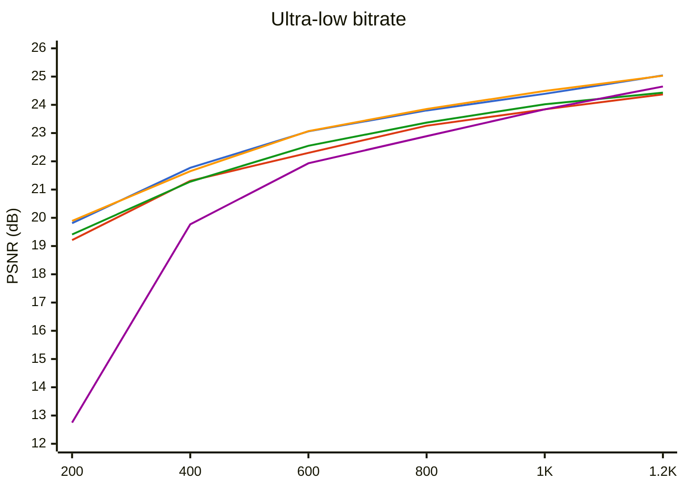
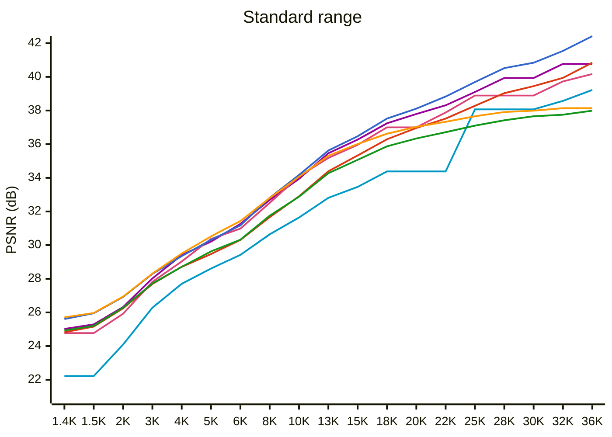

# WTPC vs JPEG vs JPEG2000 vs JPEGXL - Benchmark

**Test image:** `lena256.png` (256x256, 24-bit RGB)  
**Target range:** 200 B - 36 KB (thumbnails / previews)  
**Metrics:** PSNR (dB, higher is better), ssimulacra2 (0-100, lower is better)  
**Date:** 2026-07-14

## PSNR vs File Size

### Ultra-low range (200 B - 1.2 KB)

🔵 WTPC EBC  🔴 WTPC Huff  🟠 W420 EBC  🟢 W420 Huff  🟣 JPEG2000

### Standard range (1.4 KB - 36 KB)

🔹 JPEG  🟣 JPEG2000  💗 JPEGXL  🔵 WTPC EBC  🔴 WTPC Huff  🟠 W420 EBC  🟢 W420 Huff

## Comparison by Size Steps

Each row: closest entry from each codec to the target size. Best per metric is **bold**.

| Step | E_4 B | H_4 B | E_2 B | H_2 B | JP2K B | JPXL B | JPEG B | E_4 PSNR | H_4 PSNR | E_2 PSNR | H_2 PSNR | JP2K PSNR | JPXL PSNR | JPEG PSNR | E_4 Ssim2 | H_4 Ssim2 | E_2 Ssim2 | H_2 Ssim2 | JP2K Ssim2 | JPXL Ssim2 | JPEG Ssim2 | E_4 Q | H_4 Q | E_2 Q | H_2 Q | JP2K Q | JPXL Q | JPEG Q |
|------|------|------|------|------|------|------|------|------|------|------|------|------|------|------|------|------|------|------|------|------|------|------|------|------|------|------|------|------|
| ~200 | 200 | 200 | **200** | 201 | 244 | - | - | 19.81 | 19.21 | **19.89** | 19.41 | 12.75 | - | - | -61.38 | -62.86 | **-60.91** | -62.68 | -541.07 | - | - | 768 | 841 | 750 | 841 | 1000 | - | - |
| ~400 | **400** | 399 | 399 | 401 | 403 | - | - | **21.77** | 21.31 | 21.65 | 21.28 | 19.77 | - | - | **-42.93** | -48.47 | -43.78 | -48.30 | -64.20 | - | - | 422 | 480 | 417 | 475 | 500 | - | - |
| ~600 | 601 | 600 | **599** | 599 | 617 | - | - | 23.06 | 22.30 | **23.07** | 22.55 | 21.93 | - | - | -28.19 | -34.15 | **-27.50** | -31.93 | -49.95 | - | - | 297 | 338 | 296 | 336 | 320 | - | - |
| ~800 | 799 | 801 | **803** | 801 | 784 | - | 1097 | 23.80 | 23.26 | **23.85** | 23.37 | 22.89 | - | 20.59 | -12.09 | -19.47 | **-11.55** | -19.61 | -36.79 | - | -55.87 | 237 | 271 | 235 | 270 | 256 | - | 1 |
| ~1000 | 1000 | 998 | 1002 | 1001 | 1026 | **1418** | 1097 | 24.39 | 23.84 | 24.49 | 24.02 | 23.84 | **24.77** | 20.59 | -3.27 | -10.85 | **-2.54** | -9.66 | -21.48 | -7.86 | -55.87 | 202 | 227 | 200 | 226 | 192 | min | 1 |
| ~1200 | **1200** | 1197 | 1200 | 1199 | 1257 | 1418 | 1230 | **25.04** | 24.37 | 25.03 | 24.43 | 24.65 | 24.77 | 20.93 | **8.14** | -3.42 | 8.03 | -3.25 | -9.72 | -7.86 | -53.76 | 179 | 203 | 178 | 203 | 156 | min | 3 |
| ~1400 | 1398 | 1400 | **1400** | 1396 | 1392 | 1418 | 1467 | 25.61 | 24.82 | **25.71** | 24.93 | 25.02 | 24.77 | 22.22 | 14.61 | 5.66 | **15.15** | 6.68 | -3.29 | -7.86 | -40.85 | 161 | 183 | 159 | 183 | 140 | min | 4 |
| ~1500 | 1503 | 1500 | **1504** | 1504 | 1485 | 1418 | 1467 | 25.95 | 25.16 | **25.97** | 25.20 | 25.29 | 24.77 | 22.22 | 19.05 | 9.60 | **19.52** | 9.63 | -0.66 | -7.86 | -40.85 | 153 | 175 | 152 | 174 | 132 | min | 4 |
| ~2000 | 2006 | 1995 | **1992** | 2000 | 1976 | 1955 | 1973 | 26.92 | 26.24 | **26.94** | 26.28 | 26.32 | 25.92 | 24.09 | 31.16 | 23.42 | **31.53** | 23.60 | 13.28 | 15.03 | -10.66 | 128 | 145 | 128 | 144 | 100 | 18 | 6 |
| ~3000 | 2996 | 3012 | **2986** | 2982 | 3076 | 2849 | 3017 | 28.29 | 27.69 | **28.31** | 27.72 | 28.02 | 27.82 | 26.28 | **48.02** | 41.48 | 47.61 | 42.06 | 30.03 | 38.84 | 23.77 | 103 | 113 | 103 | 113 | 64 | 11 | 11 |
| ~4000 | 3953 | 4010 | **4043** | 3965 | 4111 | 3825 | 4040 | 29.35 | 28.71 | **29.50** | 28.71 | 29.41 | 29.03 | 27.70 | 56.43 | 52.10 | **56.94** | 51.96 | 45.18 | 49.99 | 42.32 | 92 | 98 | 91 | 98 | 48 | 8 | 17 |
| ~5000 | 4907 | 4946 | **5070** | 5070 | 4888 | 5077 | 4971 | 30.31 | 29.47 | **30.52** | 29.63 | 30.21 | 30.37 | 28.61 | 62.64 | 57.20 | **63.86** | 57.89 | 50.01 | 60.63 | 51.47 | 86 | 91 | 85 | 90 | 40 | 5.5 | 23 |
| ~6000 | 5870 | 6019 | **6115** | 5948 | 6096 | 5862 | 6041 | 31.17 | 30.31 | **31.43** | 30.32 | 31.26 | 30.98 | 29.42 | 68.30 | 62.64 | **68.64** | 62.66 | 56.32 | 63.45 | 59.06 | 82 | 86 | 81 | 86 | 32 | 4.5 | 31 |
| ~8000 | **7947** | 7964 | 7945 | 8042 | 7835 | 7770 | 7941 | **32.81** | 31.66 | 32.80 | 31.75 | 32.69 | 32.51 | 30.64 | 74.35 | 69.68 | **74.59** | 70.14 | 65.07 | 72.67 | 67.22 | 61 | 77 | 60 | 75 | 25 | 3 | 48 |
| ~10000 | **10079** | 10002 | 10074 | 9960 | 9828 | 10403 | 9979 | **34.17** | 32.90 | 34.06 | 32.88 | 33.94 | 34.09 | 31.64 | 79.09 | 74.84 | 78.99 | 75.00 | 69.66 | **79.58** | 72.24 | 47 | 60 | 46 | 59 | 20 | 2 | 65 |
| ~13000 | **12895** | 12929 | 12990 | 12920 | 13123 | 12774 | 13076 | **35.62** | 34.39 | 35.31 | 34.27 | 35.46 | 35.18 | 32.81 | **83.51** | 80.30 | 83.16 | 79.80 | 75.46 | 83.30 | 77.28 | 36 | 45 | 35 | 44 | 15 | 1.5 | 78 |
| ~15000 | **14996** | 15063 | 15104 | 15096 | 15120 | 15000 | 15179 | **36.47** | 35.33 | 36.01 | 35.07 | 36.27 | 35.96 | 33.46 | **85.59** | 82.66 | 84.93 | 82.39 | 79.05 | 85.44 | 79.70 | 31 | 38 | 29 | 37 | 13 | 1.2 | 83 |
| ~18000 | **18021** | 17777 | 17813 | 17861 | 17843 | 18160 | 18218 | **37.52** | 36.29 | 36.62 | 35.87 | 37.24 | 37.00 | 34.38 | 88.01 | 85.09 | 86.96 | 84.66 | 81.47 | **88.22** | 82.54 | 21 | 32 | 20 | 31 | 11 | 0.9 | 88 |
| ~20000 | **19849** | 19956 | 19971 | 20034 | 19642 | 18160 | 18218 | **38.11** | 36.96 | 37.03 | 36.34 | 37.79 | 37.00 | 34.38 | **89.19** | 86.78 | 87.90 | 86.23 | 82.04 | 88.22 | 82.54 | 17 | 26 | 15 | 24 | 10 | 0.9 | 88 |
| ~22000 | **22139** | 22002 | 22220 | 22108 | 21545 | 21926 | 18218 | **38.83** | 37.52 | 37.33 | 36.71 | 38.31 | 37.88 | 34.38 | **90.28** | 88.01 | 88.65 | 86.95 | 83.29 | 89.95 | 82.54 | 13 | 21 | 11 | 19 | 9 | 0.7 | 88 |
| ~25000 | **25213** | 24866 | 25209 | 24764 | 24533 | 27977 | 29845 | **39.69** | 38.28 | 37.66 | 37.10 | 39.10 | 38.89 | 38.07 | 91.18 | 89.37 | 89.32 | 88.27 | 85.62 | **91.76** | 89.45 | 9 | 16 | 7 | 14 | 8 | 0.5 | 92 |
| ~28000 | **28339** | 27885 | 28272 | 27652 | 28103 | 27977 | 29845 | **40.52** | 39.03 | 37.91 | 37.42 | 39.93 | 38.89 | 38.07 | **92.13** | 90.43 | 89.90 | 88.60 | 87.31 | 91.76 | 89.45 | 6 | 12 | 4 | 10 | 7 | 0.5 | 92 |
| ~30000 | **29626** | 29737 | 29524 | 30372 | 28103 | 27977 | 29845 | **40.84** | 39.45 | 37.99 | 37.66 | 39.93 | 38.89 | 38.07 | **92.45** | 90.96 | 90.09 | 89.32 | 87.31 | 91.76 | 89.45 | 5 | 10 | 3 | 7 | 7 | 0.5 | 92 |
| ~32000 | **32722** | 31906 | 32552 | 31469 | 32739 | 32361 | 32379 | **41.54** | 39.94 | 38.14 | 37.75 | 40.77 | 39.73 | 38.57 | **93.03** | 91.47 | 90.33 | 89.46 | 88.02 | 92.87 | 90.56 | 3 | 8 | 1 | 6 | 6 | 0.4 | 93 |
| ~36000 | **36735** | 36075 | 32552 | 35500 | 32739 | 35191 | 35656 | **42.42** | 40.84 | 38.14 | 37.99 | 40.77 | 40.17 | 39.22 | **93.81** | 92.45 | 90.33 | 90.09 | 88.02 | 93.15 | 91.43 | 1 | 5 | 1 | 3 | 6 | 0.35 | 94 |

> At each step, the codec with the best PSNR / ssimulacra2 (both higher=better) wins. Empty cells mean no data within +-50% of the target size.

## Best Codec at Each Target Size (by PSNR)

| Target (B) | Best Codec | Setting | Actual Size | PSNR (dB) | ssimulacra2 |
|------------|------------|---------|-------------|-----------|-------------|
| 200 | W420 EBC | 750 | 200 | 19.89 | -60.91 |
| 400 | WTPC EBC | 422 | 400 | 21.77 | -42.93 |
| 600 | W420 EBC | 296 | 599 | 23.07 | -27.50 |
| 800 | W420 EBC | 235 | 803 | 23.85 | -11.55 |
| 1000 | W420 EBC | 200 | 1002 | 24.49 | -2.54 |
| 1400 | W420 EBC | 159 | 1400 | 25.71 | 15.15 |
| 2000 | W420 EBC | 128 | 1992 | 26.94 | 31.53 |
| 3000 | W420 EBC | 103 | 2986 | 28.31 | 47.61 |
| 4000 | W420 EBC | 91 | 4043 | 29.50 | 56.94 |
| 5000 | W420 EBC | 85 | 5070 | 30.52 | 63.86 |
| 6000 | W420 EBC | 81 | 6115 | 31.43 | 68.64 |
| 8000 | WTPC EBC | 61 | 7947 | 32.81 | 74.35 |
| 10000 | WTPC EBC | 47 | 10079 | 34.17 | 79.09 |
| 13000 | WTPC EBC | 36 | 12895 | 35.62 | 83.51 |
| 15000 | WTPC EBC | 31 | 14996 | 36.47 | 85.59 |
| 18000 | WTPC EBC | 21 | 18021 | 37.52 | 88.01 |
| 20000 | WTPC EBC | 17 | 19849 | 38.11 | 89.19 |
| 22000 | WTPC EBC | 13 | 22139 | 38.83 | 90.28 |
| 25000 | WTPC EBC | 9 | 25213 | 39.69 | 91.18 |
| 28000 | WTPC EBC | 6 | 28339 | 40.52 | 92.13 |
| 30000 | WTPC EBC | 5 | 29626 | 40.84 | 92.45 |
| 32000 | WTPC EBC | 3 | 32722 | 41.54 | 93.03 |
| 36000 | WTPC EBC | 1 | 36735 | 42.42 | 93.81 |

## Best Codec at Each Target Size (by ssimulacra2)

| Target (B) | Best Codec | Setting | Actual Size | PSNR (dB) | ssimulacra2 |
|------------|------------|---------|-------------|-----------|-------------|
| 200 | W420 EBC | 750 | 200 | 19.89 | -60.91 |
| 400 | WTPC EBC | 422 | 400 | 21.77 | -42.93 |
| 600 | W420 EBC | 296 | 599 | 23.07 | -27.50 |
| 800 | W420 EBC | 235 | 803 | 23.85 | -11.55 |
| 1000 | W420 EBC | 200 | 1002 | 24.49 | -2.54 |
| 1400 | W420 EBC | 159 | 1400 | 25.71 | 15.15 |
| 2000 | W420 EBC | 128 | 1992 | 26.94 | 31.53 |
| 3000 | WTPC EBC | 103 | 2996 | 28.29 | 48.02 |
| 4000 | W420 EBC | 91 | 4043 | 29.50 | 56.94 |
| 5000 | W420 EBC | 85 | 5070 | 30.52 | 63.86 |
| 6000 | W420 EBC | 81 | 6115 | 31.43 | 68.64 |
| 8000 | W420 EBC | 60 | 7945 | 32.80 | 74.59 |
| 10000 | JPEG XL | 2 | 10403 | 34.09 | 79.58 |
| 13000 | WTPC EBC | 36 | 12895 | 35.62 | 83.51 |
| 15000 | WTPC EBC | 31 | 14996 | 36.47 | 85.59 |
| 18000 | JPEG XL | 0.9 | 18160 | 37.00 | 88.22 |
| 20000 | WTPC EBC | 17 | 19849 | 38.11 | 89.19 |
| 22000 | WTPC EBC | 13 | 22139 | 38.83 | 90.28 |
| 25000 | JPEG XL | 0.5 | 27977 | 38.89 | 91.76 |
| 28000 | WTPC EBC | 6 | 28339 | 40.52 | 92.13 |
| 30000 | WTPC EBC | 5 | 29626 | 40.84 | 92.45 |
| 32000 | WTPC EBC | 3 | 32722 | 41.54 | 93.03 |
| 36000 | WTPC EBC | 1 | 36735 | 42.42 | 93.81 |
## Encode / Decode Speed (ms)

| Step | E_4 enc | E_4 dec | H_4 enc | H_4 dec | E_2 enc | E_2 dec | H_2 enc | H_2 dec | JP2K enc | JP2K dec | JXL enc | JXL dec | JPEG enc |
|------|---------|---------|---------|---------|---------|---------|---------|---------|----------|----------|----------|----------|----------|
| ~200 | 12.3 | 3.4 | 6.7 | 2.1 | 11.0 | 2.2 | 3.4 | 1.5 | 16.0 | 4.0 | - | - | - |
| ~400 | 17.6 | 3.8 | 4.6 | 2.1 | 10.3 | 2.5 | 3.1 | 1.5 | 16.0 | 4.0 | - | - | - |
| ~600 | 20.3 | 4.2 | 5.5 | 2.1 | 10.5 | 2.8 | 3.2 | 1.6 | 16.0 | 4.0 | - | - | - |
| ~800 | 16.5 | 4.4 | 6.1 | 2.1 | 12.6 | 2.8 | 3.0 | 1.5 | 16.0 | 4.0 | - | - | 4.0 |
| ~1000 | 17.0 | 4.4 | 5.0 | 2.1 | 10.2 | 2.9 | 3.1 | 1.5 | 16.0 | 4.0 | 104.0 | 4.0 | 4.0 |
| ~1200 | 21.7 | 4.8 | 5.7 | 2.2 | 11.1 | 3.1 | 3.3 | 1.5 | 16.0 | 4.0 | 104.0 | 4.0 | 4.0 |
| ~1400 | 19.0 | 4.9 | 6.0 | 2.1 | 11.3 | 3.2 | 3.4 | 1.5 | 16.0 | 4.0 | 104.0 | 4.0 | 4.0 |
| ~1500 | 20.2 | 5.1 | 5.2 | 2.1 | 11.6 | 3.2 | 3.1 | 1.6 | 16.0 | 4.0 | 104.0 | 4.0 | 4.0 |
| ~2000 | 20.8 | 5.1 | 6.5 | 2.2 | 14.6 | 3.3 | 3.4 | 1.5 | 16.0 | 4.0 | 11.0 | 4.0 | 4.0 |
| ~3000 | 28.4 | 5.8 | 6.8 | 2.1 | 16.8 | 3.7 | 4.4 | 1.6 | 16.0 | 4.0 | 11.0 | 5.0 | 4.0 |
| ~4000 | 31.6 | 6.3 | 8.2 | 2.2 | 22.2 | 4.3 | 5.6 | 1.6 | 16.0 | 4.0 | 12.0 | 4.0 | 4.0 |
| ~5000 | 35.0 | 6.7 | 7.9 | 2.2 | 23.8 | 4.5 | 6.2 | 1.6 | 16.0 | 5.0 | 12.0 | 5.0 | 5.0 |
| ~6000 | 41.4 | 6.8 | 6.3 | 2.2 | 22.7 | 4.7 | 4.3 | 1.6 | 16.0 | 5.0 | 14.0 | 4.0 | 4.0 |
| ~8000 | 27.6 | 7.7 | 9.0 | 2.2 | 17.4 | 5.0 | 6.9 | 1.6 | 16.0 | 5.0 | 12.0 | 4.0 | 5.0 |
| ~10000 | 29.7 | 8.0 | 10.4 | 2.3 | 19.5 | 5.7 | 8.1 | 1.7 | 16.0 | 5.0 | 13.0 | 4.0 | 4.0 |
| ~13000 | 33.8 | 8.9 | 12.0 | 2.4 | 21.9 | 6.0 | 9.8 | 1.8 | 16.0 | 5.0 | 11.0 | 4.0 | 4.0 |
| ~15000 | 50.1 | 9.4 | 13.2 | 2.4 | 27.7 | 6.3 | 11.0 | 1.8 | 16.0 | 6.0 | 11.0 | 4.0 | 5.0 |
| ~18000 | 37.2 | 10.0 | 14.9 | 2.4 | 30.0 | 6.8 | 12.5 | 1.8 | 16.0 | 6.0 | 12.0 | 4.0 | 5.0 |
| ~20000 | 38.7 | 10.2 | 15.7 | 2.4 | 25.4 | 7.2 | 13.7 | 1.9 | 16.0 | 6.0 | 12.0 | 4.0 | 5.0 |
| ~22000 | 30.8 | 10.6 | 16.8 | 2.5 | 20.4 | 7.4 | 14.7 | 1.9 | 16.0 | 6.0 | 11.0 | 4.0 | 5.0 |
| ~25000 | 32.0 | 11.1 | 18.7 | 2.6 | 21.5 | 7.7 | 16.2 | 1.9 | 16.0 | 6.0 | 9.0 | 4.0 | 5.0 |
| ~28000 | 33.5 | 11.5 | 20.4 | 2.5 | 21.8 | 8.1 | 17.5 | 2.0 | 16.0 | 7.0 | 9.0 | 4.0 | 5.0 |
| ~30000 | 42.9 | 11.6 | 21.1 | 2.6 | 22.4 | 8.3 | 15.5 | 2.0 | 16.0 | 7.0 | 9.0 | 4.0 | 5.0 |
| ~32000 | 43.8 | 12.0 | 18.4 | 2.6 | 29.9 | 8.7 | 12.9 | 2.0 | 16.0 | 7.0 | 10.0 | 4.0 | 5.0 |
| ~36000 | 45.2 | 12.5 | 12.8 | 2.7 | 29.9 | 8.7 | 10.4 | 2.1 | 16.0 | 7.0 | 10.0 | 4.0 | 5.0 |

> WTPC encode timings above include a binary quality search to hit the exact target size (-b mode). Other codecs use pre-calibrated parameters. At fixed quality, see below.

## WTPC Speed by Quality Level (ms, fixed q)

| q | WTPC_E enc | WTPC_E dec | WTPC_H enc | WTPC_H dec | W420_E enc | W420_E dec | W420_H enc | W420_H dec |
|----|---------|---------|---------|---------|---------|---------|---------|---------|
| 400 | 3.5 | 3.9 | 2.0 | 2.1 | 2.0 | 2.5 | 1.1 | 1.5 |
| 200 | 4.1 | 4.5 | 2.0 | 2.1 | 2.4 | 2.9 | 1.2 | 1.5 |
| 100 | 5.9 | 5.9 | 2.3 | 2.2 | 3.3 | 3.7 | 1.5 | 1.6 |
| 50 | 7.8 | 7.9 | 3.0 | 2.3 | 4.9 | 5.2 | 2.0 | 1.7 |
| 20 | 9.9 | 10.0 | 3.7 | 2.5 | 6.4 | 6.6 | 2.9 | 1.9 |
| 8 | 11.1 | 11.2 | 4.6 | 2.6 | 7.2 | 7.5 | 3.5 | 2.0 |
| 3 | 12.1 | 12.0 | 5.3 | 2.8 | 7.9 | 8.3 | 4.0 | 2.1 |

> Encode at fixed q (no binary search). File sizes: ~3->400 q.

---

*Tools: ImageMagick 7.1.2, OpenJPEG 2.5.4, libjxl 0.11.1. Date: 2026-07-14.*
