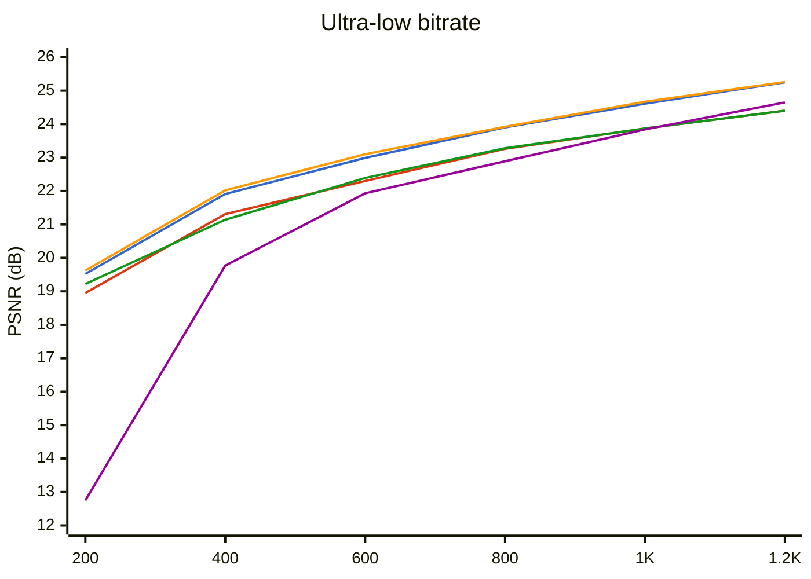
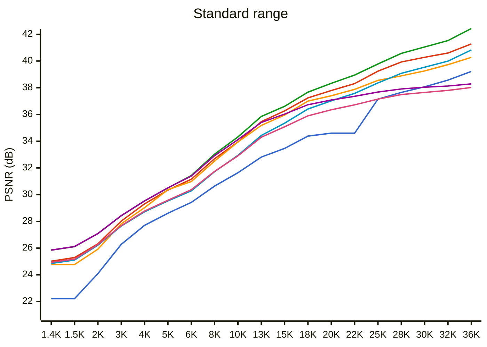

# WTPC vs JPEG vs JPEG2000 vs JPEGXL - Benchmark

**Test image:** `lena256.png` (256x256, 24-bit RGB)  
**Target range:** 200 B - 36 KB (thumbnails / previews)  
**Metrics:** PSNR (dB, higher is better), ssimulacra2 (0-100, higher is better)
**Date:** 2026-07-22

## PSNR vs File Size

### Ultra-low range (200 B - 1.2 KB)

🔵 WTPC EBC  🔴 WTPC Huff  🟠 W420 EBC  🟢 W420 Huff  🟣 JPEG2000

### Standard range (1.4 KB - 36 KB)

🔵 WTPC EBC  🔴 WTPC Huff  🟠 W420 EBC  🟢 W420 Huff  🔹 JPEG  🟣 JPEG2000  💗 JPEGXL

## Comparison by Size Steps

Each row: closest entry from each codec to the target size. Best per metric is **bold**.

| Step | E_4 B | H_4 B | E_2 B | H_2 B | JP2K B | JPXL B | JPEG B | E_4 PSNR | H_4 PSNR | E_2 PSNR | H_2 PSNR | JP2K PSNR | JPXL PSNR | JPEG PSNR | E_4 Ssim2 | H_4 Ssim2 | E_2 Ssim2 | H_2 Ssim2 | JP2K Ssim2 | JPXL Ssim2 | JPEG Ssim2 | E_4 Q | H_4 Q | E_2 Q | H_2 Q | JP2K Q | JPXL Q | JPEG Q |
|------|------|------|------|------|------|------|------|------|------|------|------|------|------|------|------|------|------|------|------|------|------|------|------|------|------|------|------|------|
| ~200 | 205 | 198 | **201** | 200 | 244 | - | - | 19.52 | 18.95 | **19.62** | 19.22 | 12.75 | - | - | -61.06 | -63.05 | **-60.88** | -62.77 | -541.07 | - | - | 896 | 921 | 899 | 922 | 1000 | - | - |
| ~400 | 400 | 402 | **401** | 404 | 403 | - | - | 21.91 | 21.31 | **22.02** | 21.14 | 19.77 | - | - | -40.78 | -49.02 | **-40.36** | -48.22 | -64.20 | - | - | 814 | 844 | 815 | 842 | 500 | - | - |
| ~600 | 607 | 605 | **600** | 600 | 617 | - | - | 22.99 | 22.30 | **23.10** | 22.39 | 21.93 | - | - | **-23.07** | -34.74 | -24.06 | -34.91 | -49.95 | - | - | 764 | 792 | 766 | 792 | 320 | - | - |
| ~800 | 803 | 804 | **806** | 797 | 784 | - | 1097 | 23.90 | 23.26 | **23.92** | 23.28 | 22.89 | - | 20.59 | -10.37 | -19.19 | **-9.82** | -20.00 | -36.79 | - | -55.87 | 726 | 757 | 726 | 757 | 256 | - | 1 |
| ~1000 | 1003 | 1000 | 1001 | 1001 | 1026 | **1418** | 1097 | 24.61 | 23.87 | 24.67 | 23.87 | 23.84 | **24.77** | 20.59 | 1.26 | -10.96 | **1.71** | -9.86 | -21.48 | -7.86 | -55.87 | 697 | 728 | 698 | 727 | 192 | min | 1 |
| ~1200 | 1206 | 1200 | **1205** | 1199 | 1257 | 1418 | 1230 | 25.25 | 24.40 | **25.26** | 24.40 | 24.65 | 24.77 | 20.93 | 11.00 | -3.16 | **11.03** | -2.41 | -9.72 | -7.86 | -53.76 | 675 | 707 | 676 | 707 | 156 | min | 3 |
| ~1400 | 1403 | 1395 | **1406** | 1398 | 1392 | 1418 | 1467 | 25.85 | 24.85 | **25.85** | 24.94 | 25.02 | 24.77 | 22.22 | **18.47** | 5.65 | 18.31 | 6.77 | -3.29 | -7.86 | -40.85 | 652 | 688 | 653 | 688 | 140 | min | 4 |
| ~1500 | 1500 | 1507 | **1500** | 1505 | 1485 | 1418 | 1467 | 26.11 | 25.11 | **26.12** | 25.17 | 25.29 | 24.77 | 22.22 | **21.80** | 9.75 | 21.10 | 10.11 | -0.66 | -7.86 | -40.85 | 643 | 679 | 644 | 679 | 132 | min | 4 |
| ~2000 | **2002** | 2001 | 1994 | 2008 | 1976 | 1955 | 1973 | **27.09** | 26.22 | 27.09 | 26.27 | 26.32 | 25.92 | 24.09 | **33.86** | 22.73 | 33.70 | 23.62 | 13.28 | 15.03 | -10.66 | 602 | 639 | 603 | 638 | 100 | 18 | 6 |
| ~3000 | 3001 | 3003 | **3008** | 3006 | 3076 | 2849 | 3017 | 28.42 | 27.65 | **28.43** | 27.68 | 28.02 | 27.82 | 26.28 | 49.47 | 41.02 | **49.49** | 42.42 | 30.03 | 38.84 | 23.77 | 539 | 575 | 540 | 574 | 64 | 11 | 11 |
| ~4000 | **4002** | 4005 | 4010 | 3991 | 4016 | 3825 | 4040 | **29.53** | 28.72 | 29.53 | 28.77 | 29.31 | 29.03 | 27.70 | **57.75** | 52.11 | 57.65 | 52.14 | 42.82 | 49.99 | 42.32 | 492 | 526 | 492 | 525 | 49 | 8 | 17 |
| ~5000 | 4994 | 4991 | **4996** | 5000 | 5026 | 5077 | 4971 | 30.50 | 29.53 | **30.51** | 29.58 | 30.34 | 30.37 | 28.61 | 64.00 | 57.75 | **64.06** | 57.88 | 50.45 | 60.63 | 51.47 | 457 | 492 | 458 | 490 | 39 | 5.5 | 23 |
| ~6000 | **5990** | 5994 | 5994 | 6008 | 5968 | 5862 | 6041 | **31.43** | 30.28 | 31.39 | 30.37 | 31.15 | 30.98 | 29.42 | **68.88** | 62.13 | 68.67 | 63.24 | 55.09 | 63.45 | 59.06 | 429 | 465 | 429 | 463 | 33 | 4.5 | 31 |
| ~8000 | **8000** | 7983 | 8018 | 7996 | 7835 | 7770 | 7941 | **33.03** | 31.72 | 32.92 | 31.74 | 32.69 | 32.51 | 30.64 | 74.84 | 70.04 | **75.19** | 70.28 | 65.07 | 72.67 | 67.22 | 381 | 420 | 380 | 417 | 25 | 3 | 48 |
| ~10000 | **10014** | 10019 | 10038 | 9993 | 9828 | 10075 | 9979 | **34.32** | 32.94 | 34.12 | 32.90 | 33.94 | 33.94 | 31.64 | **79.55** | 74.71 | 79.09 | 75.00 | 69.66 | 78.92 | 72.24 | 343 | 384 | 342 | 381 | 20 | 2.1 | 65 |
| ~13000 | **13017** | 12980 | 12997 | 13016 | 13123 | 12774 | 13076 | **35.85** | 34.43 | 35.40 | 34.30 | 35.46 | 35.18 | 32.81 | **83.84** | 79.84 | 83.04 | 79.88 | 75.46 | 83.30 | 77.28 | 297 | 340 | 295 | 335 | 15 | 1.5 | 78 |
| ~15000 | **15002** | 15008 | 15033 | 15039 | 15120 | 15000 | 15179 | **36.61** | 35.35 | 36.03 | 35.08 | 36.27 | 35.96 | 33.46 | **85.84** | 82.44 | 85.08 | 82.26 | 79.05 | 85.44 | 79.70 | 272 | 313 | 268 | 308 | 13 | 1.2 | 83 |
| ~18000 | **17985** | 18023 | 18034 | 17989 | 17843 | 18160 | 18218 | **37.67** | 36.41 | 36.73 | 35.90 | 37.24 | 37.00 | 34.38 | **88.32** | 85.05 | 86.91 | 84.66 | 81.47 | 88.22 | 82.54 | 237 | 279 | 231 | 274 | 11 | 0.9 | 88 |
| ~20000 | **20050** | 20017 | 20012 | 20028 | 19642 | 19898 | 18941 | **38.33** | 37.02 | 37.08 | 36.35 | 37.79 | 37.40 | 34.60 | **89.64** | 86.87 | 88.05 | 85.97 | 82.04 | 89.14 | 83.30 | 217 | 259 | 210 | 252 | 10 | 0.8 | 89 |
| ~22000 | **22061** | 22053 | 22054 | 22061 | 21545 | 21926 | 18941 | **38.95** | 37.58 | 37.36 | 36.72 | 38.31 | 37.88 | 34.60 | **90.20** | 87.94 | 88.53 | 86.98 | 83.29 | 89.95 | 83.30 | 199 | 240 | 190 | 232 | 9 | 0.7 | 89 |
| ~25000 | **25001** | 25087 | 25064 | 24974 | 25122 | 25130 | 26679 | **39.78** | 38.36 | 37.68 | 37.15 | 39.24 | 38.55 | 37.15 | **91.44** | 89.61 | 89.29 | 88.01 | 85.78 | 91.08 | 88.01 | 175 | 216 | 162 | 206 | 7.8 | 0.57 | 90 |
| ~28000 | **27981** | 28041 | 28000 | 28079 | 28103 | 27977 | 28350 | **40.57** | 39.08 | 37.91 | 37.49 | 39.93 | 38.89 | 37.65 | **92.20** | 90.43 | 89.78 | 88.80 | 87.31 | 91.76 | 88.88 | 154 | 195 | 138 | 180 | 7 | 0.5 | 91 |
| ~30000 | **29965** | 30011 | 30059 | 30029 | 29710 | 29858 | 29845 | **41.05** | 39.54 | 38.04 | 37.65 | 40.28 | 39.26 | 38.07 | **92.55** | 91.01 | 90.06 | 89.30 | 87.76 | 92.27 | 89.45 | 141 | 182 | 122 | 165 | 6.6 | 0.45 | 92 |
| ~32000 | **32050** | 32091 | 32072 | 32000 | 31675 | 32361 | 32379 | **41.53** | 39.99 | 38.13 | 37.80 | 40.60 | 39.73 | 38.57 | **93.06** | 91.63 | 90.37 | 89.61 | 87.97 | 92.87 | 90.56 | 128 | 169 | 107 | 151 | 6.2 | 0.4 | 93 |
| ~36000 | **36122** | 36004 | 36079 | 36062 | 36169 | 35863 | 35656 | **42.43** | 40.83 | 38.29 | 38.02 | 41.28 | 40.27 | 39.22 | **93.83** | 92.44 | 90.64 | 90.06 | 88.42 | 93.32 | 91.43 | 105 | 147 | 74 | 124 | 5.4 | 0.34 | 94 |

> At each step, the codec with the best PSNR / ssimulacra2 (both higher=better) wins. Empty cells mean no data within +-50% of the target size.

## Best Codec at Each Target Size (by PSNR)

| Target (B) | Best Codec | Setting | Actual Size | PSNR (dB) | ssimulacra2 |
|------------|------------|---------|-------------|-----------|-------------|
| 200 | W420 EBC | 899 | 201 | 19.62 | -60.88 |
| 400 | W420 EBC | 815 | 401 | 22.02 | -40.36 |
| 600 | W420 EBC | 766 | 600 | 23.10 | -24.06 |
| 800 | W420 EBC | 726 | 806 | 23.92 | -9.82 |
| 1000 | W420 EBC | 698 | 1001 | 24.67 | 1.71 |
| 1400 | W420 EBC | 653 | 1406 | 25.85 | 18.31 |
| 2000 | WTPC EBC | 602 | 2002 | 27.09 | 33.86 |
| 3000 | W420 EBC | 540 | 3008 | 28.43 | 49.49 |
| 4000 | WTPC EBC | 492 | 4002 | 29.53 | 57.75 |
| 5000 | W420 EBC | 458 | 4996 | 30.51 | 64.06 |
| 6000 | WTPC EBC | 429 | 5990 | 31.43 | 68.88 |
| 8000 | WTPC EBC | 381 | 8000 | 33.03 | 74.84 |
| 10000 | WTPC EBC | 343 | 10014 | 34.32 | 79.55 |
| 13000 | WTPC EBC | 297 | 13017 | 35.85 | 83.84 |
| 15000 | WTPC EBC | 272 | 15002 | 36.61 | 85.84 |
| 18000 | WTPC EBC | 237 | 17985 | 37.67 | 88.32 |
| 20000 | WTPC EBC | 217 | 20050 | 38.33 | 89.64 |
| 22000 | WTPC EBC | 199 | 22061 | 38.95 | 90.20 |
| 25000 | WTPC EBC | 175 | 25001 | 39.78 | 91.44 |
| 28000 | WTPC EBC | 154 | 27981 | 40.57 | 92.20 |
| 30000 | WTPC EBC | 141 | 29965 | 41.05 | 92.55 |
| 32000 | WTPC EBC | 128 | 32050 | 41.53 | 93.06 |
| 36000 | WTPC EBC | 105 | 36122 | 42.43 | 93.83 |

## Best Codec at Each Target Size (by ssimulacra2)

| Target (B) | Best Codec | Setting | Actual Size | PSNR (dB) | ssimulacra2 |
|------------|------------|---------|-------------|-----------|-------------|
| 200 | W420 EBC | 899 | 201 | 19.62 | -60.88 |
| 400 | W420 EBC | 815 | 401 | 22.02 | -40.36 |
| 600 | WTPC EBC | 764 | 607 | 22.99 | -23.07 |
| 800 | W420 EBC | 726 | 806 | 23.92 | -9.82 |
| 1000 | W420 EBC | 698 | 1001 | 24.67 | 1.71 |
| 1400 | WTPC EBC | 652 | 1403 | 25.85 | 18.47 |
| 2000 | WTPC EBC | 602 | 2002 | 27.09 | 33.86 |
| 3000 | W420 EBC | 540 | 3008 | 28.43 | 49.49 |
| 4000 | WTPC EBC | 492 | 4002 | 29.53 | 57.75 |
| 5000 | W420 EBC | 458 | 4996 | 30.51 | 64.06 |
| 6000 | WTPC EBC | 429 | 5990 | 31.43 | 68.88 |
| 8000 | W420 EBC | 380 | 8018 | 32.92 | 75.19 |
| 10000 | WTPC EBC | 343 | 10014 | 34.32 | 79.55 |
| 13000 | WTPC EBC | 297 | 13017 | 35.85 | 83.84 |
| 15000 | WTPC EBC | 272 | 15002 | 36.61 | 85.84 |
| 18000 | WTPC EBC | 237 | 17985 | 37.67 | 88.32 |
| 20000 | WTPC EBC | 217 | 20050 | 38.33 | 89.64 |
| 22000 | WTPC EBC | 199 | 22061 | 38.95 | 90.20 |
| 25000 | WTPC EBC | 175 | 25001 | 39.78 | 91.44 |
| 28000 | WTPC EBC | 154 | 27981 | 40.57 | 92.20 |
| 30000 | WTPC EBC | 141 | 29965 | 41.05 | 92.55 |
| 32000 | WTPC EBC | 128 | 32050 | 41.53 | 93.06 |
| 36000 | WTPC EBC | 105 | 36122 | 42.43 | 93.83 |
## Encode / Decode Speed (ms)

| Step | E_4 enc | E_4 dec | H_4 enc | H_4 dec | E_2 enc | E_2 dec | H_2 enc | H_2 dec | JP2K enc | JP2K dec | JXL enc | JXL dec | JPEG enc |
|------|---------|---------|---------|---------|---------|---------|---------|---------|----------|----------|----------|----------|----------|
| ~200 | 2.5 | 0.7 | 3.6 | 0.5 | 1.8 | 0.8 | 1.5 | 0.7 | 16.0 | 4.0 | - | - | - |
| ~400 | 2.6 | 0.8 | 3.2 | 0.5 | 2.1 | 0.9 | 2.1 | 0.7 | 16.0 | 4.0 | - | - | - |
| ~600 | 4.6 | 1.0 | 3.3 | 0.5 | 2.8 | 1.0 | 1.6 | 0.6 | 15.0 | 4.0 | - | - | - |
| ~800 | 3.5 | 1.0 | 3.3 | 0.5 | 3.2 | 1.1 | 2.1 | 0.6 | 16.0 | 4.0 | - | - | 4.0 |
| ~1000 | 3.9 | 1.1 | 3.5 | 0.5 | 3.0 | 1.2 | 2.1 | 0.7 | 16.0 | 4.0 | 104.0 | 4.0 | 4.0 |
| ~1200 | 5.3 | 1.3 | 2.3 | 0.5 | 4.1 | 1.3 | 1.9 | 0.7 | 16.0 | 4.0 | 104.0 | 4.0 | 4.0 |
| ~1400 | 5.8 | 1.3 | 3.7 | 0.5 | 3.7 | 1.3 | 2.3 | 0.7 | 16.0 | 4.0 | 104.0 | 4.0 | 4.0 |
| ~1500 | 4.9 | 1.4 | 4.4 | 0.5 | 3.7 | 1.3 | 2.7 | 0.7 | 16.0 | 4.0 | 104.0 | 4.0 | 4.0 |
| ~2000 | 7.6 | 1.6 | 4.0 | 0.5 | 6.1 | 1.6 | 2.6 | 0.7 | 16.0 | 4.0 | 11.0 | 4.0 | 4.0 |
| ~3000 | 11.5 | 2.3 | 4.5 | 0.6 | 11.9 | 2.3 | 3.2 | 0.7 | 16.0 | 4.0 | 11.0 | 4.0 | 4.0 |
| ~4000 | 13.5 | 2.7 | 5.1 | 0.6 | 9.6 | 2.6 | 3.0 | 0.7 | 15.0 | 4.0 | 11.0 | 4.0 | 4.0 |
| ~5000 | 12.4 | 3.0 | 4.7 | 0.6 | 10.5 | 2.8 | 3.6 | 0.8 | 16.0 | 4.0 | 11.0 | 4.0 | 4.0 |
| ~6000 | 16.8 | 3.2 | 5.1 | 0.6 | 12.2 | 3.2 | 4.0 | 0.8 | 16.0 | 5.0 | 13.0 | 4.0 | 4.0 |
| ~8000 | 15.1 | 3.8 | 5.9 | 0.6 | 13.5 | 3.6 | 4.7 | 0.8 | 16.0 | 5.0 | 12.0 | 4.0 | 4.0 |
| ~10000 | 17.3 | 4.1 | 6.8 | 0.7 | 19.0 | 4.0 | 5.5 | 0.8 | 16.0 | 5.0 | 11.0 | 4.0 | 4.0 |
| ~13000 | 23.4 | 5.5 | 9.2 | 0.7 | 20.5 | 4.4 | 7.8 | 0.9 | 16.0 | 6.0 | 11.0 | 4.0 | 4.0 |
| ~15000 | 33.3 | 6.5 | 9.9 | 0.8 | 21.4 | 4.5 | 8.7 | 0.9 | 16.0 | 5.0 | 11.0 | 4.0 | 4.0 |
| ~18000 | 29.3 | 7.1 | 11.3 | 0.8 | 23.0 | 4.8 | 10.0 | 1.0 | 16.0 | 6.0 | 11.0 | 4.0 | 4.0 |
| ~20000 | 30.4 | 7.3 | 12.1 | 0.8 | 23.6 | 4.9 | 11.0 | 1.0 | 16.0 | 6.0 | 11.0 | 4.0 | 4.0 |
| ~22000 | 31.1 | 7.5 | 10.4 | 0.9 | 24.3 | 5.2 | 11.8 | 1.0 | 16.0 | 6.0 | 11.0 | 4.0 | 4.0 |
| ~25000 | 32.3 | 7.8 | 14.0 | 0.9 | 25.5 | 5.4 | 13.1 | 1.1 | 16.0 | 6.0 | 9.0 | 4.0 | 5.0 |
| ~28000 | 33.2 | 8.1 | 15.3 | 1.0 | 26.4 | 5.8 | 14.4 | 1.1 | 16.0 | 7.0 | 9.0 | 4.0 | 5.0 |
| ~30000 | 34.2 | 8.3 | 16.4 | 1.0 | 32.4 | 6.1 | 15.5 | 1.2 | 16.0 | 7.0 | 9.0 | 4.0 | 5.0 |
| ~32000 | 34.6 | 8.5 | 14.1 | 1.0 | 39.1 | 6.0 | 13.2 | 1.2 | 16.0 | 7.0 | 9.0 | 4.0 | 5.0 |
| ~36000 | 44.5 | 9.1 | 19.2 | 1.0 | 29.6 | 6.5 | 18.1 | 1.2 | 16.0 | 8.0 | 10.0 | 4.0 | 5.0 |

> WTPC encode timings above include a binary quality search to hit the exact target size (-b mode). Other codecs use pre-calibrated parameters. At fixed quality, see below.

## WTPC Speed by Quality Level (ms, fixed q)

| q | WTPC_E enc | WTPC_E dec | WTPC_H enc | WTPC_H dec | W420_E enc | W420_E dec | W420_H enc | W420_H dec |
|----|---------|---------|---------|---------|---------|---------|---------|---------|
| 665 | 1.4 | 1.3 | 1.1 | 0.5 | 1.1 | 1.2 | 0.8 | 0.7 |
| 570 | 2.3 | 2.1 | 1.3 | 0.6 | 1.9 | 2.0 | 0.9 | 0.7 |
| 474 | 3.1 | 3.0 | 1.6 | 0.6 | 2.7 | 2.8 | 1.2 | 0.8 |
| 369 | 4.1 | 3.8 | 2.1 | 0.7 | 3.6 | 3.6 | 1.7 | 0.8 |
| 244 | 7.3 | 7.0 | 2.9 | 0.8 | 4.6 | 4.7 | 2.5 | 1.0 |
| 101 | 9.2 | 9.0 | 5.0 | 1.2 | 5.9 | 6.2 | 4.2 | 1.3 |
| 78 | 9.6 | 9.5 | 5.5 | 1.3 | 6.2 | 6.3 | 4.5 | 1.4 |

> Encode at fixed q (no binary search). File sizes: ~78->665 q.

## Compare with avif

Since avif have rough quantization steps it goes to separate table.
First step avifenc -q 0 --speed 0 and then closest to our targets.
WTPC uses -b to match avif sizes.

### AVIF --speed 0 vs WTPC

| Target | AVIF q | EBCOT 444 q | EBCOT 420 q | AVIF B | EBCOT 444 B | EBCOT 420 B | AVIF enc | EBCOT 444 enc | EBCOT 420 enc | AVIF dec | EBCOT 444 dec | EBCOT 420 dec | AVIF PSNR | EBCOT 444 PSNR | EBCOT 420 PSNR | AVIF ssim2 | EBCOT 444 ssim2 | EBCOT 420 ssim2 |
|--------|--------|-------------|-------------|--------|-------------|-------------|---------|---------------|---------------|---------|---------------|---------------|----------|----------------|----------------|-----------|------------------|-------------------|
| ~716 B | q=0 | 741 | 740 | 716 | 721 | 725 | 245 | 1 | 1 | 4 | 1 | 1 | 23.83 | 23.56 | 23.64 | -25.98 | -14.06 | -13.88 |
| 1 KB | q=3 | 701 | 702 | 971 | 971 | 973 | 363 | 1 | 1 | 4 | 1 | 1 | 25.42 | 24.53 | 24.57 | -0.18 | -0.38 | 0.12 |
| 1.4 KB | q=10 | 649 | 650 | 1430 | 1433 | 1433 | 469 | 1 | 1 | 4 | 1 | 1 | 27.17 | 25.93 | 25.93 | 20.39 | 19.97 | 19.46 |
| 2 KB | q=17 | 603 | 603 | 1991 | 1985 | 1994 | 580 | 2 | 1 | 4 | 2 | 2 | 28.80 | 27.05 | 27.09 | 39.31 | 33.56 | 33.70 |
| 4 KB | q=36 | 488 | 488 | 4106 | 4100 | 4106 | 922 | 3 | 2 | 4 | 3 | 3 | 32.56 | 29.63 | 29.64 | 66.34 | 57.92 | 58.13 |
| 8 KB | q=54 | 385 | 384 | 7830 | 7819 | 7851 | 1300 | 4 | 4 | 5 | 4 | 4 | 35.90 | 32.89 | 32.81 | 80.04 | 74.38 | 74.70 |
| 16 KB | q=76 | 260 | 255 | 15960 | 15963 | 16007 | 1729 | 7 | 5 | 5 | 7 | 5 | 39.49 | 36.99 | 36.29 | 88.87 | 86.69 | 85.80 |
| 26 KB | q=85 | 176 | 163 | 24894 | 24868 | 24951 | 1962 | 8 | 5 | 5 | 8 | 5 | 41.76 | 39.74 | 37.67 | 91.82 | 91.33 | 89.27 |
| 36 KB | q=90 | 111 | 84 | 34971 | 35029 | 35002 | 2046 | 9 | 6 | 6 | 9 | 7 | 43.60 | 42.20 | 38.25 | 93.38 | 93.53 | 90.65 |

> **Speed 0:** AVIF wins on ssim2 from 1.4 KB to 26 KB, but encoding is up to 370x slower than WTPC.

### AVIF --speed 6 vs WTPC

| Target | AVIF q | EBCOT 444 q | EBCOT 420 q | AVIF B | EBCOT 444 B | EBCOT 420 B | AVIF enc | EBCOT 444 enc | EBCOT 420 enc | AVIF dec | EBCOT 444 dec | EBCOT 420 dec | AVIF PSNR | EBCOT 444 PSNR | EBCOT 420 PSNR | AVIF ssim2 | EBCOT 444 ssim2 | EBCOT 420 ssim2 |
|--------|--------|-------------|-------------|--------|-------------|-------------|---------|---------------|---------------|---------|---------------|---------------|----------|----------------|----------------|-----------|------------------|-------------------|
| ~726 B | q=0 | 739 | 739 | 726 | 728 | 729 | 10 | 1 | 1 | 4 | 1 | 1 | 23.44 | 23.60 | 23.62 | -30.46 | -14.07 | -13.90 |
| 1 KB | q=3 | 701 | 702 | 971 | 971 | 973 | 12 | 1 | 1 | 4 | 1 | 1 | 24.83 | 24.53 | 24.57 | -9.68 | -0.38 | 0.12 |
| 1.4 KB | q=10 | 656 | 656 | 1368 | 1365 | 1372 | 13 | 1 | 1 | 4 | 1 | 1 | 26.42 | 25.75 | 25.83 | 13.81 | 16.77 | 17.31 |
| 2 KB | q=19 | 601 | 602 | 2016 | 2015 | 2013 | 15 | 2 | 1 | 4 | 2 | 2 | 28.43 | 27.10 | 27.11 | 36.15 | 34.19 | 34.14 |
| 4 KB | q=36 | 490 | 491 | 4037 | 4049 | 4033 | 19 | 3 | 3 | 4 | 3 | 3 | 31.83 | 29.59 | 29.55 | 61.96 | 57.93 | 57.68 |
| 8 KB | q=55 | 379 | 378 | 8103 | 8092 | 8108 | 24 | 4 | 4 | 4 | 4 | 4 | 35.52 | 33.10 | 32.98 | 79.41 | 75.27 | 75.27 |
| 16 KB | q=76 | 264 | 261 | 15592 | 15632 | 15578 | 23 | 7 | 5 | 5 | 7 | 5 | 38.89 | 36.87 | 36.17 | 87.58 | 86.33 | 85.47 |
| 26 KB | q=88 | 163 | 149 | 26636 | 26692 | 26618 | 28 | 9 | 5 | 5 | 8 | 6 | 41.58 | 40.21 | 37.81 | 91.52 | 92.00 | 89.62 |
| 36 KB | q=92 | 95 | 57 | 37961 | 38051 | 37949 | 31 | 10 | 6 | 5 | 9 | 7 | 43.57 | 42.83 | 38.35 | 93.15 | 94.16 | 90.74 |

> **Speed 6:** AVIF wins on ssim2 from 2 KB to 16 KB and the gap narrows, but encoding is still up to 8x slower than WTPC.

### AVIF --speed 10 vs WTPC

| Target | AVIF q | EBCOT 444 q | EBCOT 420 q | AVIF B | EBCOT 444 B | EBCOT 420 B | AVIF enc | EBCOT 444 enc | EBCOT 420 enc | AVIF dec | EBCOT 444 dec | EBCOT 420 dec | AVIF PSNR | EBCOT 444 PSNR | EBCOT 420 PSNR | AVIF ssim2 | EBCOT 444 ssim2 | EBCOT 420 ssim2 |
|--------|--------|-------------|-------------|--------|-------------|-------------|---------|---------------|---------------|---------|---------------|---------------|----------|----------------|----------------|-----------|------------------|-------------------|
| ~827 B | q=0 | 723 | 723 | 827 | 828 | 833 | 6 | 1 | 1 | 4 | 1 | 1 | 22.55 | 24.01 | 24.04 | -41.03 | -8.32 | -8.11 |
| 1 KB | q=3 | 692 | 692 | 1050 | 1051 | 1059 | 6 | 1 | 1 | 4 | 1 | 1 | 23.79 | 24.77 | 24.79 | -18.85 | 3.76 | 4.48 |
| 1.4 KB | q=9 | 649 | 650 | 1430 | 1433 | 1433 | 6 | 1 | 1 | 3 | 1 | 1 | 25.14 | 25.93 | 25.93 | 1.70 | 19.97 | 19.46 |
| 2 KB | q=16 | 607 | 608 | 1923 | 1928 | 1926 | 6 | 2 | 1 | 4 | 2 | 2 | 26.41 | 26.99 | 27.00 | 17.94 | 32.57 | 32.03 |
| 4 KB | q=33 | 489 | 489 | 4081 | 4073 | 4080 | 7 | 3 | 2 | 4 | 3 | 3 | 29.88 | 29.60 | 29.60 | 50.97 | 57.68 | 57.80 |
| 8 KB | q=51 | 378 | 377 | 8146 | 8138 | 8158 | 7 | 4 | 4 | 4 | 4 | 4 | 33.55 | 33.12 | 33.00 | 73.06 | 75.27 | 75.44 |
| 16 KB | q=72 | 265 | 262 | 15515 | 15551 | 15499 | 8 | 7 | 4 | 4 | 7 | 5 | 37.28 | 36.83 | 36.15 | 84.78 | 86.25 | 85.44 |
| 26 KB | q=86 | 164 | 149 | 26560 | 26547 | 26618 | 8 | 8 | 5 | 5 | 8 | 6 | 40.53 | 40.19 | 37.81 | 90.36 | 91.87 | 89.62 |
| 36 KB | q=90 | 107 | 76 | 35823 | 35777 | 35874 | 9 | 9 | 6 | 5 | 9 | 6 | 42.33 | 42.36 | 38.28 | 92.46 | 93.69 | 90.66 |

> **Speed 10:** AVIF loses on ssim2 at all sizes, but encoding speed is now comparable (though slightly slower than WTPC).

---

*Tools: ImageMagick 7.1.2, OpenJPEG 2.5.4, libjxl 0.11.1. Date: 2026-07-22.*
