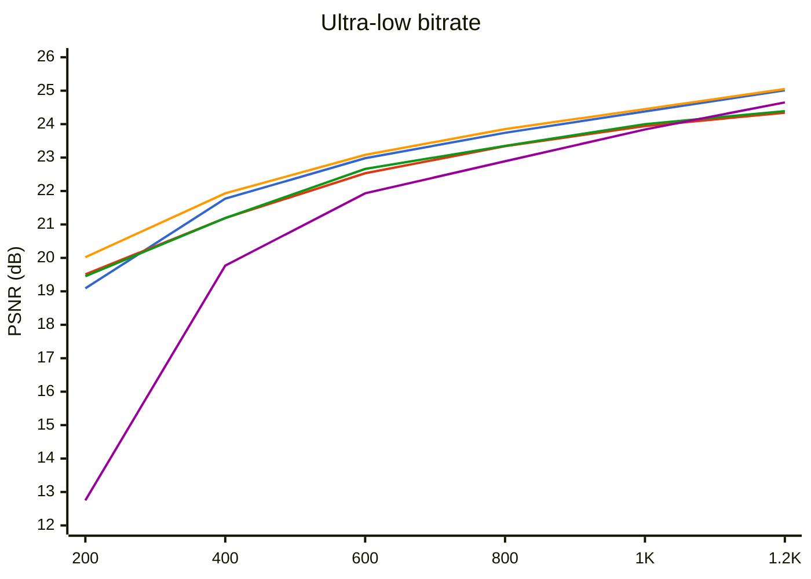
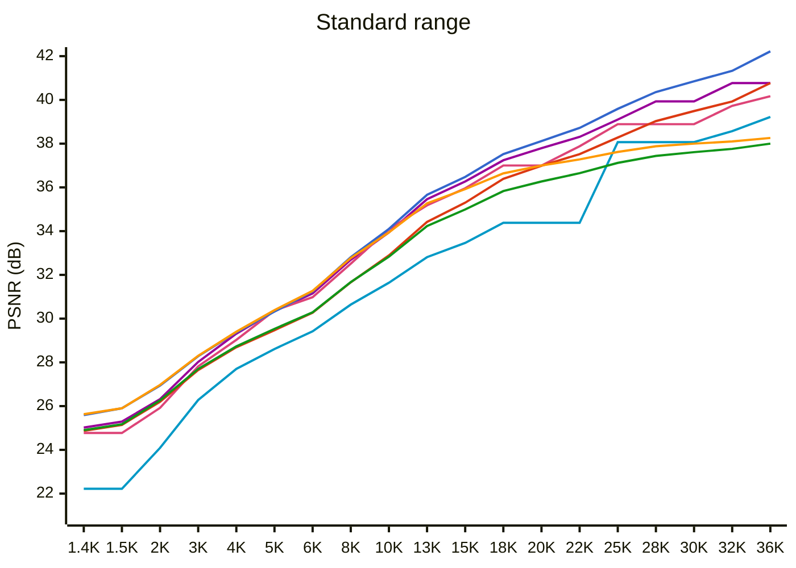

# WTPC vs JPEG vs JPEG2000 vs JPEGXL - Benchmark

**Test image:** `lena256.png` (256x256, 24-bit RGB)  
**Target range:** 200 B - 36 KB (thumbnails / previews)  
**Metrics:** PSNR (dB, higher is better), ssimulacra2 (0-100, lower is better)  
**Date:** 2026-07-18

## PSNR vs File Size

### Ultra-low range (200 B - 1.2 KB)

🔵 WTPC EBC  🔴 WTPC Huff  🟠 W420 EBC  🟢 W420 Huff  🟣 JPEG2000

### Standard range (1.4 KB - 36 KB)

🔹 JPEG  🟣 JPEG2000  💗 JPEGXL  🔵 WTPC EBC  🔴 WTPC Huff  🟠 W420 EBC  🟢 W420 Huff

## Comparison by Size Steps

Each row: closest entry from each codec to the target size. Best per metric is **bold**.

| Step | E_4 B | H_4 B | E_2 B | H_2 B | JP2K B | JPXL B | JPEG B | E_4 PSNR | H_4 PSNR | E_2 PSNR | H_2 PSNR | JP2K PSNR | JPXL PSNR | JPEG PSNR | E_4 Ssim2 | H_4 Ssim2 | E_2 Ssim2 | H_2 Ssim2 | JP2K Ssim2 | JPXL Ssim2 | JPEG Ssim2 | E_4 Q | H_4 Q | E_2 Q | H_2 Q | JP2K Q | JPXL Q | JPEG Q |
|------|------|------|------|------|------|------|------|------|------|------|------|------|------|------|------|------|------|------|------|------|------|------|------|------|------|------|------|------|
| ~200 | 203 | 201 | **199** | 204 | 244 | - | - | 19.09 | 19.51 | **20.02** | 19.45 | 12.75 | - | - | -62.11 | -62.69 | **-61.47** | -62.60 | -541.07 | - | - | 914 | 925 | 913 | 927 | 1000 | - | - |
| ~400 | 399 | 404 | **405** | 403 | 403 | - | - | 21.77 | 21.19 | **21.93** | 21.19 | 19.77 | - | - | -43.40 | -48.83 | **-41.89** | -48.42 | -64.20 | - | - | 829 | 846 | 827 | 846 | 500 | - | - |
| ~600 | 606 | 601 | **603** | 603 | 617 | - | - | 22.98 | 22.53 | **23.08** | 22.66 | 21.93 | - | - | -27.51 | -32.80 | **-27.40** | -32.72 | -49.95 | - | - | 775 | 795 | 775 | 795 | 320 | - | - |
| ~800 | 804 | 803 | **804** | 800 | 784 | - | 1097 | 23.74 | 23.34 | **23.85** | 23.35 | 22.89 | - | 20.59 | -12.27 | -19.73 | **-11.96** | -19.52 | -36.79 | - | -55.87 | 738 | 759 | 738 | 760 | 256 | - | 1 |
| ~1000 | 1005 | 1005 | 999 | 1007 | 1026 | **1418** | 1097 | 24.38 | 23.94 | 24.45 | 24.00 | 23.84 | **24.77** | 20.59 | -3.25 | -10.53 | **-2.57** | -10.14 | -21.48 | -7.86 | -55.87 | 708 | 729 | 708 | 729 | 192 | min | 1 |
| ~1200 | 1199 | 1200 | **1200** | 1198 | 1257 | 1418 | 1230 | 25.01 | 24.34 | **25.05** | 24.39 | 24.65 | 24.77 | 20.93 | 7.27 | -3.31 | **8.30** | -2.38 | -9.72 | -7.86 | -53.76 | 685 | 709 | 685 | 709 | 156 | min | 3 |
| ~1400 | 1400 | 1402 | **1399** | 1404 | 1392 | 1418 | 1467 | 25.59 | 24.87 | **25.63** | 24.90 | 25.02 | 24.77 | 22.22 | 14.55 | 6.85 | **15.73** | 8.05 | -3.29 | -7.86 | -40.85 | 664 | 690 | 663 | 690 | 140 | min | 4 |
| ~1500 | 1504 | 1510 | **1495** | 1506 | 1485 | 1418 | 1467 | 25.90 | 25.14 | **25.90** | 25.17 | 25.29 | 24.77 | 22.22 | 18.93 | 9.08 | **18.95** | 9.25 | -0.66 | -7.86 | -40.85 | 653 | 681 | 653 | 681 | 132 | min | 4 |
| ~2000 | 2005 | 1997 | **2001** | 2007 | 1976 | 1955 | 1973 | 26.94 | 26.20 | **26.97** | 26.26 | 26.32 | 25.92 | 24.09 | 31.31 | 23.38 | **31.89** | 23.56 | 13.28 | 15.03 | -10.66 | 611 | 641 | 610 | 639 | 100 | 18 | 6 |
| ~3000 | 3010 | 2998 | **3005** | 2995 | 3076 | 2849 | 3017 | 28.28 | 27.65 | **28.30** | 27.70 | 28.02 | 27.82 | 26.28 | **48.35** | 41.54 | 47.76 | 42.24 | 30.03 | 38.84 | 23.77 | 547 | 578 | 546 | 576 | 64 | 11 | 11 |
| ~4000 | 3995 | 4002 | **4005** | 4013 | 4016 | 3825 | 4040 | 29.37 | 28.69 | **29.40** | 28.73 | 29.31 | 29.03 | 27.70 | **56.68** | 52.16 | 56.51 | 52.10 | 42.82 | 49.99 | 42.32 | 501 | 529 | 498 | 526 | 49 | 8 | 17 |
| ~5000 | 4992 | 4998 | **5013** | 5003 | 5026 | 5077 | 4971 | 30.32 | 29.47 | **30.39** | 29.53 | 30.34 | 30.37 | 28.61 | 62.67 | 57.58 | **63.55** | 57.90 | 50.45 | 60.63 | 51.47 | 466 | 496 | 463 | 493 | 39 | 5.5 | 23 |
| ~6000 | 5997 | 6023 | **6008** | 6011 | 5968 | 5862 | 6041 | 31.24 | 30.27 | **31.27** | 30.29 | 31.15 | 30.98 | 29.42 | **68.41** | 62.05 | 68.04 | 63.12 | 55.09 | 63.45 | 59.06 | 437 | 468 | 433 | 466 | 33 | 4.5 | 31 |
| ~8000 | **7992** | 7997 | 7997 | 8029 | 7835 | 7770 | 7941 | **32.81** | 31.66 | 32.77 | 31.67 | 32.69 | 32.51 | 30.64 | 74.38 | 70.17 | **74.81** | 70.16 | 65.07 | 72.67 | 67.22 | 390 | 424 | 385 | 419 | 25 | 3 | 48 |
| ~10000 | **10017** | 10029 | 10002 | 9991 | 9828 | 10403 | 9979 | **34.10** | 32.89 | 33.94 | 32.83 | 33.94 | 34.09 | 31.64 | 79.22 | 74.92 | 78.78 | 75.18 | 69.66 | **79.58** | 72.24 | 352 | 388 | 346 | 383 | 20 | 2 | 65 |
| ~13000 | **13010** | 13027 | 13018 | 13022 | 13123 | 12774 | 13076 | **35.66** | 34.42 | 35.27 | 34.23 | 35.46 | 35.18 | 32.81 | **83.47** | 79.92 | 83.03 | 79.74 | 75.46 | 83.30 | 77.28 | 305 | 343 | 298 | 336 | 15 | 1.5 | 78 |
| ~15000 | **15035** | 14985 | 15031 | 15044 | 15120 | 15000 | 15179 | **36.48** | 35.30 | 35.92 | 34.99 | 36.27 | 35.96 | 33.46 | **85.52** | 82.42 | 84.70 | 82.08 | 79.05 | 85.44 | 79.70 | 279 | 317 | 271 | 309 | 13 | 1.2 | 83 |
| ~18000 | **18040** | 18063 | 18058 | 17974 | 17843 | 18160 | 18218 | **37.52** | 36.39 | 36.64 | 35.83 | 37.24 | 37.00 | 34.38 | 87.96 | 85.34 | 86.70 | 84.58 | 81.47 | **88.22** | 82.54 | 244 | 282 | 234 | 275 | 11 | 0.9 | 88 |
| ~20000 | **19980** | 20034 | 20025 | 19980 | 19642 | 18160 | 18218 | **38.12** | 36.99 | 37.00 | 36.27 | 37.79 | 37.00 | 34.38 | **89.23** | 86.77 | 87.87 | 86.03 | 82.04 | 88.22 | 82.54 | 225 | 262 | 213 | 253 | 10 | 0.9 | 88 |
| ~22000 | **21985** | 21962 | 22034 | 22044 | 21545 | 21926 | 18218 | **38.72** | 37.52 | 37.28 | 36.65 | 38.31 | 37.88 | 34.38 | **90.12** | 87.96 | 88.36 | 86.84 | 83.29 | 89.95 | 82.54 | 207 | 244 | 193 | 233 | 9 | 0.7 | 88 |
| ~25000 | **25034** | 24977 | 25045 | 25053 | 24533 | 27977 | 29845 | **39.59** | 38.28 | 37.62 | 37.12 | 39.10 | 38.89 | 38.07 | 91.15 | 89.40 | 89.22 | 88.08 | 85.62 | **91.76** | 89.45 | 182 | 220 | 165 | 206 | 8 | 0.5 | 92 |
| ~28000 | **28003** | 28064 | 28060 | 28086 | 28103 | 27977 | 29845 | **40.36** | 39.03 | 37.88 | 37.44 | 39.93 | 38.89 | 38.07 | **92.11** | 90.49 | 89.92 | 88.78 | 87.31 | 91.76 | 89.45 | 161 | 198 | 140 | 181 | 7 | 0.5 | 92 |
| ~30000 | **29985** | 30008 | 29983 | 30036 | 28103 | 27977 | 29845 | **40.85** | 39.49 | 38.00 | 37.61 | 39.93 | 38.89 | 38.07 | **92.43** | 90.96 | 90.03 | 89.22 | 87.31 | 91.76 | 89.45 | 148 | 185 | 125 | 166 | 7 | 0.5 | 92 |
| ~32000 | **32082** | 32085 | 32004 | 31987 | 32739 | 32361 | 32379 | **41.33** | 39.93 | 38.10 | 37.76 | 40.77 | 39.73 | 38.57 | **92.95** | 91.66 | 90.25 | 89.57 | 88.02 | 92.87 | 90.56 | 135 | 172 | 110 | 152 | 6 | 0.4 | 93 |
| ~36000 | **36089** | 36005 | 36005 | 36033 | 32739 | 35191 | 35656 | **42.22** | 40.77 | 38.26 | 38.00 | 40.77 | 40.17 | 39.22 | **93.73** | 92.36 | 90.63 | 90.03 | 88.02 | 93.15 | 91.43 | 112 | 150 | 78 | 125 | 6 | 0.35 | 94 |

> At each step, the codec with the best PSNR / ssimulacra2 (both higher=better) wins. Empty cells mean no data within +-50% of the target size.

## Best Codec at Each Target Size (by PSNR)

| Target (B) | Best Codec | Setting | Actual Size | PSNR (dB) | ssimulacra2 |
|------------|------------|---------|-------------|-----------|-------------|
| 200 | W420 EBC | 913 | 199 | 20.02 | -61.47 |
| 400 | W420 EBC | 827 | 405 | 21.93 | -41.89 |
| 600 | W420 EBC | 775 | 603 | 23.08 | -27.40 |
| 800 | W420 EBC | 738 | 804 | 23.85 | -11.96 |
| 1000 | W420 EBC | 708 | 999 | 24.45 | -2.57 |
| 1400 | W420 EBC | 663 | 1399 | 25.63 | 15.73 |
| 2000 | W420 EBC | 610 | 2001 | 26.97 | 31.89 |
| 3000 | W420 EBC | 546 | 3005 | 28.30 | 47.76 |
| 4000 | W420 EBC | 498 | 4005 | 29.40 | 56.51 |
| 5000 | W420 EBC | 463 | 5013 | 30.39 | 63.55 |
| 6000 | W420 EBC | 433 | 6008 | 31.27 | 68.04 |
| 8000 | WTPC EBC | 390 | 7992 | 32.81 | 74.38 |
| 10000 | WTPC EBC | 352 | 10017 | 34.10 | 79.22 |
| 13000 | WTPC EBC | 305 | 13010 | 35.66 | 83.47 |
| 15000 | WTPC EBC | 279 | 15035 | 36.48 | 85.52 |
| 18000 | WTPC EBC | 244 | 18040 | 37.52 | 87.96 |
| 20000 | WTPC EBC | 225 | 19980 | 38.12 | 89.23 |
| 22000 | WTPC EBC | 207 | 21985 | 38.72 | 90.12 |
| 25000 | WTPC EBC | 182 | 25034 | 39.59 | 91.15 |
| 28000 | WTPC EBC | 161 | 28003 | 40.36 | 92.11 |
| 30000 | WTPC EBC | 148 | 29985 | 40.85 | 92.43 |
| 32000 | WTPC EBC | 135 | 32082 | 41.33 | 92.95 |
| 36000 | WTPC EBC | 112 | 36089 | 42.22 | 93.73 |

## Best Codec at Each Target Size (by ssimulacra2)

| Target (B) | Best Codec | Setting | Actual Size | PSNR (dB) | ssimulacra2 |
|------------|------------|---------|-------------|-----------|-------------|
| 200 | W420 EBC | 913 | 199 | 20.02 | -61.47 |
| 400 | W420 EBC | 827 | 405 | 21.93 | -41.89 |
| 600 | W420 EBC | 775 | 603 | 23.08 | -27.40 |
| 800 | W420 EBC | 738 | 804 | 23.85 | -11.96 |
| 1000 | W420 EBC | 708 | 999 | 24.45 | -2.57 |
| 1400 | W420 EBC | 663 | 1399 | 25.63 | 15.73 |
| 2000 | W420 EBC | 610 | 2001 | 26.97 | 31.89 |
| 3000 | WTPC EBC | 547 | 3010 | 28.28 | 48.35 |
| 4000 | WTPC EBC | 501 | 3995 | 29.37 | 56.68 |
| 5000 | W420 EBC | 463 | 5013 | 30.39 | 63.55 |
| 6000 | WTPC EBC | 437 | 5997 | 31.24 | 68.41 |
| 8000 | W420 EBC | 385 | 7997 | 32.77 | 74.81 |
| 10000 | JPEG XL | 2 | 10403 | 34.09 | 79.58 |
| 13000 | WTPC EBC | 305 | 13010 | 35.66 | 83.47 |
| 15000 | WTPC EBC | 279 | 15035 | 36.48 | 85.52 |
| 18000 | JPEG XL | 0.9 | 18160 | 37.00 | 88.22 |
| 20000 | WTPC EBC | 225 | 19980 | 38.12 | 89.23 |
| 22000 | WTPC EBC | 207 | 21985 | 38.72 | 90.12 |
| 25000 | JPEG XL | 0.5 | 27977 | 38.89 | 91.76 |
| 28000 | WTPC EBC | 161 | 28003 | 40.36 | 92.11 |
| 30000 | WTPC EBC | 148 | 29985 | 40.85 | 92.43 |
| 32000 | WTPC EBC | 135 | 32082 | 41.33 | 92.95 |
| 36000 | WTPC EBC | 112 | 36089 | 42.22 | 93.73 |
## Encode / Decode Speed (ms)

| Step | E_4 enc | E_4 dec | H_4 enc | H_4 dec | E_2 enc | E_2 dec | H_2 enc | H_2 dec | JP2K enc | JP2K dec | JXL enc | JXL dec | JPEG enc |
|------|---------|---------|---------|---------|---------|---------|---------|---------|----------|----------|----------|----------|----------|
| ~200 | 7.0 | 1.5 | 2.5 | 0.5 | 5.2 | 1.3 | 1.7 | 0.7 | 16.0 | 4.0 | - | - | - |
| ~400 | 9.5 | 2.0 | 2.6 | 0.5 | 5.6 | 1.6 | 1.8 | 0.7 | 16.0 | 4.0 | - | - | - |
| ~600 | 10.6 | 2.3 | 3.3 | 0.5 | 7.2 | 1.6 | 1.9 | 0.7 | 16.0 | 4.0 | - | - | - |
| ~800 | 12.2 | 2.6 | 3.3 | 0.5 | 9.6 | 1.9 | 1.7 | 0.7 | 16.0 | 4.0 | - | - | 4.0 |
| ~1000 | 14.6 | 2.5 | 3.5 | 0.6 | 6.1 | 1.9 | 2.1 | 0.7 | 16.0 | 4.0 | 104.0 | 3.0 | 4.0 |
| ~1200 | 10.8 | 2.7 | 2.4 | 0.5 | 6.4 | 1.9 | 1.9 | 0.7 | 16.0 | 4.0 | 104.0 | 3.0 | 4.0 |
| ~1400 | 12.9 | 3.0 | 3.9 | 0.6 | 6.9 | 2.3 | 2.3 | 0.7 | 16.0 | 4.0 | 104.0 | 3.0 | 5.0 |
| ~1500 | 14.9 | 3.0 | 3.8 | 0.6 | 6.9 | 2.2 | 2.4 | 0.7 | 16.0 | 4.0 | 104.0 | 3.0 | 5.0 |
| ~2000 | 16.3 | 3.2 | 4.0 | 0.6 | 9.2 | 2.2 | 2.6 | 0.7 | 16.0 | 4.0 | 11.0 | 4.0 | 4.0 |
| ~3000 | 18.5 | 3.8 | 4.6 | 0.6 | 10.7 | 2.5 | 3.2 | 0.7 | 16.0 | 5.0 | 12.0 | 4.0 | 4.0 |
| ~4000 | 20.8 | 4.2 | 4.5 | 0.6 | 10.7 | 2.8 | 3.0 | 0.8 | 16.0 | 4.0 | 12.0 | 5.0 | 4.0 |
| ~5000 | 17.2 | 4.2 | 5.7 | 0.6 | 10.6 | 3.0 | 4.3 | 0.8 | 16.0 | 4.0 | 12.0 | 4.0 | 4.0 |
| ~6000 | 18.4 | 4.5 | 6.3 | 0.6 | 11.0 | 3.1 | 4.0 | 0.8 | 16.0 | 5.0 | 15.0 | 4.0 | 4.0 |
| ~8000 | 20.4 | 5.0 | 5.9 | 0.7 | 12.7 | 3.5 | 4.7 | 0.8 | 16.0 | 5.0 | 12.0 | 4.0 | 4.0 |
| ~10000 | 22.1 | 5.3 | 6.7 | 0.7 | 13.4 | 3.6 | 5.5 | 0.8 | 16.0 | 5.0 | 12.0 | 4.0 | 4.0 |
| ~13000 | 24.1 | 5.9 | 9.5 | 0.7 | 18.9 | 4.1 | 7.7 | 0.9 | 16.0 | 5.0 | 12.0 | 4.0 | 4.0 |
| ~15000 | 31.4 | 6.1 | 10.2 | 0.8 | 19.8 | 4.5 | 8.8 | 0.9 | 17.0 | 6.0 | 12.0 | 4.0 | 4.0 |
| ~18000 | 27.3 | 6.7 | 11.4 | 0.8 | 20.8 | 4.6 | 9.9 | 1.0 | 16.0 | 6.0 | 11.0 | 4.0 | 5.0 |
| ~20000 | 34.6 | 7.2 | 12.0 | 0.9 | 21.8 | 4.7 | 10.9 | 1.0 | 16.0 | 6.0 | 11.0 | 4.0 | 5.0 |
| ~22000 | 35.7 | 7.1 | 12.8 | 0.9 | 23.0 | 5.0 | 11.7 | 1.0 | 16.0 | 6.0 | 12.0 | 4.0 | 5.0 |
| ~25000 | 29.5 | 7.3 | 14.1 | 0.9 | 23.9 | 5.3 | 13.0 | 1.1 | 16.0 | 7.0 | 10.0 | 4.0 | 5.0 |
| ~28000 | 31.2 | 7.8 | 15.6 | 1.0 | 24.6 | 5.6 | 14.3 | 1.2 | 16.0 | 7.0 | 10.0 | 4.0 | 5.0 |
| ~30000 | 31.8 | 7.8 | 13.3 | 1.0 | 26.0 | 5.6 | 15.1 | 1.2 | 16.0 | 7.0 | 10.0 | 4.0 | 5.0 |
| ~32000 | 31.8 | 8.2 | 14.3 | 1.1 | 31.8 | 5.8 | 15.9 | 1.2 | 16.0 | 7.0 | 10.0 | 4.0 | 5.0 |
| ~36000 | 42.8 | 8.3 | 19.2 | 1.1 | 28.0 | 6.2 | 17.7 | 1.3 | 16.0 | 7.0 | 10.0 | 4.0 | 5.0 |

> WTPC encode timings above include a binary quality search to hit the exact target size (-b mode). Other codecs use pre-calibrated parameters. At fixed quality, see below.

## WTPC Speed by Quality Level (ms, fixed q)

| q | WTPC_E enc | WTPC_E dec | WTPC_H enc | WTPC_H dec | W420_E enc | W420_E dec | W420_H enc | W420_H dec |
|----|---------|---------|---------|---------|---------|---------|---------|---------|
| 665 | 3.3 | 3.0 | 1.1 | 0.6 | 1.9 | 2.1 | 0.8 | 0.7 |
| 570 | 3.9 | 3.6 | 1.3 | 0.6 | 2.3 | 2.5 | 0.9 | 0.8 |
| 474 | 4.5 | 4.4 | 1.6 | 0.6 | 2.8 | 3.0 | 1.2 | 0.8 |
| 369 | 5.5 | 5.2 | 2.2 | 0.7 | 3.4 | 3.6 | 1.7 | 0.9 |
| 244 | 7.0 | 6.8 | 3.0 | 0.9 | 4.3 | 4.6 | 2.5 | 1.1 |
| 101 | 8.7 | 8.6 | 5.2 | 1.3 | 5.5 | 6.0 | 4.1 | 1.3 |
| 78 | 9.1 | 8.9 | 5.6 | 1.4 | 5.9 | 6.2 | 4.4 | 1.4 |

> Encode at fixed q (no binary search). File sizes: ~78->665 q.

---

*Tools: ImageMagick 7.1.2, OpenJPEG 2.5.4, libjxl 0.11.1. Date: 2026-07-18.*
