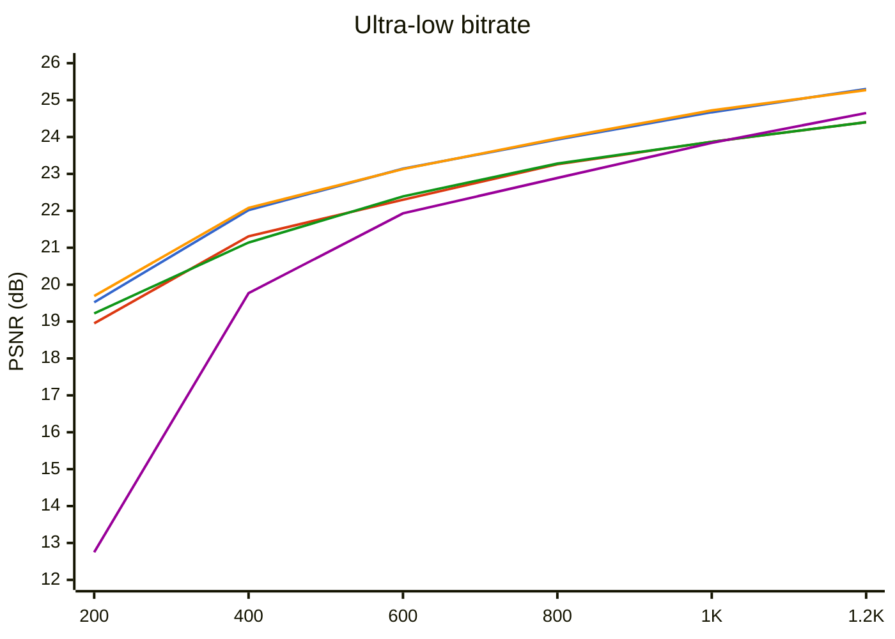
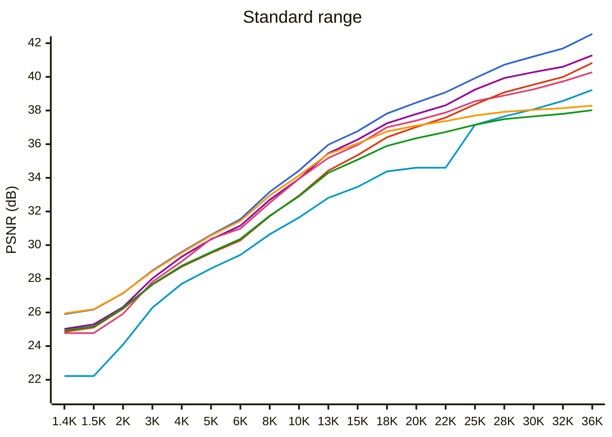

# WTPC vs JPEG vs JPEG2000 vs JPEGXL - Benchmark

**Test image:** `lena256.png` (256x256, 24-bit RGB)  
**Target range:** 200 B - 36 KB (thumbnails / previews)  
**Metrics:** PSNR (dB, higher is better), ssimulacra2 (0-100, higher is better)
**Date:** 2026-07-27

## PSNR vs File Size

### Ultra-low range (200 B - 1.2 KB)

```mermaid
%%{init: {"themeVariables": {"xyChart": {"plotColorPalette": "#3366cc, #dc3912, #ff9900, #109618, #990099"}}}}%%
xychart-beta
    title "Ultra-low bitrate"
    y-axis "PSNR (dB)" 12 --> 26
    x-axis ["200", "400", "600", "800", "1K", "1.2K"]
    line "WTPC EBC" [19.52, 22.02, 23.14, 23.93, 24.67, 25.30]
    line "WTPC Huff" [18.95, 21.31, 22.30, 23.26, 23.87, 24.40]
    line "W420 EBC" [19.69, 22.08, 23.13, 23.96, 24.72, 25.27]
    line "W420 Huff" [19.22, 21.14, 22.39, 23.28, 23.87, 24.40]
    line "JPEG2000" [12.75, 19.77, 21.93, 22.89, 23.84, 24.65]
```
🔵 WTPC EBC  🔴 WTPC Huff  🟠 W420 EBC  🟢 W420 Huff  🟣 JPEG2000

### Standard range (1.4 KB - 36 KB)

```mermaid
%%{init: {"themeVariables": {"xyChart": {"plotColorPalette": "#0099c6, #990099, #dd4477, #3366cc, #dc3912, #ff9900, #109618"}}}}%%
xychart-beta
    title "Standard range"
    y-axis "PSNR (dB)" 21 --> 42
    x-axis ["1.4K", "1.5K", "2K", "3K", "4K", "5K", "6K", "8K", "10K", "13K", "15K", "18K", "20K", "22K", "25K", "28K", "30K", "32K", "36K"]
    line "JPEG" [22.22, 22.22, 24.09, 26.28, 27.70, 28.61, 29.42, 30.64, 31.64, 32.81, 33.46, 34.38, 34.60, 34.60, 37.15, 37.65, 38.07, 38.57, 39.22]
    line "JPEG2000" [25.02, 25.29, 26.32, 28.02, 29.31, 30.34, 31.15, 32.69, 33.94, 35.46, 36.27, 37.24, 37.79, 38.31, 39.24, 39.93, 40.28, 40.60, 41.28]
    line "JPEGXL" [24.77, 24.77, 25.92, 27.82, 29.03, 30.37, 30.98, 32.51, 33.94, 35.18, 35.96, 37.00, 37.40, 37.88, 38.55, 38.89, 39.26, 39.73, 40.27]
    line "WTPC EBC" [25.90, 26.17, 27.14, 28.49, 29.60, 30.61, 31.54, 33.16, 34.43, 35.97, 36.77, 37.82, 38.47, 39.08, 39.92, 40.72, 41.21, 41.69, 42.55]
    line "WTPC Huff" [24.85, 25.11, 26.22, 27.65, 28.72, 29.53, 30.28, 31.72, 32.94, 34.43, 35.35, 36.41, 37.02, 37.58, 38.36, 39.08, 39.54, 39.99, 40.83]
    line "W420 EBC" [25.94, 26.19, 27.15, 28.45, 29.55, 30.57, 31.44, 32.95, 34.14, 35.42, 36.04, 36.75, 37.10, 37.37, 37.70, 37.92, 38.04, 38.14, 38.29]
    line "W420 Huff" [24.94, 25.17, 26.27, 27.68, 28.77, 29.58, 30.37, 31.74, 32.90, 34.30, 35.08, 35.90, 36.35, 36.72, 37.15, 37.49, 37.65, 37.80, 38.02]
```
🔹 JPEG  🟣 JPEG2000  💗 JPEGXL  🔵 WTPC EBC  🔴 WTPC Huff  🟠 W420 EBC  🟢 W420 Huff

## Comparison by Size Steps

Each row: closest entry from each codec to the target size. Best per metric is **bold**.

| Step | E_4 B | H_4 B | E_2 B | H_2 B | JP2K B | JPXL B | JPEG B | E_4 PSNR | H_4 PSNR | E_2 PSNR | H_2 PSNR | JP2K PSNR | JPXL PSNR | JPEG PSNR | E_4 Ssim2 | H_4 Ssim2 | E_2 Ssim2 | H_2 Ssim2 | JP2K Ssim2 | JPXL Ssim2 | JPEG Ssim2 | E_4 Q | H_4 Q | E_2 Q | H_2 Q | JP2K Q | JPXL Q | JPEG Q |
|------|------|------|------|------|------|------|------|------|------|------|------|------|------|------|------|------|------|------|------|------|------|------|------|------|------|------|------|------|
| ~200 | 199 | 198 | **200** | 200 | 244 | - | - | 19.52 | 18.95 | **19.69** | 19.22 | 12.75 | - | - | -61.06 | -63.05 | **-60.91** | -62.77 | -541.07 | - | - | 896 | 921 | 896 | 922 | 1000 | - | - |
| ~400 | 404 | 402 | **405** | 404 | 403 | - | - | 22.02 | 21.31 | **22.08** | 21.14 | 19.77 | - | - | **-39.39** | -49.02 | -39.64 | -48.22 | -64.20 | - | - | 811 | 844 | 812 | 842 | 500 | - | - |
| ~600 | **600** | 605 | 600 | 600 | 617 | - | - | **23.14** | 22.30 | 23.13 | 22.39 | 21.93 | - | - | **-23.04** | -34.74 | -23.07 | -34.91 | -49.95 | - | - | 763 | 792 | 764 | 792 | 320 | - | - |
| ~800 | 796 | 804 | **803** | 797 | 784 | - | 1097 | 23.93 | 23.26 | **23.96** | 23.28 | 22.89 | - | 20.59 | -9.29 | -19.19 | **-9.02** | -20.00 | -36.79 | - | -55.87 | 724 | 757 | 724 | 757 | 256 | - | 1 |
| ~1000 | 1003 | 1000 | 1004 | 1001 | 1026 | **1418** | 1097 | 24.67 | 23.87 | 24.72 | 23.87 | 23.84 | **24.77** | 20.59 | 2.60 | -10.96 | **2.95** | -9.86 | -21.48 | -7.86 | -55.87 | 695 | 728 | 696 | 727 | 192 | min | 1 |
| ~1200 | **1203** | 1200 | 1203 | 1199 | 1257 | 1418 | 1230 | **25.30** | 24.40 | 25.27 | 24.40 | 24.65 | 24.77 | 20.93 | **12.33** | -3.16 | 11.54 | -2.41 | -9.72 | -7.86 | -53.76 | 673 | 707 | 674 | 707 | 156 | min | 3 |
| ~1400 | 1399 | 1395 | **1404** | 1398 | 1392 | 1418 | 1467 | 25.90 | 24.85 | **25.94** | 24.94 | 25.02 | 24.77 | 22.22 | **19.75** | 5.65 | 19.01 | 6.77 | -3.29 | -7.86 | -40.85 | 650 | 688 | 651 | 688 | 140 | min | 4 |
| ~1500 | 1501 | 1507 | **1504** | 1505 | 1485 | 1418 | 1467 | 26.17 | 25.11 | **26.19** | 25.17 | 25.29 | 24.77 | 22.22 | 22.10 | 9.75 | **22.13** | 10.11 | -0.66 | -7.86 | -40.85 | 641 | 679 | 642 | 679 | 132 | min | 4 |
| ~2000 | 2002 | 2001 | **2005** | 2008 | 1976 | 1955 | 1973 | 27.14 | 26.22 | **27.15** | 26.27 | 26.32 | 25.92 | 24.09 | **34.39** | 22.73 | 34.37 | 23.62 | 13.28 | 15.03 | -10.66 | 600 | 639 | 601 | 638 | 100 | 18 | 6 |
| ~3000 | **3003** | 3003 | 2997 | 3006 | 3076 | 2849 | 3017 | **28.49** | 27.65 | 28.45 | 27.68 | 28.02 | 27.82 | 26.28 | **49.73** | 41.02 | 49.59 | 42.42 | 30.03 | 38.84 | 23.77 | 536 | 575 | 539 | 574 | 64 | 11 | 11 |
| ~4000 | **4000** | 4005 | 3997 | 3991 | 4016 | 3825 | 4040 | **29.60** | 28.72 | 29.55 | 28.77 | 29.31 | 29.03 | 27.70 | **57.68** | 52.11 | 57.68 | 52.14 | 42.82 | 49.99 | 42.32 | 489 | 526 | 491 | 525 | 49 | 8 | 17 |
| ~5000 | **4997** | 4991 | 5014 | 5000 | 5026 | 5077 | 4971 | **30.61** | 29.53 | 30.57 | 29.58 | 30.34 | 30.37 | 28.61 | **64.94** | 57.75 | 64.37 | 57.88 | 50.45 | 60.63 | 51.47 | 454 | 492 | 456 | 490 | 39 | 5.5 | 23 |
| ~6000 | **6002** | 5994 | 6017 | 6008 | 5968 | 5862 | 6041 | **31.54** | 30.28 | 31.44 | 30.37 | 31.15 | 30.98 | 29.42 | **69.32** | 62.13 | 68.83 | 63.24 | 55.09 | 63.45 | 59.06 | 425 | 465 | 427 | 463 | 33 | 4.5 | 31 |
| ~8000 | **8027** | 7983 | 8008 | 7996 | 7835 | 7770 | 7941 | **33.16** | 31.72 | 32.95 | 31.74 | 32.69 | 32.51 | 30.64 | **75.47** | 70.04 | 75.08 | 70.28 | 65.07 | 72.67 | 67.22 | 377 | 420 | 379 | 417 | 25 | 3 | 48 |
| ~10000 | **9996** | 10019 | 10033 | 9993 | 9828 | 10075 | 9979 | **34.43** | 32.94 | 34.14 | 32.90 | 33.94 | 33.94 | 31.64 | **79.84** | 74.71 | 79.22 | 75.00 | 69.66 | 78.92 | 72.24 | 340 | 384 | 341 | 381 | 20 | 2.1 | 65 |
| ~13000 | **13028** | 12980 | 12987 | 13016 | 13123 | 12774 | 13076 | **35.97** | 34.43 | 35.42 | 34.30 | 35.46 | 35.18 | 32.81 | **83.97** | 79.84 | 83.20 | 79.88 | 75.46 | 83.30 | 77.28 | 293 | 340 | 294 | 335 | 15 | 1.5 | 78 |
| ~15000 | **15045** | 15008 | 15019 | 15039 | 15120 | 15000 | 15179 | **36.77** | 35.35 | 36.04 | 35.08 | 36.27 | 35.96 | 33.46 | **86.12** | 82.44 | 85.10 | 82.26 | 79.05 | 85.44 | 79.70 | 267 | 313 | 267 | 308 | 13 | 1.2 | 83 |
| ~18000 | **18051** | 18023 | 18042 | 17989 | 17843 | 18160 | 18218 | **37.82** | 36.41 | 36.75 | 35.90 | 37.24 | 37.00 | 34.38 | **88.49** | 85.05 | 86.95 | 84.66 | 81.47 | 88.22 | 82.54 | 232 | 279 | 230 | 274 | 11 | 0.9 | 88 |
| ~20000 | **20029** | 20017 | 20012 | 20028 | 19642 | 19898 | 18941 | **38.47** | 37.02 | 37.10 | 36.35 | 37.79 | 37.40 | 34.60 | **89.66** | 86.87 | 88.00 | 85.97 | 82.04 | 89.14 | 83.30 | 213 | 259 | 209 | 252 | 10 | 0.8 | 89 |
| ~22000 | **22031** | 22053 | 22038 | 22061 | 21545 | 21926 | 18941 | **39.08** | 37.58 | 37.37 | 36.72 | 38.31 | 37.88 | 34.60 | **90.43** | 87.94 | 88.50 | 86.98 | 83.29 | 89.95 | 83.30 | 195 | 240 | 189 | 232 | 9 | 0.7 | 89 |
| ~25000 | **25001** | 25087 | 25062 | 24974 | 25122 | 25130 | 26679 | **39.92** | 38.36 | 37.70 | 37.15 | 39.24 | 38.55 | 37.15 | **91.52** | 89.61 | 89.30 | 88.01 | 85.78 | 91.08 | 88.01 | 171 | 216 | 161 | 206 | 7.8 | 0.57 | 90 |
| ~28000 | **27946** | 28041 | 27999 | 28079 | 28103 | 27977 | 28350 | **40.72** | 39.08 | 37.92 | 37.49 | 39.93 | 38.89 | 37.65 | **92.38** | 90.43 | 89.82 | 88.80 | 87.31 | 91.76 | 88.88 | 150 | 195 | 137 | 180 | 7 | 0.5 | 91 |
| ~30000 | **29972** | 30011 | 30078 | 30029 | 29710 | 29858 | 29845 | **41.21** | 39.54 | 38.04 | 37.65 | 40.28 | 39.26 | 38.07 | **92.73** | 91.01 | 90.07 | 89.30 | 87.76 | 92.27 | 89.45 | 137 | 182 | 121 | 165 | 6.6 | 0.45 | 92 |
| ~32000 | **32051** | 32091 | 32084 | 32000 | 31675 | 32361 | 32379 | **41.69** | 39.99 | 38.14 | 37.80 | 40.60 | 39.73 | 38.57 | **93.18** | 91.63 | 90.32 | 89.61 | 87.97 | 92.87 | 90.56 | 124 | 169 | 106 | 151 | 6.2 | 0.4 | 93 |
| ~36000 | **35966** | 36004 | 36059 | 36062 | 36169 | 35863 | 35656 | **42.55** | 40.83 | 38.29 | 38.02 | 41.28 | 40.27 | 39.22 | **93.93** | 92.44 | 90.69 | 90.06 | 88.42 | 93.32 | 91.43 | 102 | 147 | 73 | 124 | 5.4 | 0.34 | 94 |

> At each step, the codec with the best PSNR / ssimulacra2 (both higher=better) wins. Empty cells mean no data within +-50% of the target size.

## Best Codec at Each Target Size (by PSNR)

| Target (B) | Best Codec | Setting | Actual Size | PSNR (dB) | ssimulacra2 |
|------------|------------|---------|-------------|-----------|-------------|
| 200 | W420 EBC | 896 | 200 | 19.69 | -60.91 |
| 400 | W420 EBC | 812 | 405 | 22.08 | -39.64 |
| 600 | WTPC EBC | 763 | 600 | 23.14 | -23.04 |
| 800 | W420 EBC | 724 | 803 | 23.96 | -9.02 |
| 1000 | W420 EBC | 696 | 1004 | 24.72 | 2.95 |
| 1400 | W420 EBC | 651 | 1404 | 25.94 | 19.01 |
| 2000 | W420 EBC | 601 | 2005 | 27.15 | 34.37 |
| 3000 | WTPC EBC | 536 | 3003 | 28.49 | 49.73 |
| 4000 | WTPC EBC | 489 | 4000 | 29.60 | 57.68 |
| 5000 | WTPC EBC | 454 | 4997 | 30.61 | 64.94 |
| 6000 | WTPC EBC | 425 | 6002 | 31.54 | 69.32 |
| 8000 | WTPC EBC | 377 | 8027 | 33.16 | 75.47 |
| 10000 | WTPC EBC | 340 | 9996 | 34.43 | 79.84 |
| 13000 | WTPC EBC | 293 | 13028 | 35.97 | 83.97 |
| 15000 | WTPC EBC | 267 | 15045 | 36.77 | 86.12 |
| 18000 | WTPC EBC | 232 | 18051 | 37.82 | 88.49 |
| 20000 | WTPC EBC | 213 | 20029 | 38.47 | 89.66 |
| 22000 | WTPC EBC | 195 | 22031 | 39.08 | 90.43 |
| 25000 | WTPC EBC | 171 | 25001 | 39.92 | 91.52 |
| 28000 | WTPC EBC | 150 | 27946 | 40.72 | 92.38 |
| 30000 | WTPC EBC | 137 | 29972 | 41.21 | 92.73 |
| 32000 | WTPC EBC | 124 | 32051 | 41.69 | 93.18 |
| 36000 | WTPC EBC | 102 | 35966 | 42.55 | 93.93 |

## Best Codec at Each Target Size (by ssimulacra2)

| Target (B) | Best Codec | Setting | Actual Size | PSNR (dB) | ssimulacra2 |
|------------|------------|---------|-------------|-----------|-------------|
| 200 | W420 EBC | 896 | 200 | 19.69 | -60.91 |
| 400 | WTPC EBC | 811 | 404 | 22.02 | -39.39 |
| 600 | WTPC EBC | 763 | 600 | 23.14 | -23.04 |
| 800 | W420 EBC | 724 | 803 | 23.96 | -9.02 |
| 1000 | W420 EBC | 696 | 1004 | 24.72 | 2.95 |
| 1400 | WTPC EBC | 650 | 1399 | 25.90 | 19.75 |
| 2000 | WTPC EBC | 600 | 2002 | 27.14 | 34.39 |
| 3000 | WTPC EBC | 536 | 3003 | 28.49 | 49.73 |
| 4000 | WTPC EBC | 489 | 4000 | 29.60 | 57.68 |
| 5000 | WTPC EBC | 454 | 4997 | 30.61 | 64.94 |
| 6000 | WTPC EBC | 425 | 6002 | 31.54 | 69.32 |
| 8000 | WTPC EBC | 377 | 8027 | 33.16 | 75.47 |
| 10000 | WTPC EBC | 340 | 9996 | 34.43 | 79.84 |
| 13000 | WTPC EBC | 293 | 13028 | 35.97 | 83.97 |
| 15000 | WTPC EBC | 267 | 15045 | 36.77 | 86.12 |
| 18000 | WTPC EBC | 232 | 18051 | 37.82 | 88.49 |
| 20000 | WTPC EBC | 213 | 20029 | 38.47 | 89.66 |
| 22000 | WTPC EBC | 195 | 22031 | 39.08 | 90.43 |
| 25000 | WTPC EBC | 171 | 25001 | 39.92 | 91.52 |
| 28000 | WTPC EBC | 150 | 27946 | 40.72 | 92.38 |
| 30000 | WTPC EBC | 137 | 29972 | 41.21 | 92.73 |
| 32000 | WTPC EBC | 124 | 32051 | 41.69 | 93.18 |
| 36000 | WTPC EBC | 102 | 35966 | 42.55 | 93.93 |
## Encode / Decode Speed (ms)

| Step | E_4 enc | E_4 dec | H_4 enc | H_4 dec | E_2 enc | E_2 dec | H_2 enc | H_2 dec | JP2K enc | JP2K dec | JXL enc | JXL dec | JPEG enc |
|------|---------|---------|---------|---------|---------|---------|---------|---------|----------|----------|----------|----------|----------|
| ~200 | 2.6 | 0.7 | 3.7 | 0.5 | 1.5 | 0.8 | 1.5 | 0.7 | 15.0 | 4.0 | - | - | - |
| ~400 | 3.2 | 0.8 | 3.1 | 0.5 | 2.1 | 0.9 | 2.1 | 0.7 | 16.0 | 4.0 | - | - | - |
| ~600 | 4.1 | 0.9 | 3.2 | 0.5 | 2.8 | 1.0 | 1.6 | 0.7 | 15.0 | 4.0 | - | - | - |
| ~800 | 3.8 | 1.1 | 3.4 | 0.5 | 2.8 | 1.1 | 2.0 | 0.6 | 16.0 | 4.0 | - | - | 10.0 |
| ~1000 | 4.2 | 1.2 | 3.5 | 0.5 | 3.1 | 1.2 | 2.1 | 0.7 | 16.0 | 4.0 | 153.0 | 5.0 | 10.0 |
| ~1200 | 5.6 | 1.2 | 2.3 | 0.5 | 4.2 | 1.3 | 1.8 | 0.7 | 16.0 | 4.0 | 153.0 | 5.0 | 4.0 |
| ~1400 | 6.1 | 1.3 | 3.6 | 0.5 | 3.9 | 1.3 | 2.3 | 0.7 | 16.0 | 4.0 | 153.0 | 5.0 | 4.0 |
| ~1500 | 6.1 | 1.3 | 4.5 | 0.5 | 4.7 | 1.3 | 2.7 | 0.7 | 16.0 | 4.0 | 153.0 | 5.0 | 4.0 |
| ~2000 | 8.5 | 1.7 | 4.0 | 0.5 | 7.0 | 1.6 | 2.5 | 0.7 | 16.0 | 4.0 | 11.0 | 4.0 | 4.0 |
| ~3000 | 14.0 | 2.7 | 4.5 | 0.5 | 11.9 | 2.6 | 3.2 | 0.7 | 15.0 | 4.0 | 10.0 | 4.0 | 4.0 |
| ~4000 | 12.7 | 3.1 | 5.0 | 0.6 | 11.1 | 2.9 | 3.1 | 0.7 | 16.0 | 4.0 | 11.0 | 4.0 | 4.0 |
| ~5000 | 14.8 | 3.6 | 4.6 | 0.6 | 12.6 | 3.2 | 3.5 | 0.7 | 16.0 | 4.0 | 11.0 | 4.0 | 4.0 |
| ~6000 | 20.4 | 4.0 | 5.1 | 0.6 | 18.2 | 3.8 | 4.0 | 0.8 | 16.0 | 5.0 | 13.0 | 4.0 | 4.0 |
| ~8000 | 21.8 | 4.3 | 5.9 | 0.6 | 15.6 | 4.0 | 4.8 | 0.8 | 16.0 | 5.0 | 11.0 | 3.0 | 4.0 |
| ~10000 | 25.3 | 4.8 | 6.6 | 0.6 | 17.7 | 5.2 | 5.5 | 0.8 | 16.0 | 5.0 | 10.0 | 4.0 | 4.0 |
| ~13000 | 27.9 | 6.2 | 9.3 | 0.7 | 23.2 | 4.8 | 7.8 | 0.8 | 16.0 | 5.0 | 11.0 | 4.0 | 4.0 |
| ~15000 | 41.4 | 7.8 | 9.9 | 0.7 | 24.2 | 4.9 | 8.5 | 0.9 | 16.0 | 5.0 | 11.0 | 4.0 | 4.0 |
| ~18000 | 42.7 | 8.2 | 11.3 | 0.8 | 25.9 | 5.2 | 9.9 | 0.9 | 16.0 | 6.0 | 11.0 | 4.0 | 4.0 |
| ~20000 | 35.2 | 8.3 | 12.0 | 0.8 | 26.6 | 5.4 | 10.8 | 1.0 | 16.0 | 6.0 | 11.0 | 4.0 | 4.0 |
| ~22000 | 35.9 | 8.6 | 10.4 | 0.9 | 27.1 | 5.7 | 11.8 | 1.0 | 16.0 | 6.0 | 11.0 | 4.0 | 4.0 |
| ~25000 | 36.9 | 8.9 | 14.0 | 0.9 | 28.3 | 5.8 | 13.0 | 1.0 | 16.0 | 7.0 | 9.0 | 4.0 | 5.0 |
| ~28000 | 38.1 | 9.3 | 15.4 | 1.0 | 29.3 | 6.2 | 14.3 | 1.1 | 16.0 | 7.0 | 9.0 | 4.0 | 4.0 |
| ~30000 | 38.7 | 9.5 | 16.1 | 0.9 | 30.2 | 6.4 | 15.2 | 1.1 | 16.0 | 7.0 | 9.0 | 4.0 | 5.0 |
| ~32000 | 39.2 | 9.5 | 14.0 | 1.0 | 31.1 | 6.6 | 13.2 | 1.2 | 16.0 | 7.0 | 9.0 | 4.0 | 4.0 |
| ~36000 | 50.6 | 9.8 | 19.0 | 1.1 | 32.3 | 6.9 | 17.9 | 1.2 | 16.0 | 8.0 | 10.0 | 4.0 | 4.0 |

> WTPC encode timings above include a binary quality search to hit the exact target size (-b mode). Other codecs use pre-calibrated parameters. At fixed quality, see below.

## WTPC Speed by Quality Level (ms, fixed q)

| q | WTPC_E enc | WTPC_E dec | WTPC_H enc | WTPC_H dec | W420_E enc | W420_E dec | W420_H enc | W420_H dec |
|----|---------|---------|---------|---------|---------|---------|---------|---------|
| 665 | 1.4 | 1.3 | 1.1 | 0.5 | 1.1 | 1.3 | 0.8 | 0.7 |
| 570 | 2.5 | 2.3 | 1.3 | 0.6 | 2.2 | 2.2 | 0.9 | 0.7 |
| 474 | 3.6 | 3.3 | 1.5 | 0.6 | 3.2 | 3.1 | 1.2 | 0.8 |
| 369 | 4.7 | 4.3 | 2.0 | 0.7 | 4.2 | 4.1 | 1.7 | 0.8 |
| 244 | 8.7 | 8.2 | 2.8 | 0.9 | 5.2 | 5.1 | 2.4 | 1.0 |
| 101 | 10.3 | 9.8 | 5.1 | 1.2 | 6.6 | 6.6 | 4.3 | 1.3 |
| 78 | 10.7 | 10.2 | 5.5 | 1.2 | 6.7 | 6.9 | 4.4 | 1.3 |

> Encode at fixed q (no binary search). File sizes: ~78->665 q.

## Compare with avif

Since avif have rough quantization steps it goes to separate table.
First step avifenc -q 0 --speed 0 and then closest to our targets.
WTPC uses -b to match avif sizes.

### AVIF --speed 0 vs WTPC

| Target | AVIF q | EBCOT 444 q | EBCOT 420 q | AVIF B | EBCOT 444 B | EBCOT 420 B | AVIF enc | EBCOT 444 enc | EBCOT 420 enc | AVIF dec | EBCOT 444 dec | EBCOT 420 dec | AVIF PSNR | EBCOT 444 PSNR | EBCOT 420 PSNR | AVIF ssim2 | EBCOT 444 ssim2 | EBCOT 420 ssim2 |
|--------|--------|-------------|-------------|--------|-------------|-------------|---------|---------------|---------------|---------|---------------|---------------|----------|----------------|----------------|-----------|------------------|-------------------|
| ~716 B | q=0 | 736 | 739 | 716 | 726 | 716 | 310 | 1 | 1 | 4 | 1 | 1 | 23.83 | 23.73 | 23.62 | -25.98 | -12.99 | -13.90 |
| 1 KB | q=3 | 699 | 700 | 971 | 971 | 972 | 363 | 1 | 1 | 4 | 1 | 1 | 25.42 | 24.60 | 24.62 | -0.18 | 1.09 | 1.35 |
| 1.4 KB | q=10 | 647 | 648 | 1430 | 1432 | 1435 | 469 | 1 | 1 | 4 | 1 | 1 | 27.17 | 25.98 | 26.00 | 20.39 | 20.54 | 19.63 |
| 2 KB | q=17 | 600 | 602 | 1991 | 2002 | 1991 | 581 | 2 | 2 | 4 | 2 | 2 | 28.80 | 27.14 | 27.11 | 39.31 | 34.39 | 34.14 |
| 4 KB | q=36 | 484 | 486 | 4106 | 4120 | 4123 | 919 | 3 | 3 | 4 | 3 | 3 | 32.56 | 29.74 | 29.70 | 66.34 | 59.03 | 58.76 |
| 8 KB | q=54 | 381 | 383 | 7830 | 7847 | 7837 | 1310 | 5 | 4 | 5 | 4 | 4 | 35.90 | 33.03 | 32.84 | 80.04 | 74.84 | 74.74 |
| 16 KB | q=76 | 255 | 254 | 15960 | 15979 | 15996 | 1701 | 9 | 5 | 5 | 8 | 5 | 39.49 | 37.13 | 36.32 | 88.87 | 86.98 | 85.86 |
| 26 KB | q=85 | 172 | 162 | 24894 | 24852 | 24945 | 1952 | 9 | 6 | 6 | 9 | 6 | 41.76 | 39.88 | 37.68 | 91.82 | 91.45 | 89.29 |
| 36 KB | q=90 | 107 | 83 | 34971 | 35055 | 34981 | 2045 | 10 | 7 | 6 | 10 | 7 | 43.60 | 42.36 | 38.26 | 93.38 | 93.69 | 90.62 |

> **Speed 0:** AVIF wins on ssim2 from 2 KB to 26 KB, but encoding is up to 370x slower than WTPC.

### AVIF --speed 6 vs WTPC

| Target | AVIF q | EBCOT 444 q | EBCOT 420 q | AVIF B | EBCOT 444 B | EBCOT 420 B | AVIF enc | EBCOT 444 enc | EBCOT 420 enc | AVIF dec | EBCOT 444 dec | EBCOT 420 dec | AVIF PSNR | EBCOT 444 PSNR | EBCOT 420 PSNR | AVIF ssim2 | EBCOT 444 ssim2 | EBCOT 420 ssim2 |
|--------|--------|-------------|-------------|--------|-------------|-------------|---------|---------------|---------------|---------|---------------|---------------|----------|----------------|----------------|-----------|------------------|-------------------|
| ~726 B | q=0 | 734 | 737 | 726 | 733 | 725 | 12 | 1 | 1 | 4 | 1 | 1 | 23.44 | 23.75 | 23.65 | -30.46 | -12.57 | -13.25 |
| 1 KB | q=3 | 699 | 700 | 971 | 971 | 972 | 11 | 1 | 1 | 3 | 1 | 1 | 24.83 | 24.60 | 24.62 | -9.68 | 1.09 | 1.35 |
| 1.4 KB | q=10 | 653 | 654 | 1368 | 1371 | 1373 | 13 | 1 | 1 | 4 | 1 | 1 | 26.42 | 25.79 | 25.86 | 13.81 | 18.32 | 17.72 |
| 2 KB | q=19 | 598 | 600 | 2016 | 2021 | 2028 | 15 | 2 | 2 | 4 | 2 | 2 | 28.43 | 27.20 | 27.18 | 36.15 | 34.87 | 34.42 |
| 4 KB | q=36 | 487 | 489 | 4037 | 4049 | 4046 | 19 | 3 | 3 | 4 | 3 | 3 | 31.83 | 29.65 | 29.60 | 61.96 | 58.20 | 57.80 |
| 8 KB | q=55 | 375 | 377 | 8103 | 8130 | 8107 | 23 | 5 | 4 | 4 | 4 | 4 | 35.52 | 33.23 | 33.00 | 79.41 | 75.69 | 75.44 |
| 16 KB | q=76 | 260 | 259 | 15592 | 15594 | 15625 | 23 | 9 | 5 | 4 | 8 | 5 | 38.89 | 36.99 | 36.21 | 87.58 | 86.69 | 85.73 |
| 26 KB | q=88 | 159 | 148 | 26636 | 26654 | 26628 | 27 | 10 | 6 | 5 | 9 | 6 | 41.58 | 40.38 | 37.83 | 91.52 | 92.00 | 89.66 |
| 36 KB | q=92 | 91 | 55 | 37961 | 38068 | 38048 | 30 | 11 | 7 | 5 | 10 | 7 | 43.57 | 43.00 | 38.36 | 93.15 | 94.20 | 90.76 |

> **Speed 6:** AVIF wins on ssim2 from 2 KB to 16 KB and the gap narrows, but encoding is still up to 8x slower than WTPC.

### AVIF --speed 10 vs WTPC

| Target | AVIF q | EBCOT 444 q | EBCOT 420 q | AVIF B | EBCOT 444 B | EBCOT 420 B | AVIF enc | EBCOT 444 enc | EBCOT 420 enc | AVIF dec | EBCOT 444 dec | EBCOT 420 dec | AVIF PSNR | EBCOT 444 PSNR | EBCOT 420 PSNR | AVIF ssim2 | EBCOT 444 ssim2 | EBCOT 420 ssim2 |
|--------|--------|-------------|-------------|--------|-------------|-------------|---------|---------------|---------------|---------|---------------|---------------|----------|----------------|----------------|-----------|------------------|-------------------|
| ~827 B | q=0 | 720 | 721 | 827 | 832 | 832 | 8 | 1 | 1 | 4 | 1 | 1 | 22.55 | 24.10 | 24.13 | -41.03 | -7.87 | -8.60 |
| 1 KB | q=3 | 689 | 691 | 1050 | 1057 | 1050 | 6 | 1 | 1 | 3 | 1 | 1 | 23.79 | 24.84 | 24.82 | -18.85 | 5.36 | 5.70 |
| 1.4 KB | q=9 | 647 | 648 | 1430 | 1432 | 1435 | 6 | 1 | 1 | 4 | 1 | 1 | 25.14 | 25.98 | 26.00 | 1.70 | 20.54 | 19.63 |
| 2 KB | q=16 | 605 | 606 | 1923 | 1927 | 1932 | 6 | 2 | 2 | 4 | 2 | 2 | 26.41 | 27.02 | 27.02 | 17.94 | 33.07 | 32.39 |
| 4 KB | q=33 | 486 | 487 | 4081 | 4077 | 4095 | 6 | 3 | 3 | 4 | 3 | 3 | 29.88 | 29.68 | 29.67 | 50.97 | 58.47 | 58.59 |
| 8 KB | q=51 | 374 | 376 | 8146 | 8177 | 8157 | 7 | 5 | 4 | 4 | 4 | 4 | 33.55 | 33.26 | 33.04 | 73.06 | 75.81 | 75.52 |
| 16 KB | q=72 | 261 | 260 | 15515 | 15521 | 15554 | 7 | 9 | 6 | 4 | 8 | 5 | 37.28 | 36.95 | 36.19 | 84.78 | 86.51 | 85.51 |
| 26 KB | q=86 | 159 | 148 | 26560 | 26654 | 26628 | 8 | 10 | 6 | 5 | 9 | 6 | 40.53 | 40.38 | 37.83 | 90.36 | 92.00 | 89.66 |
| 36 KB | q=90 | 103 | 75 | 35823 | 35776 | 35858 | 9 | 10 | 7 | 5 | 10 | 7 | 42.33 | 42.51 | 38.29 | 92.46 | 93.85 | 90.66 |

> **Speed 10:** AVIF loses on ssim2 at all sizes, but encoding speed is now comparable (though slightly slower than WTPC).

---

*Tools: ImageMagick 7.1.2, OpenJPEG 2.5.4, libjxl 0.11.1, avifenc 1.3.0. Date: 2026-07-27.*
