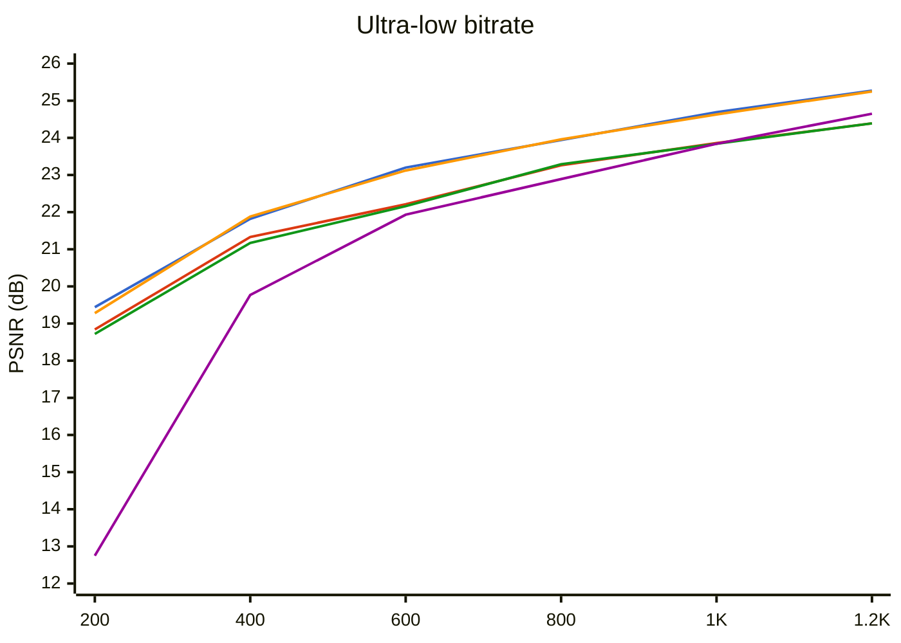

# WTPC vs JPEG vs JPEG2000 vs JPEGXL - Benchmark

**Test image:** `lena256.png` (256x256, 24-bit RGB)  
**Target range:** 200 B - 36 KB (thumbnails / previews)  
**Metrics:** PSNR (dB, higher is better), ssimulacra2 (0-100, higher is better)
**Date:** 2026-07-30

## PSNR vs File Size

### Ultra-low range (200 B - 1.2 KB)

```mermaid
%%{init: {"themeVariables": {"xyChart": {"plotColorPalette": "#3366cc, #dc3912, #ff9900, #109618, #990099"}}}}%%
xychart-beta
    title "Ultra-low bitrate"
    y-axis "PSNR (dB)" 12 --> 26
    x-axis ["200", "400", "600", "800", "1K", "1.2K"]
    line "WTPC EBC" [19.44, 21.82, 23.20, 23.94, 24.69, 25.27]
    line "WTPC Huff" [18.84, 21.33, 22.21, 23.26, 23.86, 24.39]
    line "W420 EBC" [19.28, 21.88, 23.12, 23.96, 24.63, 25.25]
    line "W420 Huff" [18.72, 21.17, 22.16, 23.29, 23.84, 24.39]
    line "JPEG2000" [12.75, 19.77, 21.93, 22.89, 23.84, 24.65]
```
🔵 WTPC EBC  🔴 WTPC Huff  🟠 W420 EBC  🟢 W420 Huff  🟣 JPEG2000

### Standard range (1.4 KB - 36 KB)

```mermaid
%%{init: {"themeVariables": {"xyChart": {"plotColorPalette": "#3366cc, #dc3912, #ff9900, #109618, #0099c6, #990099, #dd4477"}}}}%%
xychart-beta
    title "Standard range"
    y-axis "PSNR (dB)" 21 --> 42
    x-axis ["1.4K", "1.5K", "2K", "3K", "4K", "5K", "6K", "8K", "10K", "13K", "15K", "18K", "20K", "22K", "25K", "28K", "30K", "32K", "36K"]
    line "JPEG" [22.22, 22.22, 24.09, 26.28, 27.70, 28.61, 29.42, 30.64, 31.64, 32.81, 33.46, 34.38, 34.60, 34.60, 37.15, 37.65, 38.07, 38.57, 39.22]
    line "JPEG2000" [25.02, 25.29, 26.32, 28.02, 29.31, 30.34, 31.15, 32.69, 33.94, 35.46, 36.27, 37.24, 37.79, 38.31, 39.24, 39.93, 40.28, 40.60, 41.28]
    line "JPEGXL" [24.77, 24.77, 25.92, 27.82, 29.03, 30.37, 30.98, 32.51, 33.94, 35.18, 35.96, 37.00, 37.40, 37.88, 38.55, 38.89, 39.26, 39.73, 40.27]
    line "WTPC EBC" [25.94, 26.19, 27.17, 28.51, 29.61, 30.59, 31.51, 33.13, 34.40, 35.94, 36.73, 37.80, 38.47, 39.07, 39.95, 40.75, 41.23, 41.72, 42.59]
    line "WTPC Huff" [24.89, 25.13, 26.23, 27.65, 28.73, 29.53, 30.27, 31.72, 32.89, 34.43, 35.31, 36.38, 36.98, 37.56, 38.34, 39.07, 39.58, 39.99, 40.86]
    line "W420 EBC" [25.89, 26.12, 27.13, 28.41, 29.53, 30.53, 31.38, 32.89, 34.09, 35.38, 36.02, 36.72, 37.09, 37.36, 37.68, 37.91, 38.03, 38.14, 38.29]
    line "W420 Huff" [24.89, 25.17, 26.25, 27.67, 28.76, 29.56, 30.33, 31.71, 32.86, 34.26, 35.02, 35.88, 36.32, 36.68, 37.13, 37.47, 37.64, 37.79, 38.01]
```
🔵 WTPC EBC  🔴 WTPC Huff  🟠 W420 EBC  🟢 W420 Huff  🔹 JPEG  🟣 JPEG2000  💗 JPEGXL

## Comparison by Size Steps

Each row: closest entry from each codec to the target size. Best per metric is **bold**.

| Step | E_4 B | H_4 B | E_2 B | H_2 B | JP2K B | JPXL B | JPEG B | E_4 PSNR | H_4 PSNR | E_2 PSNR | H_2 PSNR | JP2K PSNR | JPXL PSNR | JPEG PSNR | E_4 Ssim2 | H_4 Ssim2 | E_2 Ssim2 | H_2 Ssim2 | JP2K Ssim2 | JPXL Ssim2 | JPEG Ssim2 | E_4 Q | H_4 Q | E_2 Q | H_2 Q | JP2K Q | JPXL Q | JPEG Q |
|------|------|------|------|------|------|------|------|------|------|------|------|------|------|------|------|------|------|------|------|------|------|------|------|------|------|------|------|------|
| ~200 | **203** | 200 | 200 | 199 | 244 | - | - | **19.44** | 18.84 | 19.28 | 18.72 | 12.75 | - | - | **-60.18** | -62.95 | -60.31 | -63.12 | -541.07 | - | - | 897 | 924 | 898 | 921 | 1000 | - | - |
| ~400 | 405 | 402 | **402** | 403 | 403 | - | - | 21.82 | 21.33 | **21.88** | 21.17 | 19.77 | - | - | **-39.96** | -48.65 | -40.39 | -48.30 | -64.20 | - | - | 812 | 845 | 813 | 843 | 500 | - | - |
| ~600 | **604** | 604 | 604 | 600 | 617 | - | - | **23.20** | 22.21 | 23.12 | 22.16 | 21.93 | - | - | **-21.18** | -34.38 | -22.59 | -35.08 | -49.95 | - | - | 763 | 793 | 764 | 792 | 320 | - | - |
| ~800 | 798 | 804 | **798** | 801 | 784 | - | 1097 | 23.94 | 23.26 | **23.96** | 23.29 | 22.89 | - | 20.59 | -10.39 | -19.70 | **-8.75** | -20.53 | -36.79 | - | -55.87 | 726 | 758 | 726 | 757 | 256 | - | 1 |
| ~1000 | 1003 | 1001 | 1000 | 999 | 1026 | **1418** | 1097 | 24.69 | 23.86 | 24.63 | 23.84 | 23.84 | **24.77** | 20.59 | **2.78** | -10.47 | 2.15 | -9.38 | -21.48 | -7.86 | -55.87 | 697 | 729 | 698 | 728 | 192 | min | 1 |
| ~1200 | **1203** | 1201 | 1206 | 1201 | 1257 | 1418 | 1230 | **25.27** | 24.39 | 25.25 | 24.39 | 24.65 | 24.77 | 20.93 | **11.78** | -3.54 | 11.39 | -2.44 | -9.72 | -7.86 | -53.76 | 675 | 709 | 675 | 708 | 156 | min | 3 |
| ~1400 | **1404** | 1408 | 1399 | 1396 | 1392 | 1418 | 1467 | **25.94** | 24.89 | 25.89 | 24.89 | 25.02 | 24.77 | 22.22 | **19.76** | 6.38 | 18.56 | 6.44 | -3.29 | -7.86 | -40.85 | 651 | 689 | 652 | 689 | 140 | min | 4 |
| ~1500 | **1504** | 1503 | 1500 | 1504 | 1485 | 1418 | 1467 | **26.19** | 25.13 | 26.12 | 25.17 | 25.29 | 24.77 | 22.22 | **22.72** | 9.49 | 21.82 | 9.08 | -0.66 | -7.86 | -40.85 | 642 | 681 | 643 | 679 | 132 | min | 4 |
| ~2000 | **2009** | 1999 | 2004 | 2003 | 1976 | 1955 | 1973 | **27.17** | 26.23 | 27.13 | 26.25 | 26.32 | 25.92 | 24.09 | **34.57** | 22.84 | 34.31 | 23.72 | 13.28 | 15.03 | -10.66 | 601 | 641 | 602 | 639 | 100 | 18 | 6 |
| ~3000 | **3007** | 3003 | 2999 | 3001 | 3076 | 2849 | 3017 | **28.51** | 27.65 | 28.41 | 27.67 | 28.02 | 27.82 | 26.28 | **49.79** | 41.64 | 49.28 | 41.93 | 30.03 | 38.84 | 23.77 | 538 | 577 | 540 | 575 | 64 | 11 | 11 |
| ~4000 | **4014** | 4005 | 4006 | 4008 | 4016 | 3825 | 4040 | **29.61** | 28.73 | 29.53 | 28.76 | 29.31 | 29.03 | 27.70 | **58.18** | 52.07 | 57.60 | 52.14 | 42.82 | 49.99 | 42.32 | 490 | 528 | 491 | 525 | 49 | 8 | 17 |
| ~5000 | **5006** | 4987 | 5008 | 5001 | 5026 | 5077 | 4971 | **30.59** | 29.53 | 30.53 | 29.56 | 30.34 | 30.37 | 28.61 | **64.84** | 57.72 | 64.50 | 57.84 | 50.45 | 60.63 | 51.47 | 455 | 493 | 456 | 490 | 39 | 5.5 | 23 |
| ~6000 | **5996** | 6003 | 6003 | 6000 | 5968 | 5862 | 6041 | **31.51** | 30.27 | 31.38 | 30.33 | 31.15 | 30.98 | 29.42 | **69.34** | 62.26 | 68.90 | 63.11 | 55.09 | 63.45 | 59.06 | 426 | 466 | 427 | 463 | 33 | 4.5 | 31 |
| ~8000 | **8027** | 8014 | 7997 | 8016 | 7835 | 7770 | 7941 | **33.13** | 31.72 | 32.89 | 31.71 | 32.69 | 32.51 | 30.64 | **75.45** | 70.41 | 75.03 | 70.09 | 65.07 | 72.67 | 67.22 | 378 | 420 | 379 | 416 | 25 | 3 | 48 |
| ~10000 | **9987** | 10013 | 10032 | 9990 | 9828 | 10075 | 9979 | **34.40** | 32.89 | 34.09 | 32.86 | 33.94 | 33.94 | 31.64 | **79.77** | 74.46 | 79.11 | 74.94 | 69.66 | 78.92 | 72.24 | 341 | 385 | 340 | 380 | 20 | 2.1 | 65 |
| ~13000 | **13009** | 13034 | 12998 | 13017 | 13123 | 12774 | 13076 | **35.94** | 34.43 | 35.38 | 34.26 | 35.46 | 35.18 | 32.81 | **84.12** | 79.86 | 83.01 | 79.98 | 75.46 | 83.30 | 77.28 | 294 | 340 | 293 | 334 | 15 | 1.5 | 78 |
| ~15000 | **15010** | 14991 | 15017 | 15038 | 15120 | 15000 | 15179 | **36.73** | 35.31 | 36.02 | 35.02 | 36.27 | 35.96 | 33.46 | **86.05** | 82.37 | 85.03 | 82.13 | 79.05 | 85.44 | 79.70 | 268 | 314 | 266 | 307 | 13 | 1.2 | 83 |
| ~18000 | **17999** | 17982 | 17979 | 17971 | 17843 | 18160 | 18218 | **37.80** | 36.38 | 36.72 | 35.88 | 37.24 | 37.00 | 34.38 | **88.40** | 85.07 | 86.94 | 84.68 | 81.47 | 88.22 | 82.54 | 233 | 280 | 229 | 273 | 11 | 0.9 | 88 |
| ~20000 | **20058** | 19981 | 20045 | 19993 | 19642 | 19898 | 18941 | **38.47** | 36.98 | 37.09 | 36.32 | 37.79 | 37.40 | 34.60 | **89.63** | 86.78 | 87.93 | 85.90 | 82.04 | 89.14 | 83.30 | 213 | 260 | 207 | 251 | 10 | 0.8 | 89 |
| ~22000 | **21964** | 22005 | 22040 | 22020 | 21545 | 21926 | 18941 | **39.07** | 37.56 | 37.36 | 36.68 | 38.31 | 37.88 | 34.60 | **90.42** | 87.97 | 88.51 | 86.85 | 83.29 | 89.95 | 83.30 | 196 | 241 | 187 | 231 | 9 | 0.7 | 89 |
| ~25000 | **25026** | 25035 | 25024 | 25018 | 25122 | 25130 | 26679 | **39.95** | 38.34 | 37.68 | 37.13 | 39.24 | 38.55 | 37.15 | **91.58** | 89.46 | 89.34 | 88.05 | 85.78 | 91.08 | 88.01 | 171 | 217 | 159 | 204 | 7.8 | 0.57 | 90 |
| ~28000 | **27973** | 28000 | 27993 | 28086 | 28103 | 27977 | 28350 | **40.75** | 39.07 | 37.91 | 37.47 | 39.93 | 38.89 | 37.65 | **92.38** | 90.42 | 89.87 | 88.77 | 87.31 | 91.76 | 88.88 | 150 | 196 | 135 | 178 | 7 | 0.5 | 91 |
| ~30000 | **29999** | 30103 | 30031 | 30016 | 29710 | 29858 | 29845 | **41.23** | 39.58 | 38.03 | 37.64 | 40.28 | 39.26 | 38.07 | **92.70** | 91.15 | 90.13 | 89.22 | 87.76 | 92.27 | 89.45 | 137 | 182 | 119 | 163 | 6.6 | 0.45 | 92 |
| ~32000 | **32047** | 32014 | 32084 | 31982 | 31675 | 32361 | 32379 | **41.72** | 39.99 | 38.14 | 37.79 | 40.60 | 39.73 | 38.57 | **93.25** | 91.62 | 90.35 | 89.55 | 87.97 | 92.87 | 90.56 | 124 | 170 | 103 | 149 | 6.2 | 0.4 | 93 |
| ~36000 | **36029** | 36069 | 36066 | 36006 | 36169 | 35863 | 35656 | **42.59** | 40.86 | 38.29 | 38.01 | 41.28 | 40.27 | 39.22 | **93.91** | 92.38 | 90.67 | 90.01 | 88.42 | 93.32 | 91.43 | 102 | 147 | 69 | 122 | 5.4 | 0.34 | 94 |

> At each step, the codec with the best PSNR / ssimulacra2 (both higher=better) wins. Empty cells mean no data within +-50% of the target size.

## Best Codec at Each Target Size (by PSNR)

| Target (B) | Best Codec | Setting | Actual Size | PSNR (dB) | ssimulacra2 |
|------------|------------|---------|-------------|-----------|-------------|
| 200 | WTPC EBC | 897 | 203 | 19.44 | -60.18 |
| 400 | W420 EBC | 813 | 402 | 21.88 | -40.39 |
| 600 | WTPC EBC | 763 | 604 | 23.20 | -21.18 |
| 800 | W420 EBC | 726 | 798 | 23.96 | -8.75 |
| 1000 | WTPC EBC | 697 | 1003 | 24.69 | 2.78 |
| 1400 | WTPC EBC | 651 | 1404 | 25.94 | 19.76 |
| 2000 | WTPC EBC | 601 | 2009 | 27.17 | 34.57 |
| 3000 | WTPC EBC | 538 | 3007 | 28.51 | 49.79 |
| 4000 | WTPC EBC | 490 | 4014 | 29.61 | 58.18 |
| 5000 | WTPC EBC | 455 | 5006 | 30.59 | 64.84 |
| 6000 | WTPC EBC | 426 | 5996 | 31.51 | 69.34 |
| 8000 | WTPC EBC | 378 | 8027 | 33.13 | 75.45 |
| 10000 | WTPC EBC | 341 | 9987 | 34.40 | 79.77 |
| 13000 | WTPC EBC | 294 | 13009 | 35.94 | 84.12 |
| 15000 | WTPC EBC | 268 | 15010 | 36.73 | 86.05 |
| 18000 | WTPC EBC | 233 | 17999 | 37.80 | 88.40 |
| 20000 | WTPC EBC | 213 | 20058 | 38.47 | 89.63 |
| 22000 | WTPC EBC | 196 | 21964 | 39.07 | 90.42 |
| 25000 | WTPC EBC | 171 | 25026 | 39.95 | 91.58 |
| 28000 | WTPC EBC | 150 | 27973 | 40.75 | 92.38 |
| 30000 | WTPC EBC | 137 | 29999 | 41.23 | 92.70 |
| 32000 | WTPC EBC | 124 | 32047 | 41.72 | 93.25 |
| 36000 | WTPC EBC | 102 | 36029 | 42.59 | 93.91 |

## Best Codec at Each Target Size (by ssimulacra2)

| Target (B) | Best Codec | Setting | Actual Size | PSNR (dB) | ssimulacra2 |
|------------|------------|---------|-------------|-----------|-------------|
| 200 | WTPC EBC | 897 | 203 | 19.44 | -60.18 |
| 400 | WTPC EBC | 812 | 405 | 21.82 | -39.96 |
| 600 | WTPC EBC | 763 | 604 | 23.20 | -21.18 |
| 800 | W420 EBC | 726 | 798 | 23.96 | -8.75 |
| 1000 | WTPC EBC | 697 | 1003 | 24.69 | 2.78 |
| 1400 | WTPC EBC | 651 | 1404 | 25.94 | 19.76 |
| 2000 | WTPC EBC | 601 | 2009 | 27.17 | 34.57 |
| 3000 | WTPC EBC | 538 | 3007 | 28.51 | 49.79 |
| 4000 | WTPC EBC | 490 | 4014 | 29.61 | 58.18 |
| 5000 | WTPC EBC | 455 | 5006 | 30.59 | 64.84 |
| 6000 | WTPC EBC | 426 | 5996 | 31.51 | 69.34 |
| 8000 | WTPC EBC | 378 | 8027 | 33.13 | 75.45 |
| 10000 | WTPC EBC | 341 | 9987 | 34.40 | 79.77 |
| 13000 | WTPC EBC | 294 | 13009 | 35.94 | 84.12 |
| 15000 | WTPC EBC | 268 | 15010 | 36.73 | 86.05 |
| 18000 | WTPC EBC | 233 | 17999 | 37.80 | 88.40 |
| 20000 | WTPC EBC | 213 | 20058 | 38.47 | 89.63 |
| 22000 | WTPC EBC | 196 | 21964 | 39.07 | 90.42 |
| 25000 | WTPC EBC | 171 | 25026 | 39.95 | 91.58 |
| 28000 | WTPC EBC | 150 | 27973 | 40.75 | 92.38 |
| 30000 | WTPC EBC | 137 | 29999 | 41.23 | 92.70 |
| 32000 | WTPC EBC | 124 | 32047 | 41.72 | 93.25 |
| 36000 | WTPC EBC | 102 | 36029 | 42.59 | 93.91 |
## Encode / Decode Speed (ms)

| Step | E_4 enc | E_4 dec | H_4 enc | H_4 dec | E_2 enc | E_2 dec | H_2 enc | H_2 dec | JP2K enc | JP2K dec | JXL enc | JXL dec | JPEG enc |
|------|---------|---------|---------|---------|---------|---------|---------|---------|----------|----------|----------|----------|----------|
| ~200 | 2.4 | 0.7 | 2.6 | 0.5 | 1.4 | 0.7 | 2.2 | 0.6 | 16.0 | 4.0 | - | - | - |
| ~400 | 3.0 | 0.8 | 3.5 | 0.6 | 1.9 | 0.8 | 1.8 | 0.6 | 16.0 | 4.0 | - | - | - |
| ~600 | 3.8 | 0.8 | 3.3 | 0.5 | 2.8 | 0.8 | 1.6 | 0.6 | 16.0 | 4.0 | - | - | - |
| ~800 | 3.4 | 1.0 | 2.8 | 0.5 | 2.5 | 0.9 | 1.7 | 0.6 | 16.0 | 4.0 | - | - | 4.0 |
| ~1000 | 4.3 | 1.0 | 3.5 | 0.5 | 3.3 | 1.0 | 2.1 | 0.6 | 16.0 | 4.0 | 103.0 | 4.0 | 4.0 |
| ~1200 | 4.7 | 1.1 | 3.0 | 0.5 | 3.6 | 1.1 | 1.8 | 0.6 | 16.0 | 4.0 | 103.0 | 4.0 | 4.0 |
| ~1400 | 4.4 | 1.1 | 3.1 | 0.5 | 3.4 | 1.1 | 2.3 | 0.6 | 16.0 | 4.0 | 103.0 | 4.0 | 4.0 |
| ~1500 | 5.3 | 1.1 | 3.8 | 0.5 | 4.1 | 1.1 | 2.3 | 0.6 | 16.0 | 4.0 | 103.0 | 4.0 | 4.0 |
| ~2000 | 7.4 | 1.4 | 4.7 | 0.6 | 5.9 | 1.4 | 3.1 | 0.6 | 16.0 | 4.0 | 11.0 | 4.0 | 4.0 |
| ~3000 | 11.6 | 2.2 | 5.3 | 0.5 | 10.1 | 2.1 | 3.1 | 0.6 | 16.0 | 4.0 | 11.0 | 4.0 | 5.0 |
| ~4000 | 11.0 | 2.5 | 5.1 | 0.6 | 9.2 | 2.4 | 3.0 | 0.6 | 16.0 | 4.0 | 11.0 | 4.0 | 4.0 |
| ~5000 | 12.3 | 2.9 | 4.6 | 0.5 | 10.4 | 2.6 | 3.6 | 0.7 | 16.0 | 4.0 | 11.0 | 4.0 | 4.0 |
| ~6000 | 13.5 | 3.2 | 5.2 | 0.6 | 11.5 | 3.0 | 3.1 | 0.7 | 16.0 | 4.0 | 14.0 | 4.0 | 4.0 |
| ~8000 | 15.3 | 3.6 | 5.9 | 0.6 | 13.4 | 3.6 | 4.8 | 0.7 | 16.0 | 5.0 | 11.0 | 4.0 | 4.0 |
| ~10000 | 21.0 | 3.9 | 6.7 | 0.7 | 17.9 | 3.8 | 5.7 | 0.8 | 16.0 | 5.0 | 11.0 | 4.0 | 4.0 |
| ~13000 | 29.4 | 5.4 | 9.7 | 0.7 | 20.2 | 4.1 | 7.6 | 0.8 | 16.0 | 5.0 | 11.0 | 4.0 | 5.0 |
| ~15000 | 35.7 | 6.9 | 9.9 | 0.8 | 21.2 | 4.4 | 8.5 | 0.8 | 16.0 | 6.0 | 11.0 | 4.0 | 4.0 |
| ~18000 | 30.1 | 7.3 | 11.2 | 0.8 | 22.5 | 4.6 | 9.8 | 0.9 | 16.0 | 6.0 | 11.0 | 4.0 | 4.0 |
| ~20000 | 30.8 | 7.5 | 12.1 | 0.8 | 23.4 | 4.9 | 10.7 | 0.9 | 16.0 | 6.0 | 11.0 | 4.0 | 4.0 |
| ~22000 | 39.4 | 7.7 | 12.8 | 0.8 | 24.5 | 5.0 | 11.6 | 1.0 | 16.0 | 6.0 | 12.0 | 4.0 | 4.0 |
| ~25000 | 32.8 | 8.0 | 11.3 | 0.9 | 25.5 | 5.3 | 12.8 | 1.0 | 16.0 | 6.0 | 9.0 | 4.0 | 5.0 |
| ~28000 | 34.1 | 8.3 | 12.4 | 1.0 | 26.6 | 5.6 | 14.1 | 1.0 | 15.0 | 7.0 | 9.0 | 4.0 | 5.0 |
| ~30000 | 34.7 | 8.5 | 13.4 | 1.0 | 27.7 | 5.8 | 15.1 | 1.1 | 16.0 | 7.0 | 9.0 | 4.0 | 5.0 |
| ~32000 | 35.4 | 8.7 | 17.0 | 1.0 | 34.0 | 6.1 | 15.8 | 1.1 | 16.0 | 7.0 | 9.0 | 4.0 | 5.0 |
| ~36000 | 45.9 | 9.1 | 15.4 | 1.1 | 29.8 | 6.4 | 17.6 | 1.1 | 16.0 | 8.0 | 10.0 | 4.0 | 5.0 |

> WTPC encode timings above include a binary quality search to hit the exact target size (-b mode). Other codecs use pre-calibrated parameters. At fixed quality, see below.

## WTPC Speed by Quality Level (ms, fixed q)

| q | WTPC_E enc | WTPC_E dec | WTPC_H enc | WTPC_H dec | W420_E enc | W420_E dec | W420_H enc | W420_H dec |
|----|---------|---------|---------|---------|---------|---------|---------|---------|
| 665 | 1.3 | 1.1 | 1.1 | 0.5 | 1.0 | 1.1 | 0.8 | 0.6 |
| 570 | 2.2 | 1.9 | 1.3 | 0.6 | 1.8 | 1.8 | 0.9 | 0.6 |
| 474 | 3.2 | 2.8 | 1.6 | 0.6 | 2.6 | 2.5 | 1.2 | 0.7 |
| 369 | 4.1 | 3.8 | 2.0 | 0.6 | 3.6 | 3.5 | 1.7 | 0.7 |
| 244 | 7.7 | 7.2 | 2.8 | 0.9 | 4.6 | 4.6 | 2.4 | 0.9 |
| 101 | 9.5 | 9.1 | 5.0 | 1.2 | 5.9 | 6.0 | 4.1 | 1.2 |
| 78 | 9.8 | 9.6 | 5.5 | 1.2 | 6.2 | 6.3 | 4.4 | 1.3 |

> Encode at fixed q (no binary search). File sizes: ~78->665 q.

## Compare with avif

Since avif have rough quantization steps it goes to separate table.
First step avifenc -q 0 --speed 0 and then closest to our targets.
WTPC uses -b to match avif sizes.

### AVIF --speed 0 vs WTPC

| Target | AVIF q | EBCOT 444 q | EBCOT 420 q | AVIF B | EBCOT 444 B | EBCOT 420 B | AVIF enc | EBCOT 444 enc | EBCOT 420 enc | AVIF dec | EBCOT 444 dec | EBCOT 420 dec | AVIF PSNR | EBCOT 444 PSNR | EBCOT 420 PSNR | AVIF ssim2 | EBCOT 444 ssim2 | EBCOT 420 ssim2 |
|--------|--------|-------------|-------------|--------|-------------|-------------|---------|---------------|---------------|---------|---------------|---------------|----------|----------------|----------------|-----------|------------------|-------------------|
| ~716 B | q=0 | 739 | 738 | 716 | 716 | 720 | 246 | 1 | 1 | 4 | 1 | 1 | 23.83 | 23.66 | 23.62 | -25.98 | -13.52 | -13.49 |
| 1 KB | q=3 | 700 | 701 | 971 | 973 | 975 | 358 | 1 | 1 | 4 | 1 | 1 | 25.42 | 24.61 | 24.59 | -0.18 | 1.39 | 1.26 |
| 1.4 KB | q=10 | 649 | 649 | 1430 | 1428 | 1433 | 467 | 1 | 1 | 4 | 1 | 1 | 27.17 | 26.03 | 25.93 | 20.39 | 20.79 | 20.09 |
| 2 KB | q=17 | 602 | 603 | 1991 | 1992 | 1991 | 577 | 2 | 1 | 4 | 1 | 1 | 28.80 | 27.17 | 27.11 | 39.31 | 34.10 | 33.72 |
| 4 KB | q=36 | 486 | 487 | 4106 | 4109 | 4107 | 917 | 3 | 2 | 4 | 3 | 2 | 32.56 | 29.71 | 29.63 | 66.34 | 58.93 | 58.32 |
| 8 KB | q=54 | 382 | 382 | 7830 | 7837 | 7863 | 1306 | 4 | 3 | 5 | 4 | 3 | 35.90 | 32.98 | 32.80 | 80.04 | 74.51 | 74.60 |
| 16 KB | q=76 | 256 | 253 | 15960 | 15937 | 15964 | 1695 | 8 | 5 | 5 | 7 | 4 | 39.49 | 37.11 | 36.28 | 88.87 | 87.16 | 85.74 |
| 26 KB | q=85 | 172 | 160 | 24894 | 24901 | 24923 | 1967 | 8 | 5 | 6 | 8 | 5 | 41.76 | 39.91 | 37.68 | 91.82 | 91.42 | 89.31 |
| 36 KB | q=90 | 107 | 79 | 34971 | 35070 | 34996 | 2041 | 9 | 7 | 6 | 9 | 6 | 43.60 | 42.39 | 38.26 | 93.38 | 93.70 | 90.63 |

> **Speed 0:** AVIF wins on ssim2 from 2 KB to 26 KB, but encoding is up to 370x slower than WTPC.

### AVIF --speed 6 vs WTPC

| Target | AVIF q | EBCOT 444 q | EBCOT 420 q | AVIF B | EBCOT 444 B | EBCOT 420 B | AVIF enc | EBCOT 444 enc | EBCOT 420 enc | AVIF dec | EBCOT 444 dec | EBCOT 420 dec | AVIF PSNR | EBCOT 444 PSNR | EBCOT 420 PSNR | AVIF ssim2 | EBCOT 444 ssim2 | EBCOT 420 ssim2 |
|--------|--------|-------------|-------------|--------|-------------|-------------|---------|---------------|---------------|---------|---------------|---------------|----------|----------------|----------------|-----------|------------------|-------------------|
| ~726 B | q=0 | 737 | 737 | 726 | 726 | 726 | 10 | 1 | 1 | 4 | 1 | 1 | 23.44 | 23.61 | 23.59 | -30.46 | -12.73 | -12.87 |
| 1 KB | q=3 | 700 | 701 | 971 | 973 | 975 | 11 | 1 | 1 | 4 | 1 | 1 | 24.83 | 24.61 | 24.59 | -9.68 | 1.39 | 1.26 |
| 1.4 KB | q=10 | 655 | 656 | 1368 | 1371 | 1367 | 13 | 1 | 1 | 4 | 1 | 1 | 26.42 | 25.81 | 25.80 | 13.81 | 18.36 | 17.22 |
| 2 KB | q=19 | 600 | 601 | 2016 | 2027 | 2021 | 15 | 2 | 1 | 4 | 1 | 1 | 28.43 | 27.18 | 27.16 | 36.15 | 34.97 | 34.63 |
| 4 KB | q=36 | 489 | 490 | 4037 | 4038 | 4030 | 19 | 3 | 3 | 4 | 3 | 2 | 31.83 | 29.63 | 29.56 | 61.96 | 58.18 | 57.84 |
| 8 KB | q=55 | 377 | 377 | 8103 | 8092 | 8101 | 23 | 4 | 4 | 4 | 4 | 3 | 35.52 | 33.16 | 32.95 | 79.41 | 75.61 | 75.36 |
| 16 KB | q=76 | 260 | 258 | 15592 | 15638 | 15599 | 23 | 8 | 5 | 5 | 7 | 4 | 38.89 | 36.98 | 36.17 | 87.58 | 86.78 | 85.61 |
| 26 KB | q=88 | 159 | 145 | 26636 | 26669 | 26719 | 27 | 9 | 5 | 5 | 8 | 5 | 41.58 | 40.40 | 37.82 | 91.52 | 92.02 | 89.68 |
| 36 KB | q=92 | 92 | 52 | 37961 | 37925 | 37957 | 31 | 10 | 6 | 6 | 9 | 6 | 43.57 | 43.00 | 38.36 | 93.15 | 94.15 | 90.73 |

> **Speed 6:** AVIF wins on ssim2 from 2 KB to 16 KB and the gap narrows, but encoding is still up to 8x slower than WTPC.

### AVIF --speed 10 vs WTPC

| Target | AVIF q | EBCOT 444 q | EBCOT 420 q | AVIF B | EBCOT 444 B | EBCOT 420 B | AVIF enc | EBCOT 444 enc | EBCOT 420 enc | AVIF dec | EBCOT 444 dec | EBCOT 420 dec | AVIF PSNR | EBCOT 444 PSNR | EBCOT 420 PSNR | AVIF ssim2 | EBCOT 444 ssim2 | EBCOT 420 ssim2 |
|--------|--------|-------------|-------------|--------|-------------|-------------|---------|---------------|---------------|---------|---------------|---------------|----------|----------------|----------------|-----------|------------------|-------------------|
| ~827 B | q=0 | 722 | 722 | 827 | 833 | 833 | 6 | 1 | 1 | 4 | 1 | 1 | 22.55 | 24.03 | 24.11 | -41.03 | -8.29 | -7.43 |
| 1 KB | q=3 | 691 | 692 | 1050 | 1051 | 1049 | 6 | 1 | 1 | 4 | 1 | 1 | 23.79 | 24.84 | 24.74 | -18.85 | 5.15 | 4.55 |
| 1.4 KB | q=9 | 649 | 649 | 1430 | 1428 | 1433 | 6 | 1 | 1 | 4 | 1 | 1 | 25.14 | 26.03 | 25.93 | 1.70 | 20.79 | 20.09 |
| 2 KB | q=16 | 607 | 608 | 1923 | 1920 | 1921 | 6 | 2 | 1 | 4 | 1 | 1 | 26.41 | 27.01 | 26.97 | 17.94 | 32.82 | 32.43 |
| 4 KB | q=33 | 487 | 488 | 4081 | 4086 | 4086 | 6 | 3 | 3 | 4 | 3 | 2 | 29.88 | 29.69 | 29.59 | 50.97 | 58.57 | 58.19 |
| 8 KB | q=51 | 376 | 376 | 8146 | 8135 | 8142 | 7 | 4 | 4 | 4 | 4 | 3 | 33.55 | 33.19 | 32.97 | 73.06 | 75.78 | 75.22 |
| 16 KB | q=72 | 261 | 259 | 15515 | 15559 | 15529 | 7 | 7 | 5 | 4 | 7 | 4 | 37.28 | 36.96 | 36.16 | 84.78 | 86.71 | 85.56 |
| 26 KB | q=86 | 160 | 146 | 26560 | 26542 | 26601 | 8 | 8 | 6 | 5 | 8 | 5 | 40.53 | 40.36 | 37.81 | 90.36 | 91.99 | 89.57 |
| 36 KB | q=90 | 103 | 71 | 35823 | 35839 | 35863 | 9 | 9 | 6 | 5 | 9 | 6 | 42.33 | 42.55 | 38.28 | 92.46 | 93.92 | 90.66 |

> **Speed 10:** AVIF loses on ssim2 at all sizes, but encoding speed is now comparable (though slightly slower than WTPC).

---

*Tools: ImageMagick 7.1.2, OpenJPEG 2.5.4, libjxl 0.11.1, avifenc 1.3.0. Date: 2026-07-30.*
