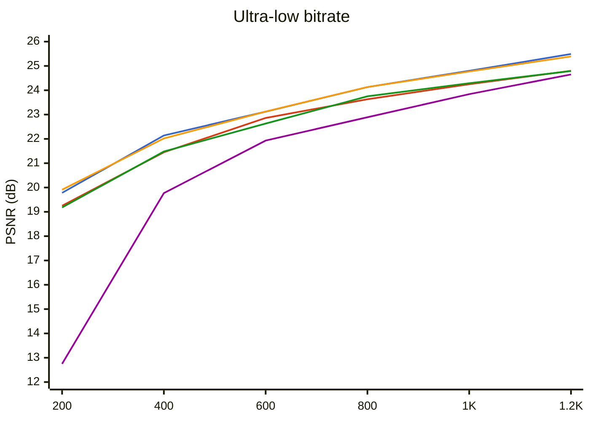
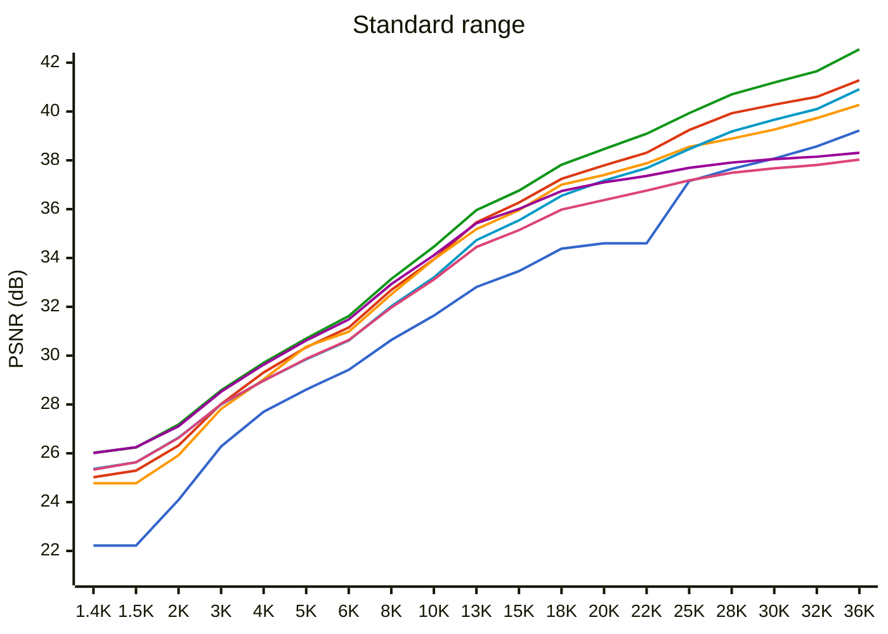

# WTPC vs JPEG vs JPEG2000 vs JPEGXL - Benchmark

**Test image:** `lena256.png` (256x256, 24-bit RGB)  
**Target range:** 200 B - 36 KB (thumbnails / previews)  
**Metrics:** PSNR (dB, higher is better), ssimulacra2 (0-100, higher is better)
**Date:** 2026-08-07

## PSNR vs File Size

### Ultra-low range (200 B - 1.2 KB)

```mermaid
%%{init: {"themeVariables": {"xyChart": {"plotColorPalette": "#3366cc, #dc3912, #ff9900, #109618, #990099"}}}}%%
xychart-beta
    title "Ultra-low bitrate"
    y-axis "PSNR (dB)" 12 --> 26
    x-axis ["200", "400", "600", "800", "1K", "1.2K"]
    line "WTPC EBC" [19.78, 22.14, 23.12, 24.13, 24.80, 25.49]
    line "WTPC Huff" [19.25, 21.45, 22.86, 23.63, 24.25, 24.80]
    line "W420 EBC" [19.91, 22.02, 23.12, 24.13, 24.77, 25.39]
    line "W420 Huff" [19.18, 21.48, 22.63, 23.75, 24.29, 24.79]
    line "JPEG2000" [12.75, 19.77, 21.93, 22.89, 23.84, 24.65]
```
🔵 WTPC EBC  🔴 WTPC Huff  🟠 W420 EBC  🟢 W420 Huff  🟣 JPEG2000

### Standard range (1.4 KB - 36 KB)

```mermaid
%%{init: {"themeVariables": {"xyChart": {"plotColorPalette": "#3366cc, #dc3912, #ff9900, #109618, #0099c6, #990099, #dd4477"}}}}%%
xychart-beta
    title "Standard range"
    y-axis "PSNR (dB)" 21 --> 42
    x-axis ["1.4K", "1.5K", "2K", "3K", "4K", "5K", "6K", "8K", "10K", "13K", "15K", "18K", "20K", "22K", "25K", "28K", "30K", "32K", "36K"]
    line "JPEG" [22.22, 22.22, 24.09, 26.28, 27.70, 28.61, 29.42, 30.64, 31.64, 32.81, 33.46, 34.38, 34.60, 34.60, 37.15, 37.65, 38.07, 38.57, 39.22]
    line "JPEG2000" [25.02, 25.29, 26.32, 28.02, 29.31, 30.34, 31.15, 32.69, 33.94, 35.46, 36.27, 37.24, 37.79, 38.31, 39.24, 39.93, 40.28, 40.60, 41.28]
    line "JPEGXL" [24.77, 24.77, 25.92, 27.82, 29.03, 30.37, 30.98, 32.51, 33.94, 35.18, 35.96, 37.00, 37.40, 37.88, 38.55, 38.89, 39.26, 39.73, 40.27]
    line "WTPC EBC" [26.02, 26.24, 27.18, 28.58, 29.71, 30.70, 31.62, 33.14, 34.46, 35.96, 36.76, 37.82, 38.46, 39.09, 39.93, 40.70, 41.19, 41.65, 42.55]
    line "WTPC Huff" [25.36, 25.63, 26.64, 28.00, 28.98, 29.85, 30.62, 32.02, 33.20, 34.73, 35.54, 36.55, 37.17, 37.68, 38.46, 39.18, 39.66, 40.10, 40.91]
    line "W420 EBC" [26.01, 26.25, 27.11, 28.52, 29.63, 30.62, 31.48, 32.93, 34.11, 35.42, 36.01, 36.74, 37.10, 37.36, 37.69, 37.91, 38.05, 38.15, 38.31]
    line "W420 Huff" [25.33, 25.63, 26.63, 28.01, 28.97, 29.87, 30.64, 31.97, 33.12, 34.45, 35.14, 35.98, 36.37, 36.76, 37.18, 37.49, 37.67, 37.81, 38.03]
```
🔵 WTPC EBC  🔴 WTPC Huff  🟠 W420 EBC  🟢 W420 Huff  🔹 JPEG  🟣 JPEG2000  💗 JPEGXL

## Comparison by Size Steps

Each row: closest entry from each codec to the target size. Best per metric is **bold**.

| Step | E_4 B | H_4 B | E_2 B | H_2 B | JP2K B | JPXL B | JPEG B | E_4 PSNR | H_4 PSNR | E_2 PSNR | H_2 PSNR | JP2K PSNR | JPXL PSNR | JPEG PSNR | E_4 Ssim2 | H_4 Ssim2 | E_2 Ssim2 | H_2 Ssim2 | JP2K Ssim2 | JPXL Ssim2 | JPEG Ssim2 | E_4 Q | H_4 Q | E_2 Q | H_2 Q | JP2K Q | JPXL Q | JPEG Q |
|------|------|------|------|------|------|------|------|------|------|------|------|------|------|------|------|------|------|------|------|------|------|------|------|------|------|------|------|------|
| ~200 | 202 | 199 | **201** | 202 | 244 | - | - | 19.78 | 19.25 | **19.91** | 19.18 | 12.75 | - | - | -59.88 | -60.28 | **-59.43** | -60.26 | -541.07 | - | - | 907 | 920 | 909 | 919 | 1000 | - | - |
| ~400 | **405** | 404 | 405 | 406 | 403 | - | - | **22.14** | 21.45 | 22.02 | 21.48 | 19.77 | - | - | -38.02 | -43.46 | **-37.81** | -42.45 | -64.20 | - | - | 823 | 840 | 824 | 840 | 500 | - | - |
| ~600 | 600 | 604 | **604** | 604 | 617 | - | - | 23.12 | 22.86 | **23.12** | 22.63 | 21.93 | - | - | **-19.91** | -25.70 | -21.20 | -26.24 | -49.95 | - | - | 776 | 792 | 777 | 792 | 320 | - | - |
| ~800 | 803 | 808 | **801** | 804 | 784 | - | 1097 | 24.13 | 23.63 | **24.13** | 23.75 | 22.89 | - | 20.59 | **-5.84** | -13.57 | -5.90 | -13.88 | -36.79 | - | -55.87 | 738 | 755 | 739 | 756 | 256 | - | 1 |
| ~1000 | **1007** | 1003 | 1003 | 1007 | 1026 | 1418 | 1097 | **24.80** | 24.25 | 24.77 | 24.29 | 23.84 | 24.77 | 20.59 | **6.03** | -3.90 | 5.90 | -3.51 | -21.48 | -7.86 | -55.87 | 709 | 730 | 710 | 730 | 192 | min | 1 |
| ~1200 | **1202** | 1201 | 1201 | 1203 | 1257 | 1418 | 1230 | **25.49** | 24.80 | 25.39 | 24.79 | 24.65 | 24.77 | 20.93 | **13.90** | 6.03 | 13.32 | 6.52 | -9.72 | -7.86 | -53.76 | 684 | 709 | 685 | 708 | 156 | min | 3 |
| ~1400 | **1401** | 1405 | 1404 | 1397 | 1392 | 1418 | 1467 | **26.02** | 25.36 | 26.01 | 25.33 | 25.02 | 24.77 | 22.22 | 21.74 | 13.15 | **21.78** | 12.44 | -3.29 | -7.86 | -40.85 | 662 | 688 | 663 | 688 | 140 | min | 4 |
| ~1500 | 1503 | 1505 | **1506** | 1507 | 1485 | 1418 | 1467 | 26.24 | 25.63 | **26.25** | 25.63 | 25.29 | 24.77 | 22.22 | 23.76 | 16.77 | **23.83** | 16.03 | -0.66 | -7.86 | -40.85 | 652 | 678 | 653 | 677 | 132 | min | 4 |
| ~2000 | **2009** | 1996 | 2008 | 2000 | 1976 | 1955 | 1973 | **27.18** | 26.64 | 27.11 | 26.63 | 26.32 | 25.92 | 24.09 | 37.19 | 29.29 | **37.20** | 28.69 | 13.28 | 15.03 | -10.66 | 611 | 636 | 611 | 635 | 100 | 18 | 6 |
| ~3000 | **3004** | 3002 | 3003 | 3001 | 3076 | 2849 | 3017 | **28.58** | 28.00 | 28.52 | 28.01 | 28.02 | 27.82 | 26.28 | **50.26** | 45.57 | 49.72 | 46.07 | 30.03 | 38.84 | 23.77 | 547 | 573 | 548 | 572 | 64 | 11 | 11 |
| ~4000 | **3992** | 4005 | 4007 | 4011 | 4016 | 3825 | 4040 | **29.71** | 28.98 | 29.63 | 28.97 | 29.31 | 29.03 | 27.70 | **59.29** | 53.48 | 58.66 | 53.89 | 42.82 | 49.99 | 42.32 | 503 | 531 | 503 | 529 | 49 | 8 | 17 |
| ~5000 | **5015** | 5011 | 5005 | 5011 | 5026 | 5077 | 4971 | **30.70** | 29.85 | 30.62 | 29.87 | 30.34 | 30.37 | 28.61 | **65.56** | 60.17 | 65.06 | 60.49 | 50.45 | 60.63 | 51.47 | 467 | 497 | 468 | 495 | 39 | 5.5 | 23 |
| ~6000 | **6013** | 5998 | 6007 | 6006 | 5968 | 5862 | 6041 | **31.62** | 30.62 | 31.48 | 30.64 | 31.15 | 30.98 | 29.42 | **70.32** | 65.43 | 69.25 | 65.09 | 55.09 | 63.45 | 59.06 | 436 | 470 | 436 | 467 | 33 | 4.5 | 31 |
| ~8000 | **8010** | 8005 | 8004 | 8006 | 7835 | 7770 | 7941 | **33.14** | 32.02 | 32.93 | 31.97 | 32.69 | 32.51 | 30.64 | **76.08** | 71.58 | 75.49 | 71.71 | 65.07 | 72.67 | 67.22 | 388 | 423 | 387 | 419 | 25 | 3 | 48 |
| ~10000 | **10021** | 10017 | 10031 | 10036 | 9828 | 10075 | 9979 | **34.46** | 33.20 | 34.11 | 33.12 | 33.94 | 33.94 | 31.64 | **80.29** | 76.31 | 79.31 | 76.28 | 69.66 | 78.92 | 72.24 | 349 | 386 | 347 | 381 | 20 | 2.1 | 65 |
| ~13000 | **12988** | 13029 | 13022 | 13033 | 13123 | 12774 | 13076 | **35.96** | 34.73 | 35.42 | 34.45 | 35.46 | 35.18 | 32.81 | **84.39** | 81.09 | 83.63 | 80.64 | 75.46 | 83.30 | 77.28 | 302 | 341 | 298 | 335 | 15 | 1.5 | 78 |
| ~15000 | **14992** | 15031 | 14990 | 14987 | 15120 | 15000 | 15179 | **36.76** | 35.54 | 36.01 | 35.14 | 36.27 | 35.96 | 33.46 | **86.53** | 83.65 | 85.24 | 82.89 | 79.05 | 85.44 | 79.70 | 275 | 315 | 271 | 309 | 13 | 1.2 | 83 |
| ~18000 | **18003** | 17992 | 18033 | 18052 | 17843 | 18160 | 18218 | **37.82** | 36.55 | 36.74 | 35.98 | 37.24 | 37.00 | 34.38 | **88.84** | 86.04 | 87.25 | 85.32 | 81.47 | 88.22 | 82.54 | 241 | 282 | 234 | 273 | 11 | 0.9 | 88 |
| ~20000 | **20025** | 20004 | 20008 | 19983 | 19642 | 19898 | 18941 | **38.46** | 37.17 | 37.10 | 36.37 | 37.79 | 37.40 | 34.60 | **89.78** | 87.38 | 88.09 | 86.41 | 82.04 | 89.14 | 83.30 | 221 | 262 | 212 | 253 | 10 | 0.8 | 89 |
| ~22000 | **22032** | 21972 | 22061 | 22043 | 21545 | 21926 | 18941 | **39.09** | 37.68 | 37.36 | 36.76 | 38.31 | 37.88 | 34.60 | **90.67** | 88.64 | 88.72 | 87.28 | 83.29 | 89.95 | 83.30 | 202 | 245 | 191 | 233 | 9 | 0.7 | 89 |
| ~25000 | **24980** | 24973 | 25025 | 24985 | 25122 | 25130 | 26679 | **39.93** | 38.46 | 37.69 | 37.18 | 39.24 | 38.55 | 37.15 | **91.74** | 89.78 | 89.37 | 88.30 | 85.78 | 91.08 | 88.01 | 178 | 221 | 164 | 206 | 7.8 | 0.57 | 90 |
| ~28000 | **27993** | 27967 | 28065 | 28056 | 28103 | 27977 | 28350 | **40.70** | 39.18 | 37.91 | 37.49 | 39.93 | 38.89 | 37.65 | **92.54** | 90.85 | 89.85 | 88.95 | 87.31 | 91.76 | 88.88 | 156 | 199 | 138 | 181 | 7 | 0.5 | 91 |
| ~30000 | **30083** | 30097 | 30028 | 30042 | 29710 | 29858 | 29845 | **41.19** | 39.66 | 38.05 | 37.67 | 40.28 | 39.26 | 38.07 | **93.02** | 91.35 | 90.08 | 89.39 | 87.76 | 92.27 | 89.45 | 142 | 185 | 122 | 166 | 6.6 | 0.45 | 92 |
| ~32000 | **31970** | 32046 | 32003 | 31997 | 31675 | 32361 | 32379 | **41.65** | 40.10 | 38.15 | 37.81 | 40.60 | 39.73 | 38.57 | **93.43** | 91.97 | 90.27 | 89.64 | 87.97 | 92.87 | 90.56 | 130 | 173 | 105 | 152 | 6.2 | 0.4 | 93 |
| ~36000 | **35964** | 36055 | 36032 | 36096 | 36169 | 35863 | 35656 | **42.55** | 40.91 | 38.31 | 38.03 | 41.28 | 40.27 | 39.22 | **93.93** | 92.78 | 90.58 | 90.07 | 88.42 | 93.32 | 91.43 | 106 | 150 | 70 | 124 | 5.4 | 0.34 | 94 |

> At each step, the codec with the best PSNR / ssimulacra2 (both higher=better) wins. Empty cells mean no data within +-50% of the target size.

## Best Codec at Each Target Size (by PSNR)

| Target (B) | Best Codec | Setting | Actual Size | PSNR (dB) | ssimulacra2 |
|------------|------------|---------|-------------|-----------|-------------|
| 200 | W420 EBC | 909 | 201 | 19.91 | -59.43 |
| 400 | WTPC EBC | 823 | 405 | 22.14 | -38.02 |
| 600 | W420 EBC | 777 | 604 | 23.12 | -21.20 |
| 800 | W420 EBC | 739 | 801 | 24.13 | -5.90 |
| 1000 | WTPC EBC | 709 | 1007 | 24.80 | 6.03 |
| 1400 | WTPC EBC | 662 | 1401 | 26.02 | 21.74 |
| 2000 | WTPC EBC | 611 | 2009 | 27.18 | 37.19 |
| 3000 | WTPC EBC | 547 | 3004 | 28.58 | 50.26 |
| 4000 | WTPC EBC | 503 | 3992 | 29.71 | 59.29 |
| 5000 | WTPC EBC | 467 | 5015 | 30.70 | 65.56 |
| 6000 | WTPC EBC | 436 | 6013 | 31.62 | 70.32 |
| 8000 | WTPC EBC | 388 | 8010 | 33.14 | 76.08 |
| 10000 | WTPC EBC | 349 | 10021 | 34.46 | 80.29 |
| 13000 | WTPC EBC | 302 | 12988 | 35.96 | 84.39 |
| 15000 | WTPC EBC | 275 | 14992 | 36.76 | 86.53 |
| 18000 | WTPC EBC | 241 | 18003 | 37.82 | 88.84 |
| 20000 | WTPC EBC | 221 | 20025 | 38.46 | 89.78 |
| 22000 | WTPC EBC | 202 | 22032 | 39.09 | 90.67 |
| 25000 | WTPC EBC | 178 | 24980 | 39.93 | 91.74 |
| 28000 | WTPC EBC | 156 | 27993 | 40.70 | 92.54 |
| 30000 | WTPC EBC | 142 | 30083 | 41.19 | 93.02 |
| 32000 | WTPC EBC | 130 | 31970 | 41.65 | 93.43 |
| 36000 | WTPC EBC | 106 | 35964 | 42.55 | 93.93 |

## Best Codec at Each Target Size (by ssimulacra2)

| Target (B) | Best Codec | Setting | Actual Size | PSNR (dB) | ssimulacra2 |
|------------|------------|---------|-------------|-----------|-------------|
| 200 | W420 EBC | 909 | 201 | 19.91 | -59.43 |
| 400 | W420 EBC | 824 | 405 | 22.02 | -37.81 |
| 600 | WTPC EBC | 776 | 600 | 23.12 | -19.91 |
| 800 | WTPC EBC | 738 | 803 | 24.13 | -5.84 |
| 1000 | WTPC EBC | 709 | 1007 | 24.80 | 6.03 |
| 1400 | W420 EBC | 663 | 1404 | 26.01 | 21.78 |
| 2000 | W420 EBC | 611 | 2008 | 27.11 | 37.20 |
| 3000 | WTPC EBC | 547 | 3004 | 28.58 | 50.26 |
| 4000 | WTPC EBC | 503 | 3992 | 29.71 | 59.29 |
| 5000 | WTPC EBC | 467 | 5015 | 30.70 | 65.56 |
| 6000 | WTPC EBC | 436 | 6013 | 31.62 | 70.32 |
| 8000 | WTPC EBC | 388 | 8010 | 33.14 | 76.08 |
| 10000 | WTPC EBC | 349 | 10021 | 34.46 | 80.29 |
| 13000 | WTPC EBC | 302 | 12988 | 35.96 | 84.39 |
| 15000 | WTPC EBC | 275 | 14992 | 36.76 | 86.53 |
| 18000 | WTPC EBC | 241 | 18003 | 37.82 | 88.84 |
| 20000 | WTPC EBC | 221 | 20025 | 38.46 | 89.78 |
| 22000 | WTPC EBC | 202 | 22032 | 39.09 | 90.67 |
| 25000 | WTPC EBC | 178 | 24980 | 39.93 | 91.74 |
| 28000 | WTPC EBC | 156 | 27993 | 40.70 | 92.54 |
| 30000 | WTPC EBC | 142 | 30083 | 41.19 | 93.02 |
| 32000 | WTPC EBC | 130 | 31970 | 41.65 | 93.43 |
| 36000 | WTPC EBC | 106 | 35964 | 42.55 | 93.93 |
## Encode / Decode Speed (ms)

| Step | E_4 enc | E_4 dec | H_4 enc | H_4 dec | E_2 enc | E_2 dec | H_2 enc | H_2 dec | JP2K enc | JP2K dec | JXL enc | JXL dec | JPEG enc |
|------|---------|---------|---------|---------|---------|---------|---------|---------|----------|----------|----------|----------|----------|
| ~200 | 1.6 | 0.7 | 1.2 | 0.5 | 1.5 | 0.7 | 0.8 | 0.6 | 16.0 | 4.0 | - | - | - |
| ~400 | 2.1 | 0.8 | 1.1 | 0.5 | 1.6 | 0.8 | 0.9 | 0.6 | 16.0 | 4.0 | - | - | - |
| ~600 | 2.6 | 0.9 | 1.3 | 0.5 | 2.1 | 0.9 | 0.9 | 0.6 | 16.0 | 4.0 | - | - | - |
| ~800 | 3.0 | 1.0 | 1.3 | 0.5 | 2.5 | 0.9 | 0.8 | 0.6 | 16.0 | 4.0 | - | - | 5.0 |
| ~1000 | 3.9 | 1.1 | 1.2 | 0.5 | 2.6 | 1.0 | 1.0 | 0.6 | 16.0 | 4.0 | 117.0 | 4.0 | 5.0 |
| ~1200 | 4.8 | 1.2 | 1.5 | 0.5 | 4.1 | 1.1 | 1.0 | 0.6 | 16.0 | 4.0 | 117.0 | 4.0 | 4.0 |
| ~1400 | 4.2 | 1.2 | 1.5 | 0.6 | 4.2 | 1.1 | 1.0 | 0.6 | 16.0 | 4.0 | 117.0 | 4.0 | 4.0 |
| ~1500 | 5.2 | 1.5 | 1.5 | 0.5 | 4.2 | 1.3 | 1.1 | 0.6 | 16.0 | 4.0 | 117.0 | 4.0 | 4.0 |
| ~2000 | 7.8 | 1.7 | 1.6 | 0.6 | 6.6 | 1.6 | 1.0 | 0.6 | 16.0 | 4.0 | 11.0 | 4.0 | 4.0 |
| ~3000 | 8.7 | 2.2 | 1.5 | 0.6 | 7.7 | 2.0 | 1.1 | 0.7 | 16.0 | 5.0 | 11.0 | 4.0 | 4.0 |
| ~4000 | 11.2 | 2.8 | 1.6 | 0.6 | 9.7 | 2.6 | 1.2 | 0.7 | 16.0 | 4.0 | 11.0 | 4.0 | 4.0 |
| ~5000 | 18.1 | 3.2 | 1.7 | 0.6 | 13.8 | 2.8 | 1.4 | 0.7 | 16.0 | 4.0 | 11.0 | 4.0 | 4.0 |
| ~6000 | 14.1 | 3.5 | 2.3 | 0.6 | 12.5 | 3.2 | 1.5 | 0.7 | 16.0 | 4.0 | 13.0 | 4.0 | 4.0 |
| ~8000 | 19.6 | 4.0 | 2.1 | 0.7 | 14.2 | 3.6 | 1.7 | 0.7 | 16.0 | 5.0 | 11.0 | 4.0 | 4.0 |
| ~10000 | 23.1 | 4.4 | 2.3 | 0.7 | 19.7 | 4.0 | 2.3 | 0.8 | 16.0 | 5.0 | 11.0 | 4.0 | 4.0 |
| ~13000 | 31.1 | 6.1 | 3.1 | 0.8 | 20.9 | 4.3 | 2.6 | 0.9 | 16.0 | 5.0 | 11.0 | 4.0 | 4.0 |
| ~15000 | 33.6 | 6.5 | 3.4 | 0.8 | 22.1 | 4.5 | 2.9 | 0.9 | 16.0 | 5.0 | 11.0 | 4.0 | 4.0 |
| ~18000 | 37.6 | 7.2 | 3.8 | 0.9 | 23.4 | 4.8 | 3.9 | 0.9 | 16.0 | 6.0 | 11.0 | 4.0 | 4.0 |
| ~20000 | 39.3 | 7.9 | 4.0 | 0.9 | 25.1 | 5.0 | 3.6 | 1.1 | 16.0 | 6.0 | 11.0 | 4.0 | 4.0 |
| ~22000 | 32.6 | 8.0 | 4.4 | 0.9 | 25.2 | 5.2 | 3.7 | 1.0 | 16.0 | 6.0 | 11.0 | 4.0 | 4.0 |
| ~25000 | 41.7 | 8.2 | 4.7 | 1.0 | 26.3 | 5.4 | 4.2 | 1.0 | 16.0 | 6.0 | 10.0 | 4.0 | 5.0 |
| ~28000 | 43.1 | 8.5 | 5.0 | 1.1 | 37.9 | 5.8 | 4.5 | 1.1 | 16.0 | 7.0 | 9.0 | 4.0 | 5.0 |
| ~30000 | 44.3 | 8.8 | 5.3 | 1.1 | 33.5 | 5.9 | 4.7 | 1.2 | 16.0 | 7.0 | 10.0 | 4.0 | 5.0 |
| ~32000 | 45.7 | 8.9 | 5.6 | 1.1 | 35.0 | 6.1 | 5.8 | 1.1 | 16.0 | 7.0 | 9.0 | 4.0 | 5.0 |
| ~36000 | 46.4 | 9.4 | 6.1 | 1.2 | 30.5 | 6.7 | 7.3 | 1.2 | 16.0 | 8.0 | 10.0 | 4.0 | 5.0 |

> WTPC encode timings above include a binary quality search to hit the exact target size (-b mode). Other codecs use pre-calibrated parameters. At fixed quality, see below.

## WTPC Speed by Quality Level (ms, fixed q)

| q | WTPC_E enc | WTPC_E dec | WTPC_H enc | WTPC_H dec | W420_E enc | W420_E dec | W420_H enc | W420_H dec |
|----|---------|---------|---------|---------|---------|---------|---------|---------|
| 665 | 1.3 | 1.2 | 0.7 | 0.6 | 1.1 | 1.1 | 0.5 | 0.6 |
| 570 | 2.2 | 2.1 | 0.7 | 0.6 | 2.0 | 1.9 | 0.5 | 0.6 |
| 474 | 3.3 | 3.1 | 0.8 | 0.6 | 2.9 | 2.8 | 0.6 | 0.7 |
| 369 | 4.3 | 4.2 | 0.9 | 0.7 | 3.9 | 3.8 | 0.8 | 0.8 |
| 244 | 7.5 | 7.2 | 1.2 | 0.9 | 4.8 | 4.7 | 1.0 | 0.9 |
| 101 | 9.7 | 9.5 | 1.8 | 1.4 | 6.0 | 6.2 | 1.4 | 1.3 |
| 78 | 10.0 | 9.7 | 1.9 | 1.5 | 6.3 | 6.3 | 1.5 | 1.3 |

> Encode at fixed q (no binary search). File sizes: ~78->665 q.

## Compare with avif

Since avif have rough quantization steps it goes to separate table.
First step avifenc -q 0 --speed 0 and then closest to our targets.
WTPC uses -b to match avif sizes.

### AVIF --speed 0 vs WTPC

| Target | AVIF q | EBCOT 444 q | EBCOT 420 q | AVIF B | EBCOT 444 B | EBCOT 420 B | AVIF enc | EBCOT 444 enc | EBCOT 420 enc | AVIF dec | EBCOT 444 dec | EBCOT 420 dec | AVIF PSNR | EBCOT 444 PSNR | EBCOT 420 PSNR | AVIF ssim2 | EBCOT 444 ssim2 | EBCOT 420 ssim2 |
|--------|--------|-------------|-------------|--------|-------------|-------------|---------|---------------|---------------|---------|---------------|---------------|----------|----------------|----------------|-----------|------------------|-------------------|
| ~716 B | q=0 | 751 | 752 | 716 | 720 | 718 | 269 | 1 | 1 | 7 | 1 | 1 | 23.83 | 23.74 | 23.73 | -25.98 | -12.18 | -11.86 |
| 1 KB | q=3 | 713 | 713 | 971 | 974 | 978 | 356 | 1 | 1 | 4 | 1 | 1 | 25.42 | 24.68 | 24.69 | -0.18 | 4.07 | 4.40 |
| 1.4 KB | q=10 | 658 | 659 | 1430 | 1435 | 1434 | 465 | 1 | 1 | 4 | 1 | 1 | 27.17 | 26.10 | 26.11 | 20.39 | 22.61 | 22.42 |
| 2 KB | q=17 | 612 | 612 | 1991 | 1994 | 1996 | 575 | 2 | 2 | 4 | 2 | 2 | 28.80 | 27.16 | 27.16 | 39.31 | 36.58 | 36.80 |
| 4 KB | q=36 | 498 | 499 | 4106 | 4117 | 4118 | 918 | 3 | 3 | 4 | 3 | 3 | 32.56 | 29.83 | 29.75 | 66.34 | 59.85 | 59.35 |
| 8 KB | q=54 | 392 | 391 | 7830 | 7820 | 7822 | 1300 | 4 | 4 | 4 | 4 | 4 | 35.90 | 32.99 | 32.82 | 80.04 | 75.65 | 75.21 |
| 16 KB | q=76 | 263 | 258 | 15960 | 15992 | 15980 | 1701 | 7 | 5 | 5 | 7 | 5 | 39.49 | 37.13 | 36.28 | 88.87 | 87.29 | 86.07 |
| 26 KB | q=85 | 178 | 165 | 24894 | 24980 | 24919 | 1955 | 10 | 6 | 6 | 10 | 6 | 41.76 | 39.93 | 37.68 | 91.82 | 91.74 | 89.41 |
| 36 KB | q=90 | 112 | 79 | 34971 | 34990 | 34952 | 2090 | 10 | 6 | 6 | 9 | 6 | 43.60 | 42.32 | 38.27 | 93.38 | 93.88 | 90.51 |

> **Speed 0:** AVIF wins on ssim2 from 2 KB to 26 KB, but encoding is up to 370x slower than WTPC.

### AVIF --speed 6 vs WTPC

| Target | AVIF q | EBCOT 444 q | EBCOT 420 q | AVIF B | EBCOT 444 B | EBCOT 420 B | AVIF enc | EBCOT 444 enc | EBCOT 420 enc | AVIF dec | EBCOT 444 dec | EBCOT 420 dec | AVIF PSNR | EBCOT 444 PSNR | EBCOT 420 PSNR | AVIF ssim2 | EBCOT 444 ssim2 | EBCOT 420 ssim2 |
|--------|--------|-------------|-------------|--------|-------------|-------------|---------|---------------|---------------|---------|---------------|---------------|----------|----------------|----------------|-----------|------------------|-------------------|
| ~726 B | q=0 | 749 | 750 | 726 | 726 | 730 | 10 | 1 | 1 | 4 | 1 | 1 | 23.44 | 23.79 | 23.87 | -30.46 | -12.24 | -11.54 |
| 1 KB | q=3 | 713 | 713 | 971 | 974 | 978 | 12 | 1 | 1 | 4 | 1 | 1 | 24.83 | 24.68 | 24.69 | -9.68 | 4.07 | 4.40 |
| 1.4 KB | q=10 | 666 | 667 | 1368 | 1366 | 1375 | 13 | 2 | 1 | 4 | 1 | 1 | 26.42 | 25.86 | 25.93 | 13.81 | 20.85 | 21.34 |
| 2 KB | q=19 | 610 | 610 | 2016 | 2024 | 2024 | 15 | 2 | 2 | 4 | 2 | 2 | 28.43 | 27.21 | 27.18 | 36.15 | 37.23 | 37.60 |
| 4 KB | q=36 | 501 | 502 | 4037 | 4041 | 4036 | 19 | 3 | 3 | 4 | 3 | 3 | 31.83 | 29.73 | 29.67 | 61.96 | 59.42 | 58.89 |
| 8 KB | q=55 | 386 | 385 | 8103 | 8092 | 8087 | 23 | 4 | 4 | 4 | 4 | 4 | 35.52 | 33.20 | 32.99 | 79.41 | 76.31 | 75.91 |
| 16 KB | q=76 | 268 | 263 | 15592 | 15582 | 15589 | 23 | 7 | 5 | 5 | 7 | 5 | 38.89 | 36.97 | 36.19 | 87.58 | 86.88 | 85.87 |
| 26 KB | q=88 | 166 | 150 | 26636 | 26596 | 26620 | 28 | 9 | 6 | 5 | 8 | 6 | 41.58 | 40.34 | 37.83 | 91.52 | 92.16 | 89.65 |
| 36 KB | q=92 | 94 | 58 | 37961 | 37992 | 37872 | 31 | 10 | 6 | 6 | 10 | 7 | 43.57 | 43.03 | 38.36 | 93.15 | 94.26 | 90.67 |

> **Speed 6:** AVIF wins on ssim2 from 4 KB to 16 KB and the gap narrows, but encoding is still up to 8x slower than WTPC.

### AVIF --speed 10 vs WTPC

| Target | AVIF q | EBCOT 444 q | EBCOT 420 q | AVIF B | EBCOT 444 B | EBCOT 420 B | AVIF enc | EBCOT 444 enc | EBCOT 420 enc | AVIF dec | EBCOT 444 dec | EBCOT 420 dec | AVIF PSNR | EBCOT 444 PSNR | EBCOT 420 PSNR | AVIF ssim2 | EBCOT 444 ssim2 | EBCOT 420 ssim2 |
|--------|--------|-------------|-------------|--------|-------------|-------------|---------|---------------|---------------|---------|---------------|---------------|----------|----------------|----------------|-----------|------------------|-------------------|
| ~827 B | q=0 | 733 | 735 | 827 | 833 | 828 | 7 | 1 | 1 | 4 | 1 | 1 | 22.55 | 24.23 | 24.20 | -41.03 | -4.72 | -4.69 |
| 1 KB | q=3 | 703 | 703 | 1050 | 1055 | 1058 | 6 | 1 | 1 | 4 | 1 | 1 | 23.79 | 24.91 | 24.96 | -18.85 | 8.10 | 8.65 |
| 1.4 KB | q=9 | 658 | 659 | 1430 | 1435 | 1434 | 6 | 1 | 1 | 4 | 1 | 1 | 25.14 | 26.10 | 26.11 | 1.70 | 22.61 | 22.42 |
| 2 KB | q=16 | 617 | 617 | 1923 | 1927 | 1931 | 6 | 2 | 1 | 4 | 2 | 1 | 26.41 | 27.05 | 27.04 | 17.94 | 35.63 | 34.95 |
| 4 KB | q=33 | 499 | 500 | 4081 | 4097 | 4086 | 7 | 3 | 3 | 4 | 3 | 3 | 29.88 | 29.81 | 29.73 | 50.97 | 59.67 | 59.26 |
| 8 KB | q=51 | 385 | 384 | 8146 | 8139 | 8139 | 7 | 4 | 4 | 4 | 4 | 4 | 33.55 | 33.23 | 33.02 | 73.06 | 76.43 | 76.01 |
| 16 KB | q=72 | 269 | 264 | 15515 | 15493 | 15505 | 8 | 7 | 5 | 4 | 7 | 5 | 37.28 | 36.94 | 36.17 | 84.78 | 86.73 | 85.64 |
| 26 KB | q=86 | 166 | 150 | 26560 | 26596 | 26620 | 8 | 9 | 6 | 5 | 8 | 6 | 40.53 | 40.34 | 37.83 | 90.36 | 92.16 | 89.65 |
| 36 KB | q=90 | 107 | 71 | 35823 | 35786 | 35902 | 9 | 10 | 6 | 5 | 9 | 7 | 42.33 | 42.51 | 38.30 | 92.46 | 93.95 | 90.59 |

> **Speed 10:** AVIF loses on ssim2 at all sizes, but encoding speed is now comparable (though slightly slower than WTPC).

---

*Tools: ImageMagick 7.1.2, OpenJPEG 2.5.4, libjxl 0.11.1, avifenc 1.3.0. Date: 2026-08-07.*
