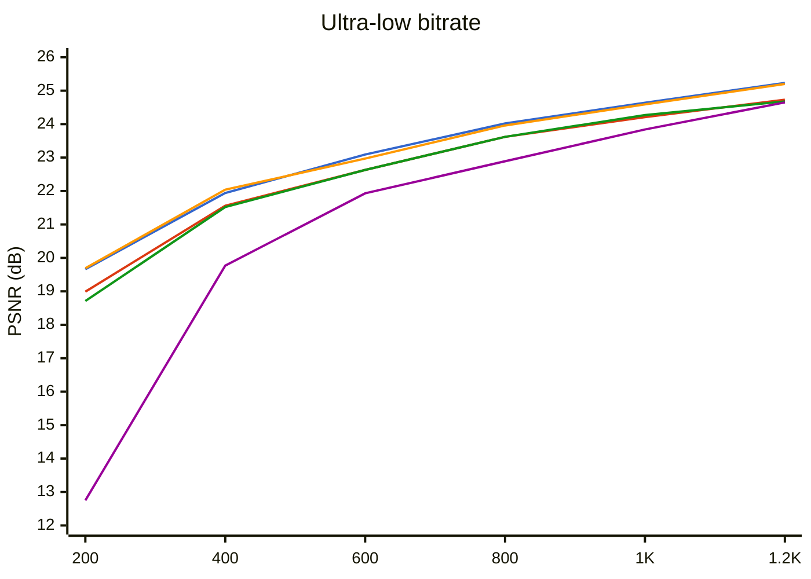

# WTPC vs JPEG vs JPEG2000 vs JPEGXL - Benchmark

**Test image:** `lena256.png` (256x256, 24-bit RGB)  
**Target range:** 200 B - 36 KB (thumbnails / previews)  
**Metrics:** PSNR (dB, higher is better), ssimulacra2 (0-100, higher is better)
**Date:** 2026-07-31

## PSNR vs File Size

### Ultra-low range (200 B - 1.2 KB)

```mermaid
%%{init: {"themeVariables": {"xyChart": {"plotColorPalette": "#3366cc, #dc3912, #ff9900, #109618, #990099"}}}}%%
xychart-beta
    title "Ultra-low bitrate"
    y-axis "PSNR (dB)" 12 --> 26
    x-axis ["200", "400", "600", "800", "1K", "1.2K"]
    line "WTPC EBC" [19.66, 21.94, 23.09, 24.02, 24.64, 25.23]
    line "WTPC Huff" [18.99, 21.56, 22.63, 23.62, 24.21, 24.73]
    line "W420 EBC" [19.69, 22.04, 22.97, 23.96, 24.59, 25.20]
    line "W420 Huff" [18.71, 21.52, 22.63, 23.62, 24.27, 24.68]
    line "JPEG2000" [12.75, 19.77, 21.93, 22.89, 23.84, 24.65]
```
🔵 WTPC EBC  🔴 WTPC Huff  🟠 W420 EBC  🟢 W420 Huff  🟣 JPEG2000

### Standard range (1.4 KB - 36 KB)

```mermaid
%%{init: {"themeVariables": {"xyChart": {"plotColorPalette": "#3366cc, #dc3912, #ff9900, #109618, #0099c6, #990099, #dd4477"}}}}%%
xychart-beta
    title "Standard range"
    y-axis "PSNR (dB)" 21 --> 42
    x-axis ["1.4K", "1.5K", "2K", "3K", "4K", "5K", "6K", "8K", "10K", "13K", "15K", "18K", "20K", "22K", "25K", "28K", "30K", "32K", "36K"]
    line "JPEG" [22.22, 22.22, 24.09, 26.28, 27.70, 28.61, 29.42, 30.64, 31.64, 32.81, 33.46, 34.38, 34.60, 34.60, 37.15, 37.65, 38.07, 38.57, 39.22]
    line "JPEG2000" [25.02, 25.29, 26.32, 28.02, 29.31, 30.34, 31.15, 32.69, 33.94, 35.46, 36.27, 37.24, 37.79, 38.31, 39.24, 39.93, 40.28, 40.60, 41.28]
    line "JPEGXL" [24.77, 24.77, 25.92, 27.82, 29.03, 30.37, 30.98, 32.51, 33.94, 35.18, 35.96, 37.00, 37.40, 37.88, 38.55, 38.89, 39.26, 39.73, 40.27]
    line "WTPC EBC" [25.90, 26.13, 27.14, 28.49, 29.57, 30.53, 31.47, 33.08, 34.40, 35.96, 36.74, 37.80, 38.47, 39.10, 39.99, 40.76, 41.24, 41.73, 42.61]
    line "WTPC Huff" [25.20, 25.45, 26.49, 27.92, 28.90, 29.72, 30.49, 31.91, 33.11, 34.63, 35.51, 36.56, 37.16, 37.72, 38.47, 39.20, 39.70, 40.12, 40.96]
    line "W420 EBC" [25.84, 26.07, 27.07, 28.42, 29.51, 30.47, 31.33, 32.84, 34.06, 35.37, 36.00, 36.72, 37.10, 37.36, 37.68, 37.92, 38.04, 38.13, 38.30]
    line "W420 Huff" [25.16, 25.43, 26.52, 27.89, 28.92, 29.71, 30.51, 31.87, 33.03, 34.37, 35.14, 35.96, 36.39, 36.73, 37.17, 37.50, 37.67, 37.81, 38.03]
```
🔵 WTPC EBC  🔴 WTPC Huff  🟠 W420 EBC  🟢 W420 Huff  🔹 JPEG  🟣 JPEG2000  💗 JPEGXL

## Comparison by Size Steps

Each row: closest entry from each codec to the target size. Best per metric is **bold**.

| Step | E_4 B | H_4 B | E_2 B | H_2 B | JP2K B | JPXL B | JPEG B | E_4 PSNR | H_4 PSNR | E_2 PSNR | H_2 PSNR | JP2K PSNR | JPXL PSNR | JPEG PSNR | E_4 Ssim2 | H_4 Ssim2 | E_2 Ssim2 | H_2 Ssim2 | JP2K Ssim2 | JPXL Ssim2 | JPEG Ssim2 | E_4 Q | H_4 Q | E_2 Q | H_2 Q | JP2K Q | JPXL Q | JPEG Q |
|------|------|------|------|------|------|------|------|------|------|------|------|------|------|------|------|------|------|------|------|------|------|------|------|------|------|------|------|------|
| ~200 | 204 | 198 | **205** | 201 | 244 | - | - | 19.66 | 18.99 | **19.69** | 18.71 | 12.75 | - | - | **-60.43** | -61.79 | -60.51 | -61.74 | -541.07 | - | - | 900 | 913 | 899 | 910 | 1000 | - | - |
| ~400 | 400 | 401 | **402** | 401 | 403 | - | - | 21.94 | 21.56 | **22.04** | 21.52 | 19.77 | - | - | **-39.14** | -44.70 | -39.34 | -44.75 | -64.20 | - | - | 817 | 832 | 817 | 831 | 500 | - | - |
| ~600 | **605** | 602 | 601 | 599 | 617 | - | - | **23.09** | 22.63 | 22.97 | 22.63 | 21.93 | - | - | **-21.70** | -27.98 | -22.54 | -28.40 | -49.95 | - | - | 767 | 782 | 768 | 782 | 320 | - | - |
| ~800 | **804** | 804 | 799 | 805 | 784 | - | 1097 | **24.02** | 23.62 | 23.96 | 23.62 | 22.89 | - | 20.59 | **-9.24** | -13.74 | -9.47 | -13.58 | -36.79 | - | -55.87 | 728 | 747 | 729 | 746 | 256 | - | 1 |
| ~1000 | 1002 | 1001 | 1002 | 1006 | 1026 | **1418** | 1097 | 24.64 | 24.21 | 24.59 | 24.27 | 23.84 | **24.77** | 20.59 | **2.69** | -6.18 | 2.56 | -6.05 | -21.48 | -7.86 | -55.87 | 700 | 720 | 701 | 719 | 192 | min | 1 |
| ~1200 | **1204** | 1205 | 1206 | 1199 | 1257 | 1418 | 1230 | **25.23** | 24.73 | 25.20 | 24.68 | 24.65 | 24.77 | 20.93 | **11.78** | 4.11 | 11.59 | 4.42 | -9.72 | -7.86 | -53.76 | 678 | 697 | 678 | 698 | 156 | min | 3 |
| ~1400 | **1405** | 1401 | 1401 | 1401 | 1392 | 1418 | 1467 | **25.90** | 25.20 | 25.84 | 25.16 | 25.02 | 24.77 | 22.22 | **19.97** | 10.53 | 18.69 | 10.73 | -3.29 | -7.86 | -40.85 | 655 | 681 | 656 | 680 | 140 | min | 4 |
| ~1500 | **1501** | 1502 | 1501 | 1501 | 1485 | 1418 | 1467 | **26.13** | 25.45 | 26.07 | 25.43 | 25.29 | 24.77 | 22.22 | **22.85** | 14.34 | 22.38 | 14.35 | -0.66 | -7.86 | -40.85 | 646 | 671 | 646 | 670 | 132 | min | 4 |
| ~2000 | **1997** | 2008 | 2007 | 2007 | 1976 | 1955 | 1973 | **27.14** | 26.49 | 27.07 | 26.52 | 26.32 | 25.92 | 24.09 | **35.16** | 26.58 | 34.50 | 26.58 | 13.28 | 15.03 | -10.66 | 605 | 630 | 605 | 629 | 100 | 18 | 6 |
| ~3000 | **3001** | 3002 | 3004 | 2997 | 3076 | 2849 | 3017 | **28.49** | 27.92 | 28.42 | 27.89 | 28.02 | 27.82 | 26.28 | **50.28** | 44.79 | 49.45 | 44.16 | 30.03 | 38.84 | 23.77 | 540 | 566 | 541 | 565 | 64 | 11 | 11 |
| ~4000 | **3999** | 3993 | 4015 | 4013 | 4016 | 3825 | 4040 | **29.57** | 28.90 | 29.51 | 28.92 | 29.31 | 29.03 | 27.70 | **58.21** | 53.87 | 58.00 | 53.54 | 42.82 | 49.99 | 42.32 | 492 | 520 | 492 | 517 | 49 | 8 | 17 |
| ~5000 | **5007** | 4997 | 5012 | 4999 | 5026 | 5077 | 4971 | **30.53** | 29.72 | 30.47 | 29.71 | 30.34 | 30.37 | 28.61 | **64.56** | 59.54 | 64.04 | 59.46 | 50.45 | 60.63 | 51.47 | 456 | 486 | 457 | 484 | 39 | 5.5 | 23 |
| ~6000 | **6000** | 6000 | 5989 | 6004 | 5968 | 5862 | 6041 | **31.47** | 30.49 | 31.33 | 30.51 | 31.15 | 30.98 | 29.42 | **69.72** | 64.14 | 68.85 | 64.43 | 55.09 | 63.45 | 59.06 | 427 | 458 | 428 | 456 | 33 | 4.5 | 31 |
| ~8000 | **8018** | 8015 | 8021 | 7996 | 7835 | 7770 | 7941 | **33.08** | 31.91 | 32.84 | 31.87 | 32.69 | 32.51 | 30.64 | **75.64** | 71.37 | 75.10 | 70.98 | 65.07 | 72.67 | 67.22 | 379 | 413 | 379 | 410 | 25 | 3 | 48 |
| ~10000 | **9993** | 10002 | 10028 | 10048 | 9828 | 10075 | 9979 | **34.40** | 33.11 | 34.06 | 33.03 | 33.94 | 33.94 | 31.64 | **79.99** | 75.47 | 79.43 | 75.70 | 69.66 | 78.92 | 72.24 | 341 | 378 | 340 | 373 | 20 | 2.1 | 65 |
| ~13000 | **13035** | 12977 | 12987 | 12993 | 13123 | 12774 | 13076 | **35.96** | 34.63 | 35.37 | 34.37 | 35.46 | 35.18 | 32.81 | **84.06** | 80.60 | 83.19 | 80.16 | 75.46 | 83.30 | 77.28 | 294 | 334 | 293 | 329 | 15 | 1.5 | 78 |
| ~15000 | **15026** | 14972 | 14999 | 15050 | 15120 | 15000 | 15179 | **36.74** | 35.51 | 36.00 | 35.14 | 36.27 | 35.96 | 33.46 | **85.96** | 82.74 | 85.00 | 82.47 | 79.05 | 85.44 | 79.70 | 268 | 308 | 266 | 302 | 13 | 1.2 | 83 |
| ~18000 | **17990** | 18016 | 18017 | 18000 | 17843 | 18160 | 18218 | **37.80** | 36.56 | 36.72 | 35.96 | 37.24 | 37.00 | 34.38 | **88.52** | 85.66 | 86.96 | 84.75 | 81.47 | 88.22 | 82.54 | 233 | 274 | 228 | 268 | 11 | 0.9 | 88 |
| ~20000 | **20031** | 20016 | 20057 | 20034 | 19642 | 19898 | 18941 | **38.47** | 37.16 | 37.10 | 36.39 | 37.79 | 37.40 | 34.60 | **89.56** | 86.98 | 87.73 | 86.09 | 82.04 | 89.14 | 83.30 | 213 | 254 | 206 | 246 | 10 | 0.8 | 89 |
| ~22000 | **22054** | 22034 | 22004 | 21976 | 21545 | 21926 | 18941 | **39.10** | 37.72 | 37.36 | 36.73 | 38.31 | 37.88 | 34.60 | **90.42** | 88.29 | 88.45 | 87.09 | 83.29 | 89.95 | 83.30 | 195 | 236 | 186 | 227 | 9 | 0.7 | 89 |
| ~25000 | **25090** | 25005 | 24985 | 25029 | 25122 | 25130 | 26679 | **39.99** | 38.47 | 37.68 | 37.17 | 39.24 | 38.55 | 37.15 | **91.59** | 89.56 | 89.29 | 88.08 | 85.78 | 91.08 | 88.01 | 170 | 213 | 158 | 200 | 7.8 | 0.57 | 90 |
| ~28000 | **28004** | 27988 | 28031 | 28012 | 28103 | 27977 | 28350 | **40.76** | 39.20 | 37.92 | 37.50 | 39.93 | 38.89 | 37.65 | **92.34** | 90.59 | 89.75 | 88.74 | 87.31 | 91.76 | 88.88 | 149 | 192 | 133 | 175 | 7 | 0.5 | 91 |
| ~30000 | **30022** | 30074 | 30077 | 29986 | 29710 | 29858 | 29845 | **41.24** | 39.70 | 38.04 | 37.67 | 40.28 | 39.26 | 38.07 | **92.79** | 91.18 | 90.02 | 89.17 | 87.76 | 92.27 | 89.45 | 136 | 178 | 117 | 160 | 6.6 | 0.45 | 92 |
| ~32000 | **32081** | 32042 | 32003 | 31959 | 31675 | 32361 | 32379 | **41.73** | 40.12 | 38.13 | 37.81 | 40.60 | 39.73 | 38.57 | **93.23** | 91.64 | 90.15 | 89.46 | 87.97 | 92.87 | 90.56 | 123 | 166 | 102 | 146 | 6.2 | 0.4 | 93 |
| ~36000 | **36067** | 35951 | 36005 | 36076 | 36169 | 35863 | 35656 | **42.61** | 40.96 | 38.30 | 38.03 | 41.28 | 40.27 | 39.22 | **93.75** | 92.50 | 90.52 | 89.96 | 88.42 | 93.32 | 91.43 | 101 | 144 | 68 | 119 | 5.4 | 0.34 | 94 |

> At each step, the codec with the best PSNR / ssimulacra2 (both higher=better) wins. Empty cells mean no data within +-50% of the target size.

## Best Codec at Each Target Size (by PSNR)

| Target (B) | Best Codec | Setting | Actual Size | PSNR (dB) | ssimulacra2 |
|------------|------------|---------|-------------|-----------|-------------|
| 200 | W420 EBC | 899 | 205 | 19.69 | -60.51 |
| 400 | W420 EBC | 817 | 402 | 22.04 | -39.34 |
| 600 | WTPC EBC | 767 | 605 | 23.09 | -21.70 |
| 800 | WTPC EBC | 728 | 804 | 24.02 | -9.24 |
| 1000 | WTPC EBC | 700 | 1002 | 24.64 | 2.69 |
| 1400 | WTPC EBC | 655 | 1405 | 25.90 | 19.97 |
| 2000 | WTPC EBC | 605 | 1997 | 27.14 | 35.16 |
| 3000 | WTPC EBC | 540 | 3001 | 28.49 | 50.28 |
| 4000 | WTPC EBC | 492 | 3999 | 29.57 | 58.21 |
| 5000 | WTPC EBC | 456 | 5007 | 30.53 | 64.56 |
| 6000 | WTPC EBC | 427 | 6000 | 31.47 | 69.72 |
| 8000 | WTPC EBC | 379 | 8018 | 33.08 | 75.64 |
| 10000 | WTPC EBC | 341 | 9993 | 34.40 | 79.99 |
| 13000 | WTPC EBC | 294 | 13035 | 35.96 | 84.06 |
| 15000 | WTPC EBC | 268 | 15026 | 36.74 | 85.96 |
| 18000 | WTPC EBC | 233 | 17990 | 37.80 | 88.52 |
| 20000 | WTPC EBC | 213 | 20031 | 38.47 | 89.56 |
| 22000 | WTPC EBC | 195 | 22054 | 39.10 | 90.42 |
| 25000 | WTPC EBC | 170 | 25090 | 39.99 | 91.59 |
| 28000 | WTPC EBC | 149 | 28004 | 40.76 | 92.34 |
| 30000 | WTPC EBC | 136 | 30022 | 41.24 | 92.79 |
| 32000 | WTPC EBC | 123 | 32081 | 41.73 | 93.23 |
| 36000 | WTPC EBC | 101 | 36067 | 42.61 | 93.75 |

## Best Codec at Each Target Size (by ssimulacra2)

| Target (B) | Best Codec | Setting | Actual Size | PSNR (dB) | ssimulacra2 |
|------------|------------|---------|-------------|-----------|-------------|
| 200 | WTPC EBC | 900 | 204 | 19.66 | -60.43 |
| 400 | WTPC EBC | 817 | 400 | 21.94 | -39.14 |
| 600 | WTPC EBC | 767 | 605 | 23.09 | -21.70 |
| 800 | WTPC EBC | 728 | 804 | 24.02 | -9.24 |
| 1000 | WTPC EBC | 700 | 1002 | 24.64 | 2.69 |
| 1400 | WTPC EBC | 655 | 1405 | 25.90 | 19.97 |
| 2000 | WTPC EBC | 605 | 1997 | 27.14 | 35.16 |
| 3000 | WTPC EBC | 540 | 3001 | 28.49 | 50.28 |
| 4000 | WTPC EBC | 492 | 3999 | 29.57 | 58.21 |
| 5000 | WTPC EBC | 456 | 5007 | 30.53 | 64.56 |
| 6000 | WTPC EBC | 427 | 6000 | 31.47 | 69.72 |
| 8000 | WTPC EBC | 379 | 8018 | 33.08 | 75.64 |
| 10000 | WTPC EBC | 341 | 9993 | 34.40 | 79.99 |
| 13000 | WTPC EBC | 294 | 13035 | 35.96 | 84.06 |
| 15000 | WTPC EBC | 268 | 15026 | 36.74 | 85.96 |
| 18000 | WTPC EBC | 233 | 17990 | 37.80 | 88.52 |
| 20000 | WTPC EBC | 213 | 20031 | 38.47 | 89.56 |
| 22000 | WTPC EBC | 195 | 22054 | 39.10 | 90.42 |
| 25000 | WTPC EBC | 170 | 25090 | 39.99 | 91.59 |
| 28000 | WTPC EBC | 149 | 28004 | 40.76 | 92.34 |
| 30000 | WTPC EBC | 136 | 30022 | 41.24 | 92.79 |
| 32000 | WTPC EBC | 123 | 32081 | 41.73 | 93.23 |
| 36000 | WTPC EBC | 101 | 36067 | 42.61 | 93.75 |
## Encode / Decode Speed (ms)

| Step | E_4 enc | E_4 dec | H_4 enc | H_4 dec | E_2 enc | E_2 dec | H_2 enc | H_2 dec | JP2K enc | JP2K dec | JXL enc | JXL dec | JPEG enc |
|------|---------|---------|---------|---------|---------|---------|---------|---------|----------|----------|----------|----------|----------|
| ~200 | 2.6 | 0.7 | 1.3 | 0.5 | 1.9 | 0.7 | 0.8 | 0.5 | 16.0 | 4.0 | - | - | - |
| ~400 | 2.4 | 0.8 | 1.4 | 0.5 | 1.9 | 0.8 | 1.0 | 0.6 | 16.0 | 4.0 | - | - | - |
| ~600 | 3.3 | 0.8 | 1.5 | 0.5 | 2.3 | 0.8 | 0.9 | 0.6 | 16.0 | 4.0 | - | - | - |
| ~800 | 3.3 | 1.0 | 1.3 | 0.5 | 2.4 | 0.9 | 1.0 | 0.6 | 16.0 | 4.0 | - | - | 4.0 |
| ~1000 | 3.5 | 1.0 | 1.5 | 0.5 | 2.6 | 1.0 | 0.9 | 0.6 | 15.0 | 4.0 | 103.0 | 3.0 | 4.0 |
| ~1200 | 4.8 | 1.1 | 1.3 | 0.5 | 4.1 | 1.0 | 0.9 | 0.6 | 16.0 | 4.0 | 103.0 | 3.0 | 4.0 |
| ~1400 | 5.1 | 1.1 | 1.6 | 0.5 | 3.3 | 1.1 | 1.0 | 0.6 | 16.0 | 4.0 | 103.0 | 3.0 | 4.0 |
| ~1500 | 5.3 | 1.2 | 1.6 | 0.5 | 3.3 | 1.1 | 1.1 | 0.6 | 16.0 | 4.0 | 103.0 | 3.0 | 4.0 |
| ~2000 | 7.0 | 1.4 | 1.9 | 0.5 | 5.4 | 1.4 | 1.2 | 0.6 | 16.0 | 4.0 | 11.0 | 4.0 | 4.0 |
| ~3000 | 10.5 | 2.1 | 1.9 | 0.6 | 8.9 | 1.9 | 1.3 | 0.6 | 16.0 | 4.0 | 11.0 | 4.0 | 4.0 |
| ~4000 | 13.1 | 2.6 | 2.0 | 0.6 | 11.1 | 2.4 | 1.5 | 0.8 | 16.0 | 4.0 | 11.0 | 4.0 | 4.0 |
| ~5000 | 12.1 | 3.0 | 1.8 | 0.6 | 10.2 | 2.7 | 1.4 | 0.7 | 16.0 | 4.0 | 11.0 | 4.0 | 4.0 |
| ~6000 | 13.0 | 3.2 | 1.6 | 0.6 | 14.0 | 2.9 | 1.5 | 0.7 | 16.0 | 4.0 | 13.0 | 4.0 | 4.0 |
| ~8000 | 14.9 | 3.7 | 2.2 | 0.7 | 13.0 | 3.4 | 1.7 | 0.7 | 16.0 | 5.0 | 11.0 | 4.0 | 4.0 |
| ~10000 | 20.6 | 4.0 | 2.4 | 0.7 | 14.3 | 3.6 | 2.3 | 0.8 | 16.0 | 5.0 | 11.0 | 4.0 | 4.0 |
| ~13000 | 29.4 | 5.6 | 3.2 | 0.7 | 19.7 | 4.2 | 2.7 | 0.8 | 16.0 | 5.0 | 11.0 | 4.0 | 4.0 |
| ~15000 | 35.1 | 7.0 | 3.5 | 0.8 | 20.9 | 4.3 | 3.0 | 0.8 | 16.0 | 6.0 | 11.0 | 4.0 | 4.0 |
| ~18000 | 36.9 | 7.2 | 3.9 | 0.8 | 22.4 | 4.6 | 3.3 | 0.9 | 16.0 | 6.0 | 11.0 | 4.0 | 4.0 |
| ~20000 | 30.3 | 7.4 | 4.2 | 0.9 | 22.9 | 4.9 | 3.6 | 0.9 | 16.0 | 6.0 | 11.0 | 4.0 | 4.0 |
| ~22000 | 38.5 | 7.6 | 3.6 | 0.9 | 23.8 | 5.3 | 3.8 | 1.0 | 16.0 | 7.0 | 11.0 | 4.0 | 4.0 |
| ~25000 | 32.4 | 8.1 | 4.7 | 1.0 | 25.1 | 5.4 | 4.1 | 1.0 | 16.0 | 7.0 | 9.0 | 4.0 | 5.0 |
| ~28000 | 33.3 | 8.5 | 5.2 | 1.2 | 26.2 | 5.6 | 4.6 | 1.1 | 16.0 | 7.0 | 9.0 | 4.0 | 4.0 |
| ~30000 | 33.9 | 8.5 | 4.4 | 1.1 | 27.0 | 5.8 | 4.9 | 1.1 | 16.0 | 7.0 | 9.0 | 4.0 | 4.0 |
| ~32000 | 43.0 | 8.7 | 4.6 | 1.1 | 33.0 | 6.0 | 4.9 | 1.2 | 16.0 | 7.0 | 9.0 | 4.0 | 5.0 |
| ~36000 | 45.0 | 9.1 | 6.0 | 1.2 | 29.4 | 6.3 | 5.4 | 1.2 | 16.0 | 8.0 | 9.0 | 4.0 | 4.0 |

> WTPC encode timings above include a binary quality search to hit the exact target size (-b mode). Other codecs use pre-calibrated parameters. At fixed quality, see below.

## WTPC Speed by Quality Level (ms, fixed q)

| q | WTPC_E enc | WTPC_E dec | WTPC_H enc | WTPC_H dec | W420_E enc | W420_E dec | W420_H enc | W420_H dec |
|----|---------|---------|---------|---------|---------|---------|---------|---------|
| 665 | 1.3 | 1.1 | 0.7 | 0.5 | 1.0 | 1.1 | 0.5 | 0.6 |
| 570 | 1.9 | 1.7 | 0.7 | 0.6 | 1.5 | 1.6 | 0.5 | 0.6 |
| 474 | 3.2 | 2.9 | 0.8 | 0.6 | 2.6 | 2.6 | 0.6 | 0.7 |
| 369 | 4.1 | 3.8 | 0.9 | 0.7 | 3.6 | 3.5 | 0.7 | 0.8 |
| 244 | 7.5 | 7.2 | 1.2 | 0.9 | 4.5 | 4.5 | 1.0 | 0.9 |
| 101 | 9.3 | 9.0 | 1.8 | 1.5 | 5.8 | 5.9 | 1.4 | 1.3 |
| 78 | 9.7 | 9.5 | 1.9 | 1.4 | 6.0 | 6.4 | 1.5 | 1.3 |

> Encode at fixed q (no binary search). File sizes: ~78->665 q.

## Compare with avif

Since avif have rough quantization steps it goes to separate table.
First step avifenc -q 0 --speed 0 and then closest to our targets.
WTPC uses -b to match avif sizes.

### AVIF --speed 0 vs WTPC

| Target | AVIF q | EBCOT 444 q | EBCOT 420 q | AVIF B | EBCOT 444 B | EBCOT 420 B | AVIF enc | EBCOT 444 enc | EBCOT 420 enc | AVIF dec | EBCOT 444 dec | EBCOT 420 dec | AVIF PSNR | EBCOT 444 PSNR | EBCOT 420 PSNR | AVIF ssim2 | EBCOT 444 ssim2 | EBCOT 420 ssim2 |
|--------|--------|-------------|-------------|--------|-------------|-------------|---------|---------------|---------------|---------|---------------|---------------|----------|----------------|----------------|-----------|------------------|-------------------|
| ~716 B | q=0 | 744 | 744 | 716 | 721 | 721 | 249 | 1 | 1 | 4 | 1 | 1 | 23.83 | 23.59 | 23.63 | -25.98 | -12.87 | -12.84 |
| 1 KB | q=3 | 704 | 705 | 971 | 975 | 971 | 364 | 1 | 1 | 4 | 1 | 1 | 25.42 | 24.54 | 24.51 | -0.18 | 0.42 | 0.19 |
| 1.4 KB | q=10 | 653 | 653 | 1430 | 1429 | 1431 | 466 | 1 | 1 | 4 | 1 | 1 | 27.17 | 25.98 | 25.87 | 20.39 | 21.15 | 19.70 |
| 2 KB | q=17 | 605 | 606 | 1991 | 1997 | 1992 | 577 | 2 | 1 | 4 | 1 | 1 | 28.80 | 27.14 | 27.05 | 39.31 | 35.16 | 34.47 |
| 4 KB | q=36 | 487 | 488 | 4106 | 4114 | 4108 | 916 | 3 | 2 | 4 | 3 | 2 | 32.56 | 29.69 | 29.60 | 66.34 | 59.30 | 58.61 |
| 8 KB | q=54 | 382 | 383 | 7830 | 7858 | 7822 | 1291 | 4 | 4 | 4 | 4 | 3 | 35.90 | 32.97 | 32.72 | 80.04 | 74.90 | 74.75 |
| 16 KB | q=76 | 256 | 252 | 15960 | 15945 | 16002 | 1701 | 7 | 5 | 5 | 7 | 4 | 39.49 | 37.10 | 36.27 | 88.87 | 86.87 | 85.67 |
| 26 KB | q=85 | 171 | 159 | 24894 | 24939 | 24874 | 1945 | 8 | 5 | 5 | 8 | 5 | 41.76 | 39.95 | 37.68 | 91.82 | 91.51 | 89.26 |
| 36 KB | q=90 | 107 | 77 | 34971 | 34914 | 35007 | 2028 | 9 | 6 | 6 | 9 | 6 | 43.60 | 42.37 | 38.26 | 93.38 | 93.69 | 90.40 |

> **Speed 0:** AVIF wins on ssim2 from 2 KB to 26 KB, but encoding is up to 370x slower than WTPC.

### AVIF --speed 6 vs WTPC

| Target | AVIF q | EBCOT 444 q | EBCOT 420 q | AVIF B | EBCOT 444 B | EBCOT 420 B | AVIF enc | EBCOT 444 enc | EBCOT 420 enc | AVIF dec | EBCOT 444 dec | EBCOT 420 dec | AVIF PSNR | EBCOT 444 PSNR | EBCOT 420 PSNR | AVIF ssim2 | EBCOT 444 ssim2 | EBCOT 420 ssim2 |
|--------|--------|-------------|-------------|--------|-------------|-------------|---------|---------------|---------------|---------|---------------|---------------|----------|----------------|----------------|-----------|------------------|-------------------|
| ~726 B | q=0 | 742 | 741 | 726 | 731 | 733 | 9 | 1 | 1 | 4 | 1 | 1 | 23.44 | 23.60 | 23.62 | -30.46 | -12.93 | -12.04 |
| 1 KB | q=3 | 704 | 705 | 971 | 975 | 971 | 11 | 1 | 1 | 4 | 1 | 1 | 24.83 | 24.54 | 24.51 | -9.68 | 0.42 | 0.19 |
| 1.4 KB | q=10 | 659 | 659 | 1368 | 1366 | 1367 | 13 | 1 | 1 | 4 | 1 | 1 | 26.42 | 25.80 | 25.77 | 13.81 | 18.05 | 17.17 |
| 2 KB | q=19 | 603 | 604 | 2016 | 2024 | 2016 | 15 | 2 | 1 | 4 | 2 | 1 | 28.43 | 27.18 | 27.09 | 36.15 | 35.75 | 34.71 |
| 4 KB | q=36 | 490 | 491 | 4037 | 4046 | 4035 | 19 | 3 | 2 | 4 | 3 | 2 | 31.83 | 29.62 | 29.52 | 61.96 | 58.54 | 58.10 |
| 8 KB | q=55 | 377 | 377 | 8103 | 8118 | 8119 | 24 | 4 | 4 | 4 | 4 | 3 | 35.52 | 33.14 | 32.90 | 79.41 | 75.61 | 75.12 |
| 16 KB | q=76 | 260 | 257 | 15592 | 15645 | 15631 | 23 | 7 | 4 | 4 | 7 | 4 | 38.89 | 36.99 | 36.16 | 87.58 | 86.59 | 85.39 |
| 26 KB | q=88 | 158 | 144 | 26636 | 26685 | 26650 | 27 | 8 | 5 | 5 | 8 | 6 | 41.58 | 40.42 | 37.83 | 91.52 | 92.00 | 89.49 |
| 36 KB | q=92 | 91 | 50 | 37961 | 37915 | 37998 | 31 | 9 | 6 | 5 | 9 | 7 | 43.57 | 43.01 | 38.36 | 93.15 | 94.15 | 90.70 |

> **Speed 6:** AVIF wins on ssim2 from 2 KB to 16 KB and the gap narrows, but encoding is still up to 8x slower than WTPC.

### AVIF --speed 10 vs WTPC

| Target | AVIF q | EBCOT 444 q | EBCOT 420 q | AVIF B | EBCOT 444 B | EBCOT 420 B | AVIF enc | EBCOT 444 enc | EBCOT 420 enc | AVIF dec | EBCOT 444 dec | EBCOT 420 dec | AVIF PSNR | EBCOT 444 PSNR | EBCOT 420 PSNR | AVIF ssim2 | EBCOT 444 ssim2 | EBCOT 420 ssim2 |
|--------|--------|-------------|-------------|--------|-------------|-------------|---------|---------------|---------------|---------|---------------|---------------|----------|----------------|----------------|-----------|------------------|-------------------|
| ~827 B | q=0 | 725 | 725 | 827 | 830 | 831 | 6 | 1 | 1 | 4 | 1 | 1 | 22.55 | 24.10 | 24.11 | -41.03 | -9.09 | -7.86 |
| 1 KB | q=3 | 694 | 695 | 1050 | 1053 | 1054 | 6 | 1 | 1 | 4 | 1 | 1 | 23.79 | 24.82 | 24.80 | -18.85 | 5.42 | 5.59 |
| 1.4 KB | q=9 | 653 | 653 | 1430 | 1429 | 1431 | 6 | 1 | 1 | 4 | 1 | 1 | 25.14 | 25.98 | 25.87 | 1.70 | 21.15 | 19.70 |
| 2 KB | q=16 | 610 | 610 | 1923 | 1923 | 1931 | 6 | 2 | 1 | 4 | 1 | 1 | 26.41 | 27.02 | 26.97 | 17.94 | 33.52 | 33.15 |
| 4 KB | q=33 | 488 | 489 | 4081 | 4088 | 4083 | 6 | 3 | 3 | 4 | 3 | 2 | 29.88 | 29.66 | 29.58 | 50.97 | 59.12 | 58.60 |
| 8 KB | q=51 | 376 | 376 | 8146 | 8160 | 8160 | 7 | 4 | 4 | 4 | 4 | 3 | 33.55 | 33.17 | 32.93 | 73.06 | 75.76 | 75.23 |
| 16 KB | q=72 | 262 | 258 | 15515 | 15497 | 15557 | 8 | 7 | 4 | 4 | 7 | 4 | 37.28 | 36.93 | 36.14 | 84.78 | 86.43 | 85.36 |
| 26 KB | q=86 | 159 | 144 | 26560 | 26540 | 26650 | 8 | 8 | 5 | 5 | 8 | 5 | 40.53 | 40.39 | 37.83 | 90.36 | 91.94 | 89.49 |
| 36 KB | q=90 | 102 | 69 | 35823 | 35887 | 35893 | 9 | 9 | 6 | 5 | 9 | 6 | 42.33 | 42.57 | 38.29 | 92.46 | 93.79 | 90.50 |

> **Speed 10:** AVIF loses on ssim2 at all sizes, but encoding speed is now comparable (though slightly slower than WTPC).

---

*Tools: ImageMagick 7.1.2, OpenJPEG 2.5.4, libjxl 0.11.1, avifenc 1.3.0. Date: 2026-07-31.*
